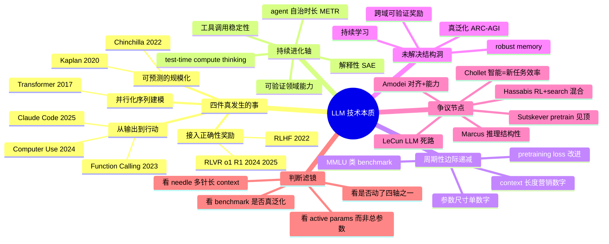

# 01 · 技术演进与本质

> 视角：从 2017 Transformer 到 2026 agentic 系统，逐个拐点拆解"底层范式"是什么、之前为什么做不到、之后什么变成可能。目标是建立一套"看到新模型/新名词能秒判断真本质 vs 工程包装"的认知滤镜。

---

## 一句话总览

LLM 八年的真演进，本质只发生过**四件事**：(1) 把序列建模并行化（Transformer）；(2) 发现 loss 随规模可预测下降（Scaling Laws）；(3) 把"对答案的奖励信号"接入预训练后的网络（RLHF → o1/R1 的 RLVR）；(4) 把"模型说话"扩成"模型行动"（tool use → computer use → agent）。其余多数"突破"，要么是这四件事的衍生工程化，要么是产品包装；判断一项新技术是否"真本质"，看它有没有改变这四个轴中的至少一个。

---

## 关键句提纲

- **Transformer (2017)**：把"必须按时间步走"的递归换成"全部 token 同时算注意力"，让 GPU 吃满算力，规模化才成为可能。
- **Scaling Laws (Kaplan 2020)**：loss 是参数/数据/算力的幂律函数，跨 7 个数量级稳定；从此训模型从手艺变工程预测。
- **GPT-3 (2020)**：175B + few-shot 涌现 in-context learning，prompt 第一次取代 fine-tuning 成为接口。
- **Chinchilla (2022)**：参数和 token 应等比扩张；之前所有人都把模型做太大、数据喂太少。
- **CoT + Emergent Abilities (Wei 2022)**：让模型把推理链显式吐出来，多步任务首次可能；同时 Schaeffer 2023 警告"涌现"很多是评测指标的非线性假象。
- **InstructGPT / RLHF (2022)**：把"人类偏好"接入 fine-tune，第一次让对话产品可用，催生 ChatGPT。
- **GPT-4 / Claude 3 (2023-2024)**：多模态原生 + 长上下文，模型从"语言机"变成"视觉-语言-代码-工具"统一接口。
- **Function Calling (2023.6)**：把"模型生成 JSON 调用外部 API"训成模型本身的能力，agent 时代地基。
- **o1 / R1 (2024-2025)**：把 RL 的奖励信号从"人类喜欢"换成"答案对错"（RLVR），test-time compute 成为新的 scaling 维度。
- **Computer Use / Claude Code (2024-2025)**：模型从"输出 token"扩到"操作屏幕和文件系统"，长 horizon agent 自治时长翻倍。
- **持续进化轴**：context 长度、工具调用稳定性、agent 自治时长（METR：每 4-7 个月翻倍）、可验证领域（数学/代码）能力。
- **周期性 / 边际递减轴**：纯 pretraining loss 改进、benchmark 分数、模型尺寸单一指标、对话流畅度。

---

## 时间线深度展开

### 2017 · Transformer：把序列建模变成可并行的表示学习

Vaswani et al. *Attention Is All You Need*（NeurIPS 2017，arxiv 1706.03762）。RNN/LSTM 的根本瓶颈是"必须按时间步串行"——梯度沿时间反传，长序列梯度消失，且 GPU 用不满。Transformer 的本质动作只有一个：用 self-attention 让序列里所有位置在一次矩阵乘法里互相看，**计算图变成全并行**。

这之前做不到的：在合理时间内训 100B 量级模型；学到长距依赖。之后变成可能的：把 NLP 当成"一个统一架构 + 大数据 + 大算力"的工程问题。Karpathy 在 2023 年 *Intro to Large Language Models* 里反复强调，Transformer 的真正意义不是"更聪明"，而是"可扩展到任意规模而不退化"。Noam Shazeer 一作之一（multi-head attention 出自他手），论文 2017 年发布时几乎没引爆，今天被引超 12.5 万次。

判断滤镜：**任何宣称"取代 Transformer"的新架构（RWKV、Mamba、xLSTM 等），先问它有没有保留全并行 + 长距访问这两条；保不住至少其一，就还在做 RNN 的事**。

### 2020 · GPT-3：scaling laws + in-context learning

Kaplan et al. *Scaling Laws for Neural Language Models*（arxiv 2001.08361）：跨 7 个数量级，loss 随参数 N、数据 D、算力 C 都是干净的幂律。Brown et al. *Language Models are Few-Shot Learners*（GPT-3，arxiv 2005.14165）175B 参数在 prompt 里直接给几个例子就能做新任务，**in-context learning** 出场。

之前做不到的：看到一个新任务直接做，不用 fine-tune 数据。之后变成可能的：prompt 成为编程接口；"训一个大模型解决无限下游任务"的范式确立。

本质突破在哪？不是模型变聪明了，而是**scaling 的可预测性被证明了**——你给 OpenAI/Anthropic/DeepMind 一笔钱，他们能算出 loss 会到几位小数。这把 LLM 从研究项目变成基础设施投资。

### 2022 · Chinchilla：算力最优分配

Hoffmann et al. *Training Compute-Optimal Large Language Models*（DeepMind，arxiv 2203.15556）。训 400+ 个模型后发现：Kaplan 法则给出的"参数比数据更值得加"是错的，**参数和 token 应等比双倍**。70B 的 Chinchilla 训 1.4T token，吊打 280B Gopher、175B GPT-3、530B MT-NLG。

含义：之前所有大模型都"太胖太瘦"——参数过多、token 不够。这条法则之后，Llama、Mistral、DeepSeek 都走"小参数 + 大 token"路线，今天最强开源模型的尺寸（7B-70B 活跃参数）是这条法则的直接产物。

### 2022.1 · CoT 与"涌现能力"

Wei et al. *Chain-of-Thought Prompting Elicits Reasoning*（arxiv 2201.11903）。在 prompt 里给"思考过程"示例，540B 模型在 GSM8K 上准确率从 18% 跳到 57%，超过 fine-tune + verifier 的 GPT-3。同年 Wei et al. *Emergent Abilities of Large Language Models*（arxiv 2206.07682）：某些能力在小模型上 0%，跨过某尺寸阈值后陡升。

之前做不到的：让模型把"中间步骤"作为可优化对象；多步算术。

但要注意 Schaeffer et al. 2023 *Are Emergent Abilities a Mirage?*（NeurIPS 2023 best paper runner-up）：很多"涌现"是因为研究者用了非线性指标（如 exact-match accuracy）；换成 token edit distance，曲线就是平滑的。**涌现是真，但"突然出现"多半是测量假象**——这是这套认知框架里最重要的"反热度"工具。

### 2022.3 · InstructGPT / RLHF：让模型听人话

Ouyang et al. *Training language models to follow instructions with human feedback*（arxiv 2203.02155）。三阶段：SFT → 训 reward model → PPO。1.3B InstructGPT 在人工评测里超过 175B GPT-3。**100 倍参数差被对齐方法吃掉**。

这才是 ChatGPT 能在 2022.11 起飞的真原因。GPT-3 在 2020 已存在，但"会聊天"这件事不是 scale 给的，是 RLHF 给的。Constitutional AI（Anthropic 2022）后续把"人类标注"换成"模型按一组宪法原则自我批评"，DPO（Rafailov 2023）干脆绕开 reward model 直接优化策略——alignment 工具栈在 2023-2024 演化得很快，但**底层范式始终是"用偏好信号塑造 base model"**。

### 2023 · GPT-4 / Claude：多模态 + 长上下文

GPT-4 Technical Report（OpenAI 2023.3）；Bubeck et al. *Sparks of Artificial General Intelligence*（Microsoft，arxiv 2303.12712）声称 GPT-4 早期版本展现"AGI 的火花"——能在没特殊训练的情况下解决跨学科新颖任务。Anthropic Claude 3 Opus/Sonnet/Haiku（2024.3）原生视觉 + 200K context。

本质突破：**模型从单一模态扩到统一表示**。图像 token 化后塞进同一个 Transformer，"看图说话"不再是 caption 模型 + 语言模型拼接。这条路径让 multimodal 不再是产品功能，而是基础能力。

### 2023.6 · Function Calling：从"说话"到"做事"

OpenAI 2023 年 6 月把"调函数"做进 GPT-3.5/4 的训练目标里：模型学会判断什么时候该停止聊天、输出严格 JSON、等待外部结果再续接。11 月升级为 tools 参数支持多工具并行。这是 agent 时代的物理基础。

之前做不到的：稳定的工具调用——靠 prompt 工程让模型输出 JSON 总有 5-10% 失败率，没法跑生产。之后变成可能的：检索、计算、外部 API、代码执行成为模型的"延伸器官"。

### 2024 · 100K-2M 长上下文：工程化但有"context rot"

Gemini 1.5 Pro 上线 1M-2M token；Claude 1M context 2026.3 GA；Gemini 在 needle-in-haystack 上 >99.7% 召回。但 **Chroma 2025 *Context Rot* 研究**测了 18 个前沿模型（GPT-4.1 / Claude Opus 4 / Gemini 2.5），发现**所有模型在每个长度增量都有性能下降**——"能记住"≠"能用"。这是 attention 的架构属性，不是数据问题。

判断滤镜：**长 context ≠ 长记忆。看到"我家模型 10M context"先问 needle 多个 + 跨段推理的准确率**。

### 2024.9-12 · o1：test-time compute 成为新 scaling 轴

OpenAI o1 System Card（2024.9 / 12.5）。Learning to reason with LLMs。本质：**用大规模 RL 训练模型在内部生成更长的 chain-of-thought，奖励信号是"答案最终对不对"**。性能在两个轴上都涨：训练时 RL 算力、推理时思考 token 数。Codeforces 89th percentile，AIME 平均 74%（单样本）。

为什么这是真本质？因为它打开了**第二条 scaling 维度**。pretraining 数据快用完（Sutskever NeurIPS 2024：「数据是 AI 的化石燃料，我们已到 peak data」），test-time compute 给了"越想越准"的新规模化方式。

### 2025.1 · DeepSeek R1：纯 RL 也能涌现推理

Guo et al. *DeepSeek-R1: Incentivizing Reasoning Capability via Reinforcement Learning*（arxiv 2501.12948，Nature 2025）。R1-Zero **完全跳过 SFT**，只用 GRPO（Group Relative Policy Optimization，去掉 critic 网络，用同 prompt 多次 rollout 之间的相对优势）+ 答案正确性这一个 reward，居然就涌现出**自我反思、回退、验证**这些行为——著名的「**Aha moment**」：训练曲线上某一刻模型突然学会说「等等，让我重新想想」。

这个发现颠覆了"必须先 SFT 才能 RL"的工程信条。开源 + 蒸馏出 1.5B-70B 一系列推理模型，几周内复现遍地开花，把 reasoning 能力的复制成本打到 50 美元（李飞飞团队 s1，蒸馏 Gemini 2.0 Flash Thinking）。

### 2024.10-2025 · Computer Use / Claude Code：从输出到行动

Anthropic 2024.10 推出 Claude 3.5 Sonnet computer use beta：模型直接看屏幕截图、移动鼠标、敲键盘。Claude Code 2025 推出后，agent 单次自治会话长度在 3 个月内**从 25 分钟翻到 45 分钟**（Anthropic 2026 Agentic Coding Trends Report）。METR 测得 AI 完成任务的"时长 horizon" **2019-2025 每 7 个月翻倍，2024-2025 加速到每 4 个月**。

本质：模型的输出空间从 "next token" 扩到 "next action on real world"。这一步比 function calling 大——function calling 是结构化输出，computer use 是连续控制。

### 2024 · Mechanistic Interpretability：第一次看见 LLM 在想什么

Anthropic *Towards Monosemanticity*（2023.10）和 *Scaling Monosemanticity: Extracting Interpretable Features from Claude 3 Sonnet*（2024.5）。用稀疏自编码器（SAE）在 Claude 3 Sonnet 残差流上抠出**数千万个特征**，70% 人类可解释，并能直接 steering 模型行为（"金门大桥 Claude" 实验：把"金门大桥"特征 clamp 高，模型自称是金门大桥）。

这不是产品意义上的拐点，但是**理解层面的拐点**：之前我们对 LLM 内部完全黑箱，现在至少有了"分子生物学"——能定位概念在哪几个特征上、能做因果干预。后续 OpenAI 也跟上做 SAE 大模型化。

### 2025+ · 持续学习与 memory：仍未解决

Anthropic 在 Claude 3.5/4 内置 persistent memory；OpenAI 给 ChatGPT Pro 加 cross-session memory（2024）；Mem0、A-Mem、FLEX 等学术系统层出不穷。但 MemoryArena benchmark 显示：在 LoCoMo（被动记忆 QA）拿满分的系统，进入"记忆驱动决策"任务掉到 40-60%。

**真本质突破还没发生**。今天所谓的"memory"基本是 RAG + 工程 hack。Demis Hassabis 2024.12 直接说：**AGI 还差 continual learning、robust memory、introspective reasoning 这三块**——这些都是当前架构的结构性洞，不是 scale 能补的。

---

## 哪些是真本质？哪些是表象？

| 维度 | 类别 | 说明 |
|---|---|---|
| 架构并行性（Transformer） | 真本质（一次性） | 一次完成，今天所有进步建立其上 |
| Pretraining scale loss | **持续但已边际递减** | Kaplan→Chinchilla→数据墙；Orion 相对 GPT-4 进步远小于 GPT-3→GPT-4 |
| In-context learning | 真本质（一次性） | 改变了交互范式，无法"再发现一次" |
| RLHF / 偏好对齐 | 真本质 | 让模型可用；DPO/CAI 都是工具变体 |
| RLVR / 可验证奖励（o1/R1） | **真本质，且仍在扩张** | 打开 test-time compute 新轴；目前只在数学/代码这种"易验证"领域 work |
| Test-time compute | **持续进化** | thinking token 数、self-consistency、tree search 仍在涨 |
| Context 长度（裸数字） | **周期性/边际** | 1M tokens 是营销，真实可用约 100-200K，再长是 context rot |
| 工具调用稳定性 | 持续进化 | 从 90% JSON 成功率到 99.5%+ |
| Agent 自治时长 | **持续进化（METR 每 4-7 月翻倍）** | 25 分钟 → 45 分钟，向小时级走 |
| 多模态融合 | 持续进化 | 文本/视觉/音频统一表示已成熟，视频和具身仍开放 |
| 模型参数尺寸单数字 | **已边际** | MoE 后"总参数 vs 活跃参数"不能再单看；尺寸不是好指标 |
| 通用 benchmark 分数 | **快饱和** | MMLU、HumanEval 已到天花板；ARC-AGI-2、Frontier Math、ARC-AGI-3（人 100% AI 0%）才有信号 |
| 解释性 / SAE feature | 真本质（仍年轻） | 第一次有"看见模型在想什么"的工具 |
| Memory / 持续学习 | **未解决** | 当前都是工程 hack，结构性突破未发生 |

### 工程包装而非本质的典型例子

- **"Agent 框架"层出不穷**（AutoGPT, BabyAGI, CrewAI, …）：底层全是 prompt + tool calling + while-loop；模型不变，框架不会让"agent 自治时长"突破。Anthropic 2024 *Building effective agents* 直说"大多数生产系统不需要 framework"。
- **"我家模型 1M/10M context"**：不配 needle-in-haystack 多针 + 跨段推理评测的，都是营销。
- **"思维链产品"包一个 prompt 就喊 reasoning model**：没有 RLVR 训练的，只是 CoT prompting，o1 那一档跳跃靠的是 RL 不是 prompt。
- **MoE 总参数堆到万亿**：单看总参数无意义，看活跃参数（active params）和路由质量。

---

## 不同立场和争议

### Yann LeCun（Meta → 2025.11 离职创办 AMI Labs，10 亿美金种子轮）
**核心立场**：自回归 LLM 是 dead end，不可能到达 human-level，更不用说 AGI。

**理由**：LLM 没有世界模型、不能做 grounded planning、没有持续学习。他的 JEPA / energy-based / objective-driven 路线主张"先建世界模型，再让 agent 在模型里规划"。X 原帖（2024.5）：「自回归 LLM 不足以达到人类级智能（甚至猫级智能也不行）」。

**背景**：他是连接主义 + 计算机视觉派，长期主张感官 grounded learning > 文本统计；Meta 投了多年 LeCun 路线但 Llama 系列证明 LLM 路径仍在涨，他出走某种程度是路线之争。

### Sutskever（OpenAI → SSI）/ Hinton
**核心立场**：scaling 路径还远未饱和，但形态会变——下一代是 agentic + reasoning + 自我意识系统。

**理由**：NeurIPS 2024 演讲明确"pre-training as we know it will end"（**不是说 scaling 死了，是说 pretraining 这个具体实现方式到顶了**），但 inference-time compute、agents、合成数据是新疆域。"我们已到 peak data"是核心论断。

**背景**：他亲自写了大部分 OpenAI scaling 论文，2023 年起转 alignment / superintelligence 长视角。

### Gary Marcus
**核心立场**：推理是结构性问题，scale 永远解决不了。

**理由**：从 1998 年起就论证神经网络在分布外泛化失败；指 Apple 2024 *GSM-Symbolic* 论文（轻微改写题目就崩）作为"知识盲打"。认为 LLM 没有显式符号系统、没有可点查的世界模型。即使 o1/R1 这种 reasoning model，他认为只是"在分布内推理变好了"。

**背景**：神经符号融合派（neuro-symbolic），与 LeCun 共享"LLM 不够"的判断但路线不同——Marcus 主张混合显式符号，LeCun 主张 self-supervised 视觉/世界模型。

### Anthropic / Dario Amodei
**核心立场**：alignment 与能力**联合演进**才是关键；powerful AI 2026-2030 大概率到来。

**理由**：*Machines of Loving Grace*（2024.10）：powerful AI 的定义比 AGI 操作化（"a country of geniuses in a datacenter"），预测 5-10 年内可压缩"21 世纪生物医学进展"。但前提是 interpretability + 可控的 RL 推理一起做。

**背景**：他是 GPT-2/3 scaling 论文的合著者，对 scaling 信念深，但出走 OpenAI 创立 Anthropic 就是因为相信"光 scale 会出事"，必须 alignment first。

### Demis Hassabis（DeepMind）
**核心立场**：AGI 来自 LLM + RL + search + world model 的混合架构；2030 前 50/50 概率到达。

**理由**：DeepMind 血统是 AlphaGo/AlphaZero 那条 search + RL 路线。Hassabis 反复说"missing 1-2 big ideas"，明确指 continual learning、memory、introspective reasoning。Genie 2/3 做可控世界模拟环境，让 embodied agent 先在虚拟里学。

**背景**：神经科学博士，认为生物大脑是 existence proof，AGI 要从神经科学借蓝图（海马体记忆、皮层世界模型、基底节 RL）。

### 第六派加分：François Chollet（ARC Prize）
**核心立场**：智能不是知识量，是**新任务的 skill-acquisition efficiency**。

**理由**：ARC-AGI-2 上纯 LLM 0%，前沿 reasoning system 单数字百分比，人类很高。ARC-AGI-3 video-game 风格人 100% / AI 0%。这说明现有路径**没在测真泛化**，benchmark 进步多半是分布内。

---

## 前瞻假设（5 条可验证）

1. **2026 内**至少一家头部实验室发布**纯非文本预训练**的世界模型 + LLM 混合系统（视频/3D 仿真原生），benchmark 在 ARC-AGI-3 类任务上从 0% 跳到两位数。**证伪条件**：到 2026.12 仍是文本-only 模型小修小补。

2. **2027 前**长 horizon agent 自治时长（METR 50% 成功率口径）突破**8 小时**——按当前每 4 个月翻倍外推。**证伪条件**：2027.6 仍卡在 1-2 小时台。

3. **持续学习**至少一种工程上可用方案在 2026-2027 出现（不是简单 RAG，能在多 session 做参数级更新且不灾难性遗忘）。**证伪条件**：到 2027.6 仍只有"扩大 context + 向量库"路线。

4. **RLVR 跨域**：可验证奖励训练扩到目前 verify 难的领域（开放写作、设计判断、科研假设）的可信信号在 2026 出现，靠的是 reward model + 自博弈或多 agent 互查；**证伪条件**：到 2026.12 仍只有数学/代码这两类受益。

5. **Pretraining 端单纯 scale loss 改进** 在 2026 公开模型上**不再带来**前端能力质变（仍降 loss，但 benchmark/真实任务无显著跃升），所有跃升来自 RL/agentic/inference compute。**证伪条件**：2026 出现一个纯 scale-up 模型在通用 benchmark 上重现 GPT-3→GPT-4 量级跳跃。

---

## Mermaid 脑图

---

## 来源库（按重要性）

| 类型 | 标题 | 作者/机构 | 日期 | 链接 | 关键洞察 |
|---|---|---|---|---|---|
| 论文 | Attention Is All You Need | Vaswani, Shazeer et al. (Google Brain) | 2017.6 | https://arxiv.org/abs/1706.03762 | 序列建模并行化的奠基；今天一切的起点 |
| 论文 | Scaling Laws for Neural Language Models | Kaplan, McCandlish, Amodei et al. (OpenAI) | 2020.1 | https://arxiv.org/abs/2001.08361 | loss 跨 7 量级幂律；规模化变工程预测 |
| 论文 | Language Models are Few-Shot Learners (GPT-3) | Brown et al. (OpenAI) | 2020.5 | https://arxiv.org/abs/2005.14165 | in-context learning 出场 |
| 论文 | Training Compute-Optimal LLMs (Chinchilla) | Hoffmann et al. (DeepMind) | 2022.3 | https://arxiv.org/abs/2203.15556 | 参数 token 等比；颠覆此前所有"大模型" |
| 论文 | Chain-of-Thought Prompting | Wei et al. (Google) | 2022.1 | https://arxiv.org/abs/2201.11903 | 推理链作为可优化对象 |
| 论文 | Emergent Abilities of LLMs | Wei et al. (Google) | 2022.6 | https://arxiv.org/abs/2206.07682 | 跨阈值能力跃迁的命名与编目 |
| 论文 | Training LMs to Follow Instructions w/ Human Feedback (InstructGPT) | Ouyang et al. (OpenAI) | 2022.3 | https://arxiv.org/abs/2203.02155 | RLHF 三阶段；ChatGPT 的真技术地基 |
| 论文 | Sparks of Artificial General Intelligence | Bubeck et al. (Microsoft) | 2023.3 | https://arxiv.org/abs/2303.12712 | GPT-4 跨学科早期 AGI 信号；也带争议 |
| 论文 | Are Emergent Abilities a Mirage? | Schaeffer, Miranda, Koyejo (Stanford) | 2023.4 | https://arxiv.org/abs/2304.15004 | 涌现"突变"多半是评测指标非线性的产物 |
| 论文 | DeepSeek-R1: Incentivizing Reasoning via RL | DeepSeek | 2025.1 | https://arxiv.org/abs/2501.12948 | 纯 RL 涌现 aha moment；GRPO 算法 |
| 文档 | OpenAI o1 System Card | OpenAI | 2024.9 / 12.5 | https://cdn.openai.com/o1-system-card-20241205.pdf | test-time compute 作为新 scaling 轴 |
| 博文 | Learning to reason with LLMs | OpenAI | 2024.9 | https://openai.com/index/learning-to-reason-with-llms/ | o1 训练框架的官方解释 |
| 博文 | Towards Monosemanticity | Anthropic | 2023.10 | https://transformer-circuits.pub/2023/monosemantic-features/ | 稀疏自编码器 + dictionary learning |
| 博文 | Scaling Monosemanticity (Claude 3 Sonnet) | Anthropic | 2024.5 | https://transformer-circuits.pub/2024/scaling-monosemanticity/ | 千万级特征；金门大桥 Claude steering |
| 博文 | Introducing Computer Use & Claude 3.5 Sonnet | Anthropic | 2024.10 | https://www.anthropic.com/news/3-5-models-and-computer-use | 模型直接操作屏幕键鼠 |
| 博文 | Measuring AI Ability to Complete Long Tasks | METR | 2025.3 | https://metr.org/blog/2025-03-19-measuring-ai-ability-to-complete-long-tasks/ | 任务时长 horizon 每 7→4 月翻倍 |
| 博文 | Context Rot: Increasing Input Tokens Impacts Performance | Chroma Research | 2025 | https://www.trychroma.com/research/context-rot | 18 个前沿模型全部呈现 context rot |
| 文章 | Machines of Loving Grace | Dario Amodei | 2024.10 | https://www.darioamodei.com/essay/machines-of-loving-grace | "Country of geniuses in a datacenter"；2026-2030 时间线 |
| 演讲 | Sequence to Sequence Learning: What a Decade | Ilya Sutskever | NeurIPS 2024.12 | https://www.youtube.com/watch?v=1yvBqasHLZs | "Pre-training as we know it will end"；peak data |
| 演讲 | Software Is Changing (Again) / Software 3.0 | Andrej Karpathy | YC AI School 2025.6 | https://www.latent.space/p/s3 | 1.0 代码→2.0 权重→3.0 prompts |
| 博文 | 2025 LLM Year in Review | Andrej Karpathy | 2025.12 | https://karpathy.bearblog.dev/year-in-review-2025/ | "Summoning ghosts not raising animals"；jagged intelligence |
| 视频 | Intro to Large Language Models | Andrej Karpathy | 2023.11 | https://www.youtube.com/watch?v=zjkBMFhNj_g | LLM = OS，context = RAM 的隐喻 |
| 访谈 | Demis Hassabis on Dwarkesh Patel | Hassabis × Patel | 2024 | https://www.dwarkesh.com/p/demis-hassabis | AGI 还差 1-2 个 big idea |
| 论文 | DeepSeekMoE: Towards Ultimate Expert Specialization | DeepSeek | 2024.1 | https://arxiv.org/abs/2401.06066 | 细粒度专家 + 共享专家；活跃参数路线 |
| 论文 | ARC-AGI-2: Challenge for Frontier AI Reasoning | Chollet et al. | 2025.5 | https://arxiv.org/abs/2505.11831 | LLM 0%；reasoning system 单数字 |
| 报告 | 2026 Agentic Coding Trends Report | Anthropic | 2026 | https://resources.anthropic.com/hubfs/2026%20Agentic%20Coding%20Trends%20Report.pdf | Claude Code 自治时长 25→45 分钟 |
| X/分析 | LeCun: Auto-Regressive LLMs are insufficient | Yann LeCun | 2024.5 | https://x.com/ylecun/status/1793680385403957295 | LLM 不到 cat-level；objective-driven 替代 |
| 博文 | A Knockout Blow for LLMs? | Gary Marcus | 2024 | https://garymarcus.substack.com/p/a-knockout-blow-for-llms | 推理模型仍困于 Tower of Hanoi 类分布外 |
| 中文 | 从 o1-mini 到 DeepSeek-R1：推理模型的历史与技术 | 机器之心编译 | 2025.2 | https://zhuanlan.zhihu.com/p/25978555277 | 推理模型路径中文综述 |
| 中文 | Karpathy 软件 3.0 演讲全文 | 36kr / 腾讯新闻 | 2025.6 | https://36kr.com/p/3344734734566016 | 中文受众入口 |
| 博文 | Reverse engineering OpenAI's o1 | Nathan Lambert (Interconnects) | 2024.9 | https://www.interconnects.ai/p/reverse-engineering-openai-o1 | PRM、过程奖励、self-play 拼图 |
| 博文 | Notes on o1 chain-of-thought models | Simon Willison | 2024.9 | https://simonwillison.net/2024/Sep/12/openai-o1/ | 第一手实操观察 |

---

## 终极判断滤镜（一页式）

看到任何"新模型/新技术"，按这五问过：

1. **它动了上面四件真本质中的哪一件？**（架构并行性 / 可预测 scaling / 接入正确性奖励 / 输出→行动）。一件没动，多半是工程包装。
2. **它的 benchmark 是不是真泛化？** MMLU、HumanEval 已饱和不能用了；看 ARC-AGI-2/3、Frontier Math、SWE-bench Verified、METR 长 horizon。
3. **它给出的 context / 参数 / 时长数字背后真实可用比例多少？** Needle 多针、active params、50% 成功率口径，三个去掉一个就警觉。
4. **它解决了 LeCun/Marcus/Hassabis 共同指出的结构洞了吗？** 持续学习、robust memory、真泛化、世界模型。没解决，再强也是当前曲线上的一格。
5. **它的提升是来自 pretraining loss 还是 RL/agentic/inference compute？** 后者还有空间，前者已边际递减。

---

*完稿 2026.5.10 · 主要参照 Anthropic / OpenAI / DeepMind / Karpathy / Sutskever / LeCun / Marcus / Chollet / Anthropic Interpretability / METR / Chroma / DeepSeek 一手材料*
