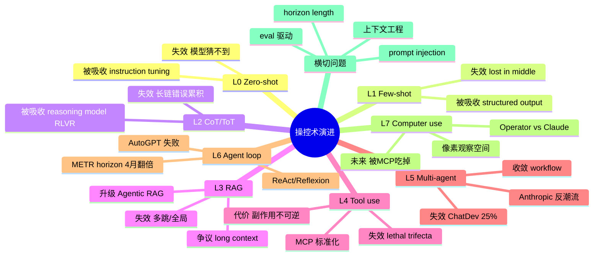

# 02 · 操控术分层演进

> 视角：人类如何"驾驭"LLM。从 zero-shot 一句话到让模型自己点鼠标，每一层都是上一层失效后的逃生通道。

## 一句话总览

**操控 LLM 的本质是「把意图编码成模型能听懂的形式」，每升一层是因为上一层在某类任务上的可靠性塌陷。** 因此「最新的操控术」并不总是「最好的操控术」——只有当任务的不确定性、动作空间或时长突破上一层天花板，才有必要付出更高的工程成本上升一层。判断一个新范式的价值，不看名字多酷，而看它解决了哪一种"具体的失效"。

## 分层速览（L0-L7）

| 层 | 名字 | 大致出现 | 本质 | 失效场景 | 升级触发 |
|---|---|---|---|---|---|
| L0 | Zero-shot prompt | 2020 (GPT-3) | 用自然语言描述任务，让模型一发命中 | 任务规则隐晦、需要特定格式、有罕见知识 | 模型猜不到你想要什么 |
| L1 | Few-shot / In-context learning | 2020-2022 | 喂几个示例，让模型从分布中归纳 | 上下文超长、示例之间冲突、需要推理链 | "我给了 3 个例子它还是错" |
| L2 | CoT / ToT / Self-consistency | 2022 (Wei) → 2023 (Yao ToT) | 把"想"也写出来，让推理可被采样、剪枝 | 推理超过 20 步、需要外部事实 | 模型推理对了但事实错 |
| L3 | RAG（含 long-context 替代论） | 2020 (Lewis) → 2023 爆发 | 用检索把外部知识塞进 context | 知识库巨大或频繁更新；多跳推理；长尾问题 | 检索召回不够 / 上下文塞不下 |
| L4 | Tool use / Function calling | 2023.06 (OpenAI) → 2024.11 (MCP) | 让模型主动调函数，拿真实世界返回值 | 工具数量爆炸、状态需要持久化、动作需要规划 | 一次调用解决不了，得连环 |
| L5 | Multi-agent / Workflow | 2023 (AutoGen, CrewAI) → 2024 | 多角色或固定 DAG 编排 | 角色扮演带来的串扰；调度开销 > 收益 | "其实一个 agent 加 if-else 就够了" |
| L6 | Agent loop（ReAct/Plan-Execute/Reflexion） | 2022 (ReAct) → 2024 (Anthropic 简单循环) | 让模型在「思考-行动-观察」循环中自驱 | 长 horizon 错误累积；上下文爆；幻觉死循环 | 任务时长超过 30 分钟 |
| L7 | Computer use / 真实环境 | 2024.10 (Anthropic) → 2025.01 (Operator) | 给模型屏幕、键鼠，吞掉一切没有 API 的世界 | 视觉延迟、误点击、注入攻击、合规 | 业务被困在没有 API 的 GUI / 物理世界 |

## 关键句提纲

- **L0**：你以为的「魔法咒语」其实是模型在还原"训练分布里最像这句话之后会出现什么"。
- **L1**：示例不是教学，是把模型的注意力锚定到一个特定子分布。
- **L2**：CoT 不是让模型变聪明，是让"原本就在 logits 里的推理痕迹"被显式化、可干预。
- **L3**：RAG 不只是补知识，是把「写权限给训练集」变成「写权限给检索库」——更新成本从百万美元降到秒级。
- **L4**：Function calling 是 LLM 第一次拥有"副作用"。从此「操控 LLM」开始有了「LLM 操控世界」的反向通道。
- **L5**：Multi-agent 大多数失败案例是把工程问题误诊成"角色不够多"。
- **L6**：Agent loop 的真正约束不是模型聪明度，而是 horizon × reliability_per_step 的复利曲线。
- **L7**：Computer use 是承认 "无法等所有软件都开放 API" 的现实主义产物，代价是把所有 OS 级安全模型重新写一遍。

## 各层深度展开

### L0 · Zero-shot prompt
**本质**：用自然语言条件分布采样。
**何时出现**：GPT-3 (2020) 之后大规模可用，instruction-tuning (InstructGPT, 2022) 之后真正稳定。
**代表**：ChatGPT 的初始体验、Karpathy 描述的"和有间歇性失忆的同事对话"。
**失效场景**：
1. 任务在训练分布里太罕见（小语种合规文书）；
2. 输出格式非自然语言（JSON schema 严格、有嵌套）；
3. 模型对"什么算好"没有先验。
**已被吸收**：reasoning model 时代，大部分曾经的 prompt 技巧（"think step by step"、角色扮演专家）被内化进模型 RL 训练目标，o1/o3 上很多 CoT 模板反而降低性能（Microsoft Azure 团队 2025 测试）。Karpathy 的核心建议从 "写好 prompt" 变成 "建好上下文"——把相关材料堆好，模型自己会推。

### L1 · Few-shot / In-context learning
**本质**：把 task 转化成「续写一个分布」。模型不学习，只是匹配。
**何时出现**：GPT-3 论文标题就是 "Language Models are Few-Shot Learners" (Brown 2020)。
**失效场景**：
1. 长 context 后段例子被淹没（lost in the middle）；
2. 示例之间不一致，模型反而更乱；
3. 需要的是推理而非模式匹配。
**已被吸收**：strucutred output（Jason Liu / Instructor / OpenAI 原生 schema）让"用例子教格式"几乎过时——直接传 Pydantic schema。Instructor 月下载量 300 万，OpenAI 把它列为结构化输出的灵感来源。

### L2 · Chain-of-Thought / Tree-of-Thought
**本质**：把「中间状态」从 hidden 变成 token，让人类（或另一个模型）能介入。
**关键论文**：Wei 2022 (CoT), Wang 2022 (Self-Consistency, 多次采样取众数), Yao 2023 (ToT, 把搜索算法套在思考上)。
**失效场景**：
1. 推理链超长（20+ 步），错一步全错；
2. 需要外部事实校验（CoT 不能纠正幻觉，只能让幻觉更连贯）；
3. reasoning model 出现后，**外置 CoT 反而干扰内置 CoT**——这是 2025 年最大的反直觉发现。
**已被吸收**：o1/o3、DeepSeek-R1、Claude thinking 把 CoT 从 prompt 时代的"小聪明"升级为后训练的"大力出奇迹"——RLVR (Reinforcement Learning with Verifiable Rewards) 直接奖励推理痕迹。
**仍活的部分**：Self-consistency 在结构化任务（数学、代码）依然提分；ToT 思想被吸收进 search-based agents（Anthropic 的 Best-of-N、并行搜索）。

### L3 · RAG（与 long-context 之争）
**本质**：把「写权限给训练集」变成「写权限给外部索引」。
**何时出现**：Lewis 2020 RAG paper → 2023 LangChain/LlamaIndex 引爆 → 2024 长上下文挑战。
**失效场景**：
1. 多跳推理（hop 1 答案在文档 A，hop 2 在 B，朴素 RAG 只看 top-k）；
2. 检索器与生成器目标不对齐；
3. 「知识在哪不知道」——需要全局视角。
**长上下文派 vs RAG 派**：Gemini 1.5 Pro 在 needle-in-haystack 上 99.7%，看似 RAG 已死。但 2025 实测：真实多事实召回平均 60%，130k token 后性能突崖式下降，1M token 请求比 RAG 慢 30-60×、贵 1250×。结论是**混用**：简单查询走 RAG，复杂多跳走长上下文，让模型自己判断。
**已被吸收**：Agentic RAG —— 把检索本身变成 tool call，模型决定"是否要查""查几次""换 query 重查"。这其实是 L3 被 L4 吃掉一半。

### L4 · Tool use / Function calling
**本质**：模型第一次有"副作用"——可以让世界发生改变。
**演进**：OpenAI Plugins (2023.03) → Function Calling (2023.06) → JSON mode → Structured Output → MCP (Anthropic, 2024.11)。
**MCP 的意义**：把 N×M 的连接器问题（N 个 LLM × M 个工具）变成 N+M。2024.11 发布，2025 年 OpenAI/Google/Microsoft 全部跟进，2025.12 Anthropic 把它捐给 Linux 基金会下的 AAIF 基金。**这是 LLM 生态第一个被全行业接受的标准**。
**失效场景**：
1. 工具数量爆炸（>50 个），模型选错；
2. 工具描述含糊；
3. 工具有副作用且不可逆（删数据、发邮件）。
**Simon Willison 的「lethal trifecta」**（2025.06）：私有数据 + 不可信内容 + 外发通道，三件齐全必出 prompt injection 漏洞。GitHub MCP 有过实例：恶意 issue 让 agent 把私库内容塞进 PR 标题。这是 L4 不可逆的代价——能动手就能闯祸。

### L5 · Multi-agent / Workflow
**本质**：把"角色"或"流程"作为先验注入到 LLM 调度上。
**代表**：AutoGen (Microsoft)、CrewAI（角色扮演）、LangGraph（状态图）。
**失效场景**：
1. 角色之间互相说服反而把简单事情搞复杂；
2. ChatDev 类多 agent 系统在真实软件任务上正确率仅 25%（arxiv 2503.13657）；
3. 调度开销和 token 成本远超单 agent。
**Anthropic 的反潮流立场**（"Building Effective Agents", 2024.12）：明确建议**先用 workflow（确定性 DAG）而不是 agent**，再用单 agent 而不是多 agent。"Most successful implementations weren't using complex frameworks." 五个核心 workflow pattern：prompt chaining / routing / parallelization / orchestrator-workers / evaluator-optimizer。
**已被吸收/重构**：CrewAI 在 2025 加了 Flows（事件驱动管线），向 workflow 收敛；LangGraph 用 reducer 和 checkpoint 把"图"做成生产级，本质是把 multi-agent 变成 stateful workflow。

### L6 · Agent loop（ReAct → Plan-Execute → Reflexion）
**本质**：让模型在 thought-action-observation 循环里自驱，直到达成目标或耗尽预算。
**关键论文**：Yao 2022 ReAct（推理 + 行动交错）；Shinn 2023 Reflexion（每轮反思错误，写进下一轮 prompt）。
**AutoGPT 的滑铁卢**：2023.04 爆红，半年内被发现"创建过于复杂的计划、卡在循环里反复尝试同一个失败动作、丢失上下文"。2023.11 停止迭代，35k stars 但成维护模式。教训：纯 LLM 自驱在 horizon > 30 分钟时错误累积致命。
**METR 的 horizon length 研究**（2025-2026）：前沿模型能完成的任务时长**指数增长**，2019-2024 每 7 个月翻一倍，2024-2025 每 4 个月翻一倍（TH1.1 更新后约 131 天）。Claude Opus 4.5 (2025.11) 据测能独立完成约 5 小时任务。**这是衡量 L6 进展最干净的指标**。
**Horizon 上限由什么决定**：
1. step 可靠性（0.95^N 复利曲线，N=100 时只剩 0.6%）；
2. context 容量与 attention 退化；
3. 错误检测能力（reflexion / verifier）；
4. 工具反馈 latency；
5. 人类介入成本。
**已被吸收**：Anthropic 的 "simple agent loop" + 工具循环就是 ReAct 的极简版，Claude Code 是这个范式最成功的产品化。

### L7 · Computer use / 具身真实环境
**本质**：承认大量业务被困在没有 API 的 GUI / OS / 物理世界，让模型直接操作屏幕和键鼠。
**时间线**：Anthropic Claude Computer Use (2024.10) → OpenAI Operator (2025.01) → Operator 并入 ChatGPT agent mode (2025.07) → Anthropic 加 zoom 高分辨率 (2025.11)。
**性能差距**（2025）：Operator 在 OSWorld 38.1% / WebVoyager 87%；Computer Use 在 OSWorld 22% / WebVoyager 56%。Operator 偏浏览器原生，Computer Use 偏桌面通用。
**与 API tool use 的本质差异**：
1. **观察空间从结构化变成像素**——视觉 OCR 误差进入循环；
2. **动作空间从 schema 变成连续坐标**——模型可能点错按钮；
3. **延迟从 ms 级变成 100ms-s 级**——一个任务几十次截图；
4. **状态来自 OS / 网页 DOM**——不可控、随版本变；
5. **安全边界从函数白名单变成整个用户会话**——lethal trifecta 全开。
**真实失效**：表单填错、二次验证截不到、广告弹窗误点。Anthropic 自己的 demo 也演过"分心去看 Yellowstone 照片"。
**未来**：Computer use 短期是"API 缺位的临时桥",长期会被 agent-native 接口（llms.txt / MCP / 标准 actions）吃掉一部分。Karpathy "Software 3.0" 的核心论点之一就是 **build for agents**——重写 web，而不是让 LLM 模拟人类点鼠标。

## "已死"或"被吸收"的操控术

| 操控术 | 状态 | 原因 |
|---|---|---|
| 复杂 prompt 工程模板（DAN、专家人设） | 大幅衰退 | reasoning model 内置 CoT，外置模板反而干扰；OpenAI 2025 prompting guide 明确 o1/o3 不需要"think step by step" |
| 纯 AutoGPT 式自驱 agent | 失败 | horizon 太短、无可靠性保证、错误累积；2023.11 项目停滞 |
| 单纯 RAG 的硬性贴片 | 被 Agentic RAG 吸收 | 检索变成 tool call，模型自己控制 |
| 复杂 prompt 链 / DAG 框架 (LangChain v0.x 风格) | 收缩 | Anthropic、Simon Willison 都建议"先用 LLM API 直接写" |
| 多 agent 角色扮演 | 收缩 | ChatDev 25% 正确率，工程开销 > 收益 |
| "Magic prompt" / 提示词秘籍市场 | 衰退 | 模型迭代速度 > 秘籍传播速度，技巧三个月就失效 |

## 看似新但其实是旧术换皮

- **"Skills" / "GPTs"** ≈ system prompt + 文件 RAG 的产品化包装。
- **"Workflow agent"** ≈ 把 if-else + LLM 调用画成 DAG。
- **"Computer use"** ≈ Selenium + OCR 的 LLM 版，1990s 末期就有屏幕自动化机器人。
- **"Reasoning model"** ≈ CoT 内化进训练，但 prompt-time CoT 的祖先是 1990s 的 reasoning trace IR。
- **"Multi-agent debate"** ≈ Self-consistency 多次采样的角色化版本，本质都是 ensemble。

## Horizon length 讨论

> 这是 2025-2026 最值得长期跟踪的一条曲线。

- **METR 度量**：把任务按"50% 成功率所需人类时长"分箱，看模型能完成多长的任务。
- **数字**：2019 年约 30 秒，2024 年约 1 小时，2025 年顶级模型 ~5 小时；doubling time 从 7 月→4 月。
- **物理意义**：horizon = log(目标可靠性) / log(单步可靠性)。step reliability 从 95% 提到 99% 时，可承担任务步数从 ~13 跳到 ~69，曲线陡峭。
- **天花板猜想**：
  1. **memory bottleneck**：context 窗在 1M-10M token 后性价比急剧下降（lost-in-middle）。
  2. **环境反馈延迟**：computer use 任务每步几秒，10 小时任务 = 几千步 × N 秒，wall-clock 把 horizon 限制在系统延迟乘积上。
  3. **错误检测**：没有 verifier 的领域（开放写作、设计）horizon 涨得最慢。
  4. **人类介入成本**：当 agent 每 5 分钟需要确认一次，"自治时长"再长也无意义——这把 horizon 重新定义成"无中断时长"。

## 不同立场和争议

1. **长上下文派 vs RAG 派**
   - 立场 A（Gemini, Anthropic 部分团队）：context 越长越好，RAG 是临时方案。Gemini 2M 上下文 + context cache 鼓吹"绕过 RAG"。
   - 立场 B（Eugene Yan, Hamel Husain, 实战派）：4k + retrieval 在多事实召回上打 16k 无 retrieval；1M 请求慢 30-60×、贵 1250×。
   - **判断信号**：你的瓶颈是召回率还是 token 成本？是新文档频率还是单次查询深度？

2. **Anthropic "simple agent loop" vs LangGraph "状态图编排"派**
   - 立场 A（Anthropic, Simon Willison）：直接用 API + 简单循环，框架是负债。
   - 立场 B（LangChain, 大型企业用户）：生产环境需要 checkpoint、observability、human-in-loop hooks，框架的抽象成本是必要投资。
   - **判断信号**：你的 agent 是否需要时间旅行调试 / 多人协作 / 长期持久化？需要就上 LangGraph，否则裸写。

3. **prompt engineering 已死 vs 仍是核心技能**
   - 立场 A（reasoning model 推崇者）：o1/o3 时代过度 prompt 反而扣分，"少即是多"。
   - 立场 B（Karpathy, Hamel, eval 派）：prompt 工程并未死，只是从"咒语"变成"上下文工程 + eval 驱动"。eval 数据集 > prompt 模板，这才是新的核心竞争力。
   - **判断信号**：你是在调"句子"还是在调"上下文 + eval 闭环"？

4. **structured output / DSL vs 自由文本**
   - 立场 A（Jason Liu, Instructor）：从 string 升级到 data structure 是质变，所有 agent 出口都该走 schema。
   - 立场 B（部分 reasoning 派）：约束过强会损害 chain-of-thought 自由度，让模型先 think 再 schema。
   - **判断信号**：下游要不要程序消费？要就 schema，要文学性就放任。

## 前瞻假设（5 条可验证）

1. **2026 内**，超过 70% 的"agent 框架"特性会被收敛进 Anthropic 风格的 simple loop + MCP 标准——CrewAI、AutoGen 部分模块会被 deprecated 或重构。可验证指标：GitHub stars 月增量、生产案例使用 raw API 占比。
2. **horizon length 的 doubling time 会在 2027 前撞到第一道墙**，从 4 月延长到 8-12 月，原因是单步可靠性突破 99.5% 越来越难。可验证指标：METR 季度更新。
3. **computer use 在 2026 内不会成为主流入口**，会被 MCP + agent-native 网站（llms.txt 类标准）压制；computer use 沦为"长尾、合规、桌面遗产软件"专用。
4. **prompt injection 会出现"重大事件级别"事故**（如某金融 agent 被 lethal trifecta 攻破，损失千万级），推动监管定义 agent action 的"信任域"标准。
5. **"上下文工程"会取代"prompt 工程"成为新职业关键词**——招聘描述里前者出现频率超过后者。从 Karpathy "build context, not prompts" 流行可见端倪。

## Mermaid 脑图

## 来源库

| 类型 | 标题 | 作者/机构 | 日期 | 链接 | 关键洞察 |
|---|---|---|---|---|---|
| 必读 | Building Effective Agents | Anthropic | 2024.12 | https://www.anthropic.com/research/building-effective-agents | 5 个 workflow pattern；先 workflow 再 agent；不要无脑上框架 |
| 必读 | LLM Powered Autonomous Agents | Lilian Weng | 2023.06 | https://lilianweng.github.io/posts/2023-06-23-agent/ | Agent = LLM + planning + memory + tools 的奠基公式 |
| 必读 | The lethal trifecta for AI agents | Simon Willison | 2025.06 | https://simonwillison.net/2025/Jun/16/the-lethal-trifecta/ | 私有数据 + 不可信内容 + 外发通道 = 必出漏洞 |
| 必读 | Building effective agents 解读 | Simon Willison | 2024.12 | https://simonwillison.net/2024/Dec/20/building-effective-agents/ | 工业一线对 Anthropic 立场的二次背书 |
| 必读 | Time horizons / Moore's Law for AI agents | METR / AI Digest | 2025-2026 | https://theaidigest.org/time-horizons | horizon doubling 4 个月，最干净的 agent 进展度量 |
| 论文 | ReAct: Synergizing Reasoning and Acting | Yao et al. | 2022.10 | https://arxiv.org/abs/2210.03629 | thought-action-observation 循环范式起点 |
| 论文 | Chain-of-Thought Prompting | Wei et al. | 2022 | (NeurIPS 2022) | "think step by step" 的源头 |
| 论文 | Tree of Thoughts | Yao et al. | 2023 | (NeurIPS 2023) | 把 BFS/DFS 套在思考上 |
| 论文 | Reflexion | Shinn et al. | 2023 | (NeurIPS 2023) | 反思写入下一轮 prompt，自我纠错 |
| 论文 | Why Do Multi-Agent LLM Systems Fail? | Cemri et al. | 2025 | https://arxiv.org/html/2503.13657v1 | ChatDev 类系统正确率 25% 的实证 |
| 标准 | Introducing the Model Context Protocol | Anthropic | 2024.11 | https://www.anthropic.com/news/model-context-protocol | N×M → N+M，全行业接受的工具协议 |
| 产品 | Introducing computer use | Anthropic | 2024.10 | https://www.anthropic.com/news/3-5-models-and-computer-use | L7 的开局事件 |
| 产品 | OpenAI Operator launch | OpenAI / MIT Tech Review | 2025.01 | https://www.technologyreview.com/2025/01/23/1110484/ | 浏览器原生 computer use，OSWorld 38% |
| 实战 | Patterns for Building LLM-based Systems | Eugene Yan | 2023-2025 | https://eugeneyan.com/writing/llm-patterns/ | Eval / RAG / Caching / Guardrails 七件套 |
| 实战 | Your AI Product Needs Evals | Hamel Husain | 2024.03 | https://hamel.dev/blog/posts/evals/ | "失败的 AI 产品都缺 eval"；eval > prompt |
| 实战 | LLM-as-Judge Won't Save the Product | Eugene Yan | 2025.04 | https://eugeneyan.com/writing/eval-process/ | LLM judge 被滥用，过程 > 工具 |
| 实战 | OpenAI reasoning models prompting advice | Simon Willison | 2025.02 | https://simonwillison.net/2025/Feb/2/openai-reasoning-models-advice-on-prompting/ | o1/o3 上少 prompt 反而更好 |
| 实战 | Prompt Engineering for o1/o3 | Microsoft Azure | 2025.02 | https://techcommunity.microsoft.com/blog/azure-ai-services-blog/prompt-engineering-for-openai%E2%80%99s-o1-and-o3-mini-reasoning-models/4374010 | 实测 CoT 模板对 o1-mini 反而扣分 |
| 工具 | Instructor | Jason Liu | 2024 | https://python.useinstructor.com/ | 月下载 300 万；OpenAI 把它列为 structured output 灵感 |
| 视角 | Software 3.0 / How I use LLMs | Andrej Karpathy | 2025 | https://karpathy.ai/ | "build for agents"；上下文 > prompt |
| 工程 | LangGraph vs CrewAI vs AutoGen | Datacamp | 2025 | https://www.datacamp.com/tutorial/crewai-vs-langgraph-vs-autogen | 框架的真实分工，不是替代关系 |
| 调研 | Computer Use vs Operator | WorkOS | 2025 | https://workos.com/blog/anthropics-computer-use-versus-openais-computer-using-agent-cua | 桌面派 vs 浏览器派的实测对比 |
| 中文 | 基于大语言模型的智能代理（Lilian Weng 译） | 宝玉xp | 2023 | https://baoyu.io/translations/ai-agent/llm-powered-autonomous-agents | 中文圈对 Weng agent 框架的标准译本 |
| 中文 | Google 提示工程白皮书译注 | 宝玉xp | 2024 | https://baoyu.io/blog/google-prompt-engineering-whitepaper | 中文圈系统介绍提示工程的入口 |
| 趋势 | RAG vs Long Context production decision | TianPan | 2026.04 | https://tianpan.co/blog/2026-04-09-long-context-vs-rag-production-decision-framework | 长上下文 130k 后性能崖；混用是答案 |
| 趋势 | Long-running Agents | Addy Osmani | 2025 | https://addyo.substack.com/p/long-running-agents | 工程师视角的 horizon length 实践 |
| 安全 | New prompt injection papers | Simon Willison | 2025 | https://simonw.substack.com/p/new-prompt-injection-papers-agents | "Agents Rule of Two"；攻击者后手 |
| 综述 | An Analysis of Anthropic's Guide | Agents Decoded | 2024.12 | https://www.agentsdecoded.com/p/an-analysis-of-anthropics-guide-to | 对 Anthropic agent 哲学的工业反思 |

---

*维护者注：本层级框架是动态的。如果 2026 末出现 L8（如脑机接口或自我修改代码），应回头审视 L0-L7 的边界是否需要重画。"框架失效"本身是观察 LLM 进化最有价值的信号之一。*
