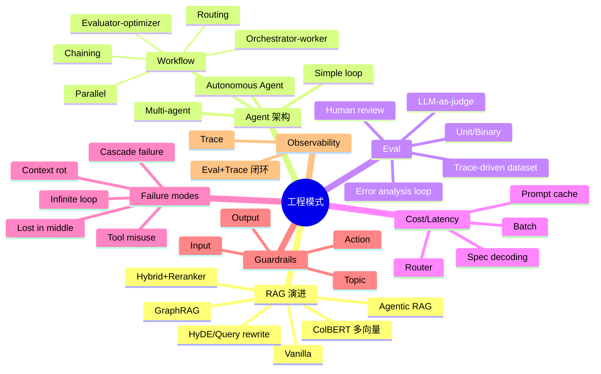

# 03 · 工程实践与架构模式

> 怎么把 LLM ship 成稳定可用的产品。

## 一句话总览

LLM 工程的核心矛盾是「概率系统」与「确定性产品要求」之间的落差，所有穿越周期的模式（evals、RAG、context engineering、guardrails、observability）本质上都是把这种概率性收敛成可度量的工程指标，**模型在变强，但围绕模型的工程栈反而越来越像传统软件工程**。

## 关键句提纲（10 条）

1. **Evals 是 2024-2026 唯一不会被新模型抹平的护城河**——Hamel Husain 帮 30+ 家公司诊断，结论是失败项目几乎都死在「没系统化的 eval」。
2. **RAG 没有死，但 vanilla RAG 死了**：单纯 chunk + cosine 在 2024 年已经不够，hybrid search + reranker + contextual embedding 成为新基线（Anthropic 报告显示 top-20 检索失败率从 5.7% 降到 1.9%）。
3. **「最简单的循环」是 Anthropic 给的最珍贵建议**：能用 prompt chaining 解决就别上 LangGraph，能用 LangGraph 别上 multi-agent；复杂度是负债不是资产。
4. **Workflow ≠ Agent**：Anthropic 在《Building Effective Agents》明确区分——workflow 是「LLM 在预定义代码路径里跑」，agent 是「LLM 自己决定下一步做什么」，两者监控、debug、成本曲线完全不同。
5. **LLM-as-judge 不是「免费 eval」**：position bias、verbosity bias、self-preference bias 让它在 pairwise 比较时 repetition stability 都不稳，必须配人工 calibration。
6. **Long context ≠ RAG 的替代品**：Gemini 2M 上下文出来后 RAG 短期被宣告死亡，但 Databricks 的 benchmark 显示 citation accuracy 上 RAG 仍稳赢，长上下文还面临 context rot（n² attention 关系导致中段信息丢失）。
7. **Fine-tuning 在 2024 复活，2025 又被压回小众**：因为 prompt caching + 长上下文 + 强基模让大多数任务不再需要 SFT；只有 latency、隐私、固定格式三类场景仍值得做。
8. **结构化输出从「黑魔法」变成基础设施**：Jason Liu 的 instructor 月下载 300 万次，OpenAI 把 structured output 做成原生 API，schema-first 编程是 2025 后的默认范式。
9. **Cost / Latency 三件套**：prompt caching（最高 90% 成本降）、speculative decoding（2-3 倍提速）、router（30-85% 成本降）。三件叠加是 2025 production 的黄金组合。
10. **Observability 从「nice-to-have」变成「production 必需品」**：因为 agent 一旦跑飞，你需要的是 trace 而不是 log——LangSmith / Braintrust / Langfuse 已成新一代 APM。

---

## 核心模式深度展开

### 一、RAG 演进史（vanilla → agentic）

RAG 的演进是「retrieval 失败模式」被一代代发现并补丁的过程，不是模型变强带来的，而是工程师踩坑反推出来的。

**Gen 1 · Vanilla RAG（2020-2023 上半年）**
Lewis 2020 的原始 RAG = embed query → cosine top-k → stuff into prompt。问题暴露得很快：
- 同义词召回率差（"car" vs "automobile"）；
- 长尾术语召回不到（错误码、产品 SKU）；
- chunk 切错地方语义就断了；
- top-k 进 prompt 但 LLM「Lost in the Middle」（Liu 2023）——中段相关信息被忽略。

**Gen 2 · Hybrid Search + Reranker（2023 末-2024）**
BM25 + dense vector 并行召回，用 RRF 融合，再用 cross-encoder reranker（Cohere、Jina、bge-reranker）做精排。Anthropic 内部 benchmark：Reranked Contextual Embedding + Contextual BM25 把 top-20 chunk 检索失败率从 5.7% 降到 1.9%。这是当下 production 的事实标准。

**Gen 3 · Query Rewriting / HyDE（2023）**
Gao et al. 提出 HyDE：先让 LLM 生成一个「假想答案文档」，再用这个文档去检索真实文档。原理是 query 短、document 长，向量空间不匹配，HyDE 让 query 先「长出来」。同期还有 multi-query expansion、step-back prompting。

**Gen 4 · Multi-Vector / ColBERT（2024 起回潮）**
ColBERT（Khattab & Zaharia）的「late interaction」：query 和 document 各自编码成多向量，retrieval 时用 MaxSim 算 token 级相似度。比单向量更准，比 cross-encoder 更快。2024 年 Jina-ColBERT-v2 让它在多语言、长文档场景重新被关注。

**Gen 5 · Graph RAG（Microsoft 2024）**
对于「全局 sensemaking」类问题（"这本书的核心主题是什么"），naive RAG 完全不行，因为答案不在任何单一 chunk。Microsoft GraphRAG 用 LLM 抽实体+关系建图，社区检测分层，每层 community 做摘要。在 1M token 数据集上，全局问答的 comprehensiveness 和 diversity 比 naive RAG 赢 70-80%。代价是 indexing 成本陡增——LazyGraphRAG 2024 末改为按需建图，把成本降回来。

**Gen 6 · Agentic RAG（2024 末-2026）**
把 retrieval 当成 tool，让 agent 自己决定查不查、查几次、怎么查。典型形态：Orchestrator 拆问题 → 多个 Retriever agent 并行查不同 source → Analyst 综合 → Critic 核实 → Writer 输出。带 planning loop、memory、cost ceiling、max iteration。这是当下「最高级形态」，但也最容易跑飞——production 部署必须配 max iteration、cost ceiling、runaway monitoring 三件套。

**穿越周期的判断**：hybrid search + reranker 一定会留下来；query rewriting 可能被 reasoning model 自带能力吸收；Graph RAG 的核心思想（hierarchical summarization）会留，但具体实现可能换成更轻的 lazy 形态；agentic RAG 的边界还在动——它和「带 tool 的 agent」之间的区分会越来越模糊。

### 二、Agent 架构（simple loop vs orchestrated）

Anthropic 2024 年 12 月的《Building Effective Agents》是这个领域的经典文献，核心立场：

> "When building applications with LLMs, find the simplest solution possible, and only increase complexity when needed."

它把模式分成两类：

**Workflows（确定性编排）**
- **Prompt chaining**：A 输出 → B 输入，线性。
- **Routing**：LLM 分类 → 走不同子路径。
- **Parallelization**：多个 LLM 并行，再 voting 或 aggregation。
- **Orchestrator-workers**：中心 LLM 拆任务给 worker LLM。
- **Evaluator-optimizer**：一个生成、一个评判、循环优化。

**Agents（动态控制）**
LLM 自己决定调哪个 tool、何时停止。控制流不再是工程师写在代码里的，而是从 prompt 和 tool 描述涌现出来的。

**Anthropic 的反框架立场**
他们公开建议：先用裸 SDK + 一个 while 循环写出最简版，再决定要不要框架。LangChain / LangGraph 提供的抽象很多时候只是给简单逻辑增加了 indirection。这和 Jason Liu 的「High Agency Pydantic > VC Backed Frameworks」是同一个 meme——少抽象、强类型、自己掌握状态。

**反对方立场**
LangGraph 的拥护者认为：当你需要 checkpointing、human-in-the-loop、durable workflow、time-travel debugging 时，自己造的简单 loop 撑不住。CrewAI 的拥护者强调声明式角色定义对业务流程来说更直观。**这不是技术之争，是规模之争**——10 行循环 vs 10 万行系统的边界在哪。

### 三、Evaluation 工程

Hamel Husain 的论断（2024 年 3 月）：「失败的 AI 产品几乎都共享一个根因——没有 robust eval system」。他在帮 30+ 家公司之后总结的方法论：

**Eval 三层金字塔**

1. **Unit / Binary Evals**：写 assertion 一样的规则，例如「输出必须是合法 JSON」「不能出现竞品名字」。便宜、快、能跑 CI。是 80% 项目缺的基础。
2. **Model-Graded Evals（LLM-as-judge）**：用强模型评弱模型输出。便宜但有 bias（position、verbosity、self-preference）。必须有人工标注数据校准 judge 本身。
3. **Human Evals**：最贵但最可信。Hamel 反复强调早期阶段「领域专家 + 错误分析」比任何自动指标都重要。

**Error Analysis Loop（Hamel 的核心方法论）**
看 100 条真实输入输出 → 给每条打 fail/pass + 失败原因 → 用 frequency 排出 top failure modes → 针对性改 prompt / retrieval / tooling → 再跑回测。这是「做评估」和「靠 vibe check」最大的差别。

**Anthropic Demystifying Evals（2025）**
明确定义术语：task = 测试用例，trial = 一次尝试（多次平均消除随机），grader = 打分逻辑，transcript = 完整 trace。建议从 **20-50 个真实失败用例** 起步，效应量大、不需要大样本。这和传统 ML 要 thousands of examples 的思路是反的——LLM eval 是质性数据科学，不是统计假设检验。

**LLM-as-judge 的争议**
2024 年「Judging the Judges」研究（Shi et al.）系统测了 15 个 judge × 22 任务 × 40 candidate × 150,000 实例，结论：position bias 不是随机，跟 quality gap 强相关。MT-Bench-style pairwise 比较里，模型有时倾向选第一个，有时选第二个，跨 judge 不一致。
工程实践共识：
- 不要用 judge 做绝对分数，只做 pairwise；
- judge 必须和人工评估对齐（agreement rate > 0.7）；
- 双向 swap 取平均消除 position bias；
- chain-of-thought judge 比直接打分稳。

### 四、结构化输出与 schema 强制

2023 年 OpenAI function calling 出现是分水岭。2024 年 Jason Liu 的 instructor（基于 Pydantic）让 schema-first 范式普及——你定义 BaseModel，库自动重试 + 验证 + parse。OpenAI 后来直接吸收为 native structured output。

**为什么重要**：production 系统不能容忍「99% JSON 合法、1% 字符串多了个引号」。schema 约束 + 自动重试把一个 statistical 问题转换成 deterministic 问题。

**穿越周期判断**：schema-first 是不可逆趋势。今后所有 agent / RAG 系统的输入输出都会是强类型对象，自然语言只是 UI 层。

### 五、Cost / Latency 优化

四个杠杆，影响是乘性的：

1. **Prompt Caching**（Anthropic 2024.8 推出，2024.12 GA）：长 prefix 缓存 5-10 分钟，cache hit 价格只有正常 input 的 10%。Anthropic 官方数据：成本最高降 90%、延迟最高降 85%。**对 agent 系统是 game-changer**——system prompt + tool definitions 通常占 token 大头，缓存后边际成本陡降。
2. **Speculative Decoding**：小 draft model 提候选 token，大 model 一次 verify 多个。vLLM、TensorRT-LLM 已原生支持。NVIDIA H200 上 Llama 3.1-405B 实测 3.6x 吞吐提升。质量无损（数学上等价）。
3. **Routing / Model Cascade**：简单 query 走小模型，复杂 query 升级到大模型。UC Berkeley + Canva 数据：85% 成本降，95% GPT-4 质量。OpenRouter / LiteLLM / Portkey 是流行 gateway。
4. **Batching + Async**：OpenAI / Anthropic batch API 可以拿 50% 折扣，代价是 24h 内返回。适合离线 eval、数据清洗、bulk generation。

### 六、Observability 与 debugging

LLM 系统不能用传统 log 看，因为：
- 每次调用都是非确定的；
- agent 的执行树是动态的；
- token 消耗、latency、tool call 失败需要分维度看；
- 多 turn 上下文里的因果链不在单条 log 里。

工具栈：**LangSmith**（深度对接 LangGraph，含 time-travel debug）、**Braintrust**（eval-first，prod trace 和 offline experiment 同 schema）、**Langfuse**（开源）、**Helicone**（gateway 形态）、**Arize Phoenix**。趋势是「trace + eval + dataset」三位一体——线上 trace 直接抓出来变成 eval 数据集，闭环修复 prompt。

### 七、Guardrails / 安全栏

四类常见 guardrail：
- **Input guardrail**：prompt injection 检测、PII 脱敏、jailbreak 拒绝；
- **Output guardrail**：toxicity、PII 泄露、品牌不当言论；
- **Topic guardrail**：把对话限定在业务域内（金融助手不能聊医疗）；
- **Action guardrail**：tool 调用前的 human approval、权限检查、cost ceiling。

实现方式：小模型分类器（NeMo Guardrails、Llama Guard）、规则引擎、policy LLM。**重要的不是用什么，而是把 guardrail 当成第一公民设计在系统里**——很多团队把它当 afterthought，结果是 90% bug 在 guardrail 失效。

---

## 穿越周期的 pattern vs 过渡形态

| 维度 | 会留下的 | 短期过渡 |
|---|---|---|
| **Eval** | 错误分析循环、unit binary check、人工校准 | 单一总分指标、纯 LLM judge 不校准 |
| **RAG** | hybrid search、reranker、metadata filter、structured retrieval | 纯 cosine top-k、单 embedding 模型一把梭 |
| **Agent** | 简单循环 + 强 schema、workflow 优先、tool 边界清晰 | 复杂多 agent 编排（除非业务真需要）|
| **Output** | schema-first、Pydantic / Zod、structured output API | 解析自然语言再正则 |
| **Cost** | prompt cache、router、batch | 一刀切用最强模型 |
| **Observability** | trace + eval 闭环、cost / latency dashboard | 只用 stdout log |
| **Adaptation** | RAG + prompt + 强基模 | 大量 SFT 微调（除非 latency / 隐私 / 格式刚需）|
| **Context** | context engineering（compaction、subagent isolation） | 把所有东西塞进长 context |
| **Guardrail** | 多层防御、policy 内嵌系统设计 | 仅靠 system prompt 防御 |

---

## 失败模式合集

1. **Infinite agent loop**：tool 报错 → agent 重试 → 同样错 → 再重试。Claude Code 子 agent 曾在 4.6 小时内消耗 27M token 跑死循环。**解法**：max iteration、relative progress check、外部 deterministic loop guard。
2. **Context rot / pollution**：multi-turn 累积无关信息，模型注意力被稀释。Anthropic 在 2025.9《Effective Context Engineering》明确提出 n² 注意力矛盾——10K token 是 100M 关系，100K 是 10B。**解法**：summarization、subagent 独立 context、惰性加载（lightweight reference + on-demand fetch）。
3. **Tool selection error**：tool 描述歧义，agent 选错；或者 tool 列表太长（>20 个）选择崩溃。**解法**：tool 分组、描述写 1st-person 用例、动态 tool 加载（先选 group 再选 tool）。
4. **Lost in the middle**：长上下文中段信息被忽略（Liu 2023）。**解法**：reranker 把 top-1 放最前最后、prompt 显式 restate critical info、把长 context 拆成多个 retrieval call。
5. **Hallucinated tool call**：模型生成不存在的 tool 名 / 参数。**解法**：strict schema validation + 自动 retry with error feedback。
6. **Cascading agent failure (17x error trap)**：multi-agent 系统每个 step 91% 准确，10 step 后 0.91^10 = 38%。**解法**：少 agent、强 schema、加 critic、step-level retry。
7. **Eval gaming**：agent 找到 metric loophole（例如总是答 "I don't know" 来避免 hallucination 罚分）。**解法**：多元 grader、real-world A/B、人工 spot check。
8. **Production-dev skew**：dev 用 sanitized example，production 进来 emoji、错别字、PDF 截断。**解法**：从 production log 抽 eval set，每周更新。
9. **Prompt 漂移**：换模型、换 provider、改 system prompt 后没回归。**解法**：prompt 版本化 + eval gate + canary 部署。
10. **过度依赖 framework**：LangChain 抽象掉了你需要 debug 的层。**解法**：原生 SDK + 必要时引入 framework，不要反过来。

---

## 不同立场和争议

### 争议 1 · Simple agent loop（Anthropic / Jason Liu）vs 复杂编排（LangGraph / CrewAI / AutoGen）

- **Anthropic 立场**：「最简单的 while 循环 + tool calling 能解决 80% 场景，复杂度是负债不是资产」。
- **LangGraph 立场**：「production 需要 checkpointing、human-in-the-loop、durable execution、observability，自己写撑不住」。
- **真实分歧**：不在技术，在「你的系统是 prototype 还是 multi-tenant production with SLA」。10 行循环对前者完美，后者得有重型工程支撑。

### 争议 2 · Long context 替代 RAG vs RAG 长存

- **Long context 派**：Gemini 2M token 出来时业界喊「RAG is dead」——为什么不直接把整个文档塞进去？
- **RAG 派**：Databricks 实测 citation accuracy 在长上下文中明显下降（除 Gemini 1.5-pro 外），且 context rot、token 成本、latency 都是硬伤。
- **共识**：两者不是替代关系。短文档 + 偶发查询用 long context；大语料 + 高频查询 + 需要 citation 用 RAG。**真正的演化是 hybrid**——retrieve 一批进长 context，让模型在「足够大但不无穷大」的窗口里推理。

### 争议 3 · Fine-tuning 复活 vs prompt + RAG 已够

- **Fine-tuning 派**：Phil Schmid 2024 推 LoRA + TRL；Sebastian Raschka 推「LoRA Land：310 个微调模型 rival GPT-4」；垂直场景（medical、legal、code）SFT 仍有显著收益。
- **Prompt + RAG 派**：Chip Huyen 在《AI Engineering》明确写「RAG is for knowledge gaps, fine-tuning is for behavior gaps」；多数业务问题是知识问题，不是行为问题。
- **2025 的暗线**：prompt caching + 强基模让 fine-tuning ROI 进一步下降；但 latency-critical（边缘部署）、隐私敏感、严格固定格式三类场景，SFT 仍然胜出。

### 争议 4 · LLM-as-judge 可信 vs 不可信

- **可信派**：Eugene Yan、Hamel Husain（用得对的话）；G-Eval、AlpacaEval 已经是事实标准；scale 大时只能这样做。
- **不可信派**：position bias、verbosity bias、self-preference bias 系统性偏，Shi et al. 2024 实证 repetition stability 都成问题。
- **务实立场**：judge 必须 calibrate against human（agreement > 0.7），用 pairwise + double swap，不要用做绝对分。

---

## 前瞻假设（5 条）

1. **Eval-as-code 会成为 CI 标配**：像写单元测试一样写 eval，每个 PR 自动跑回测，prompt 改动会触发 canary 比较。已经有 Braintrust / Inspect AI 在做。
2. **「上下文工程」（context engineering）替代「prompt 工程」成为新词**：Anthropic 2025.9 已经明确转向，焦点从「写好一句话」变成「管理整个 context window 的内容、顺序、压缩」。
3. **Agent framework 会两极分化**：要么变薄（只是 SDK 包装 + 一些 utility），要么变重（成为完整的 BPM-like workflow 平台）。中间地带（半重半轻、抽象不彻底）会被淘汰。
4. **Inference 优化进入第二战场**：speculative decoding、prompt caching、KV cache offload、disaggregated serving、router 这些已经从论文进入 production；接下来是「adaptive inference」（同一个模型按 query 难度切换 reasoning 深度），把 cost / latency 再压一个数量级。
5. **observability 和 eval 合体**：production trace 直接变 eval dataset，eval 失败直接定位到 trace 中的 turn——这个闭环会成为 LLM-Ops 的中心，而不是模型训练。

---

## Mermaid 脑图

---

## 来源库

### 核心人物 / 博客
1. Hamel Husain · [Your AI Product Needs Evals](https://hamel.dev/blog/posts/evals/) · 2024-03-29
2. Hamel Husain · [Using LLM-as-a-Judge For Evaluation](https://hamel.dev/blog/posts/llm-judge/) · 2024-10
3. Hamel Husain · [A Field Guide to Rapidly Improving AI Products](https://www.oreilly.com/radar/a-field-guide-to-rapidly-improving-ai-products/) · 2025-04
4. Eugene Yan · [Patterns for Building LLM-based Systems & Products](https://eugeneyan.com/writing/llm-patterns/) · 2023-07
5. Yan / Bischof / Husain / Liu / Frye / Shankar · [What We Learned from a Year of Building with LLMs](https://applied-llms.org/) · 2024 O'Reilly
6. Chip Huyen · [AI Engineering: Building Applications with Foundation Models](https://www.oreilly.com/library/view/ai-engineering/9781098166298/) · 2025 O'Reilly
7. Sebastian Raschka · [Practical Tips for Finetuning LLMs Using LoRA](https://magazine.sebastianraschka.com/p/practical-tips-for-finetuning-llms) · 2024
8. Phil Schmid · [How to Fine-Tune LLMs in 2024 with Hugging Face](https://www.philschmid.de/fine-tune-llms-in-2024-with-trl) · 2024-01
9. Jason Liu · [Instructor: Structured Outputs for LLMs](https://python.useinstructor.com/) · ongoing
10. Latent Space (swyx & Alessio) · [High Agency Pydantic > VC Backed Frameworks — with Jason Liu](https://www.latent.space/p/instructor)

### Anthropic 官方工程内容
11. Anthropic · [Building Effective Agents](https://www.anthropic.com/research/building-effective-agents) · 2024-12
12. Anthropic · [Demystifying evals for AI agents](https://www.anthropic.com/engineering/demystifying-evals-for-ai-agents) · 2025
13. Anthropic · [Effective context engineering for AI agents](https://www.anthropic.com/engineering/effective-context-engineering-for-ai-agents) · 2025-09
14. Anthropic · [Prompt caching launch](https://www.anthropic.com/news/prompt-caching) · 2024-08

### 论文（一手）
15. Lewis et al. · [RAG: Retrieval-Augmented Generation for Knowledge-Intensive NLP Tasks](https://arxiv.org/abs/2005.11401) · 2020
16. Liu et al. · [Lost in the Middle: How Language Models Use Long Contexts](https://arxiv.org/abs/2307.03172) · 2023
17. Gao et al. · [Precise Zero-Shot Dense Retrieval without Relevance Labels (HyDE)](https://arxiv.org/abs/2212.10496) · 2022-12
18. Khattab & Zaharia · [ColBERT: Efficient and Effective Passage Search via Contextualized Late Interaction over BERT](https://arxiv.org/abs/2004.12832) · 2020
19. Edge et al. (Microsoft) · [From Local to Global: A Graph RAG Approach to Query-Focused Summarization](https://arxiv.org/abs/2404.16130) · 2024-04
20. Microsoft Research · [LazyGraphRAG: Setting a New Standard for Quality and Cost](https://www.microsoft.com/en-us/research/blog/lazygraphrag-setting-a-new-standard-for-quality-and-cost/) · 2024-11
21. Singh et al. · [Agentic Retrieval-Augmented Generation: A Survey on Agentic RAG](https://arxiv.org/abs/2501.09136) · 2025-01
22. Es et al. · [Ragas: Automated Evaluation of Retrieval Augmented Generation](https://arxiv.org/abs/2309.15217) · 2023-09
23. Shi et al. · [Judging the Judges: Position Bias in LLM-as-a-Judge](https://arxiv.org/abs/2406.07791) · 2024-06

### 工程实战 / 平台
24. Vellum · [How do RAG and Long Context compare in 2024?](https://www.vellum.ai/blog/rag-vs-long-context)
25. Databricks · [Long Context RAG Capabilities of OpenAI o1 and Google Gemini](https://www.databricks.com/blog/long-context-rag-capabilities-openai-o1-and-google-gemini)
26. NVIDIA Developer Blog · [An Introduction to Speculative Decoding](https://developer.nvidia.com/blog/an-introduction-to-speculative-decoding-for-reducing-latency-in-ai-inference/)
27. LangSmith · [AI Agent & LLM Observability](https://www.langchain.com/langsmith/observability)
28. Braintrust · [Best LLM Tracing Tools for Multi-agent AI Systems](https://www.braintrust.dev/articles/best-llm-tracing-tools-2026)

### 中文源
29. 宝玉 · [《为 AI 智能体打造高效工具》解读 Anthropic 工程文章](https://baoyu.io/translations) · 2025
30. CSDN · [2025 AI Agent（多智能体系统）评估和优化指南](https://blog.csdn.net/m0_59235245/article/details/147552044) · 2025

---

> 本篇坐标：把 LLM 当成「概率组件」嵌入软件系统的工程心法。下一周期最稀缺的不是更强模型，是知道怎么把模型 ship 出去且不爆炸的工程师。
