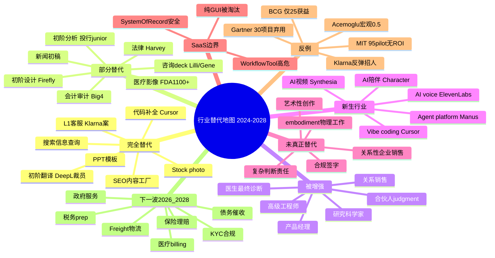

# 04 · 行业替代地图

> 一张可索引的"行业 × 任务 × 替代度"地图：哪些已经被吃掉，哪些只是被增强，哪些会在 2026-2028 被端到端地重塑。

## 一句话总览

**AI 替代不按"行业"颗粒度发生，而按"任务"颗粒度发生**。同一行业里，"高频、低风险、有明确正确答案、单 turn 输出"的任务先被吃掉（搜索、客服 L1、翻译、SEO 内容、代码补全、初阶法律研究、初阶分析报告）；"长上下文、关系性、需要责任承担、需要 embodiment"的任务暂时安全（关系销售、复杂判断、医生最终决策、CEO 战略、家政护理）。但 2024 年 BCG/MIT 数据同时揭穿了一个反向真相——**75% 的企业 AI 项目目前没有创造可衡量价值**，所以"替代发生"和"替代成功创造企业级 ROI"是两件不同的事。下一波 2026-2028 的真正分水岭，不是"哪个行业被替代"，而是"哪家公司能让多 agent 端到端跑完一个工作流"。

## 关键句提纲（10 条）

1. 替代发生在 task 层，不在 industry 层。一个法律 5 人小组里，4 个人的工作可以被吃掉，但案件最终责任人不能。
2. 已发生（高确定性）的完全/接近完全替代：Google 搜索的"信息查询"任务、L1 客服、初阶笔译、SEO 长尾内容工厂、代码片段补全、PowerPoint 模板生成、初阶尽调摘要、教培答疑。
3. 部分替代（人+AI 协作显著加速但仍需人）：会计审计（Big Four 已自动化 60-70% 标准分析）、医疗影像、咨询 deck 生成、新闻初稿、初阶设计稿。
4. 真正未被替代：复杂判断责任承担、关系性销售、监管/合规签字、需要 embodiment 的物理工作、艺术性"为什么"。
5. 反例最强：MIT NANDA 报告 95% 企业 GenAI pilot 没有可衡量 P&L 影响；BCG 2025 只有 25% 企业从 AI 中获得显著价值，5% 真正规模化获益；Klarna 2025 年承认 AI 客服替代过头要重新招人。
6. 软件壁垒分层：System of record（Salesforce、Workday、Box）依然安全，但 Workflow tool（Notion、Asana、低代码、传统 BI、ServiceNow 部分模块）正被 AI agent 直接吃。
7. 下一波（2026-2028）最危险位置：Tier 2 法律研究/Paralegal、初级税务/审计员、招聘助理、入门级数据分析师、初阶财务分析师、L1 IT helpdesk、初级广告投放优化师、入门级会计、初级翻译。
8. AI 替代≠失业总量下降。Goldman Sachs 估全球 3 亿岗位"暴露"于 AI，但 Acemoglu 估 10 年总 TFP 仅 +0.53-0.66%——意思是"再分配"压力远大于"总产出"压力。
9. SaaS 被吃边界的一句话判断：**有专属数据 + 有合规责任 + 有跨部门关系网**的 SaaS 安全；**只是个输入框 + 输出框的工具**会被 ChatGPT/Claude/Cursor 类通用 agent 吃掉。
10. 真正的 alpha：在 BPO（India/PH 800 万岗位）、保险理赔、债务催收、freight/logistics、政府服务这些"非性感"的高劳动密集服务业中，垂直 agent 才刚开始；这是 2026-2028 真正的赌注。

## 替代分类框架

把每一个"行业 × 任务"放到下面四个格子里：

| 类别 | 定义 | 代表案例 | 时序判断 |
|------|------|----------|----------|
| **完全替代** | 90%+ 任务可由 AI 独立完成且企业不再雇人 | 搜索、L1 客服、初阶翻译、SEO 内容工厂、PPT 模板、stock photo | 已发生（2023-2025） |
| **部分替代** | 人+AI 协作，AI 完成 50-80% 工作，人做最后一公里 | 法律 review、医疗影像、code review、设计、咨询 deck、新闻初稿、初阶审计 | 进行中（2024-2026） |
| **被增强** | AI 让一个人能做以前 5 个人的事，但人数不直接砍掉，而是产能扩张 | 高级研发、产品经理、senior engineer、CFO、研究科学家、企业销售 | 持续中 |
| **新生行业** | AI 才有的全新 SKU | 生成式视频（Synthesia、Sora）、AI voice clone（ElevenLabs）、AI 陪伴（Character.ai、Replika）、Vibe coding（Cursor、Lovable）、Agent platform（LangChain、Crew、Manus） | 2024+ 持续诞生 |

判断口诀：
- 任务可以**单 turn** 完成 → 完全替代
- 任务需要**多次反馈、多人协作、跨系统操作** → 部分替代
- 任务**结果不能错**，且错的代价高（医疗、合规、法务签字、CEO 决策）→ 被增强而非替代
- 任务在过去**根本不存在**（个人 24h 视频化身、5min 出 SaaS）→ 新生

## 行业逐项分析

### 1. 搜索 / 信息检索（替代程度：高）

- **现状数据**：Perplexity 2025 年 5 月单月 7.8 亿次查询，2025 年总查询超 50 亿次（约为 Google 同期的 9% 左右）；Perplexity 2025 年收入约 $200M，2026 年目标 $650M；ChatGPT DAU/MAU 比已逼近 Reddit 级。
- **谁被替代**：Google 的"信息查询型"流量（不是导航/交易型）正在被 AI 答案吃掉；SEO 内容农场的下游变现路径首先崩塌（CTR 跌 30-40%）。
- **未替代环节**：本地、地图、视频、电商搜索 Google 仍稳；Google Discover/AI Overviews 是反吃。
- **时序判断**：信息查询型任务 5 年内 50%+ 转移到 AI 端；Google 不会死，但其"广告税"基础在缩水。

### 2. 客户服务 / 呼叫中心（替代程度：极高，但反弹明显）

- **Klarna 案例（最被引用）**：2024 年 2 月宣称 AI 助手处理 230 万对话/月，相当于 700 名 agent，节约 $40M/年，问题解决时间下降 82%；35 种语言 24x7。但 2025 年 5 月 CEO Sebastian Siemiatkowski 公开承认"AI 替代客服过头了"，重新招回部分员工，转向"AI handles simple, humans handle nuance"的混合模式。
- **BPO 整体**：印度+菲律宾约 800 万 BPO 岗位"高度暴露"；2025 年印度 IT 大厂净招聘接近零；菲律宾官方承认 2.5M 2028 目标作废。LimeChat 类 agent 已能处理 95% query。
- **Gartner 预测**：2029 年 80% 常见客服 issue 由 AI 解决。
- **未替代**：高情绪、Tier 3 复杂纠纷、合规相关 escalation。
- **时序判断**：L1 80% 替代是 2025-2027 的事；L2 是 2027-2030。

### 3. 翻译 / 本地化（替代程度：极高）

- **数据**：DeepL 2025 年裁员 25%（约 250 人）；微软 2025 年 7 月研究把"翻译"列为最暴露职业第一名；魁北克受访译者收入 2024 年下降 60%，2025 年预计跌 80%。
- **结构变化**：行业从"按字数收费"转向"按 post-edit 小时收费"，单价下降 30-50%。
- **未替代**：文学翻译、法律合同最终签字版本、医疗/制药高合规翻译。
- **时序判断**：通用翻译 95% 被吃已是定局，剩下的 5% 高端市场会出现"AI + 顶级译者"双签产品。

### 4. 软件开发 / 代码（替代程度：部分替代但加速极快）

- **Cursor / Anysphere**：从 0 到 $2B ARR 用了 3 年（B2B 软件史上最快）；2025 年 1 月 $100M、6 月 $500M、11 月 $1B、2026 年 2 月 $2B；Fortune 1000 中 70% 是其客户；Enterprise 占比从 25%→60%。
- **Devin / Cognition**：ARR 从 $1M（2024.9）→$73M（2025.6）；估值 $4B→$10.2B；Devin 2.0 的 PR merge 率 67%（前代 34%）；Goldman Sachs 12,000 工程师试点，CIO 称"hybrid workforce"产能提升 20%。
- **影响**：初级前端、模板代码、单元测试、bug fix 这些"junior dev"工作直接被吃；Big Tech 2024-2025 集中削减初级岗位，硅谷"new grad SWE"招聘崩盘。
- **未替代**：架构设计、系统调试、跨团队协调、面向客户的需求挖掘、高风险代码 review。
- **时序判断**：到 2027 年"junior 后台开发"作为入门岗将基本消失，但"AI native PM/工程师"会成为新职级。

### 5. 设计 / 创意（视觉/UI/品牌）（替代程度：部分替代）

- **Adobe Firefly**：2025 年 4 月生成 220 亿资产；占 AI 设计工具市场 29%（Midjourney 19%、Canva 16%、DALL-E 14%）；Creative Cloud 内 32.5M 用户有访问权，45% 活跃使用。
- **Midjourney**：2025 估收入 $500M+；订阅制不接 VC，仍盈利。
- **替代场景**：Stock photo、初稿草图、moodboard、营销 banner、低端 UI 模板、社交内容素材——已大量替代。
- **未替代**：品牌系统设计、复杂动态界面、产品级交互逻辑、艺术性"为什么这样而不是那样"。
- **时序判断**：初阶视觉设计岗到 2027 年裁 30-50%，剩余的会向"prompt + 审美 + 品牌战略"演化。

### 6. 内容写作 / 营销 / SEO（替代程度：高）

- **Upwork 数据 2025**：AI 相关自由职业技能需求 YoY +109%；同时传统"通用文案"需求骤降。
- **真实案例**：多名英文 copywriter 报告"被同事用 ChatGPT 取代"。
- **结构变化**：写作不死，但单价崩，需求转向"strategist + ghost writer + 品牌口吻 + SEO 思维"组合体；纯产文岗位消失。
- **新生**：Newsletter ghostwriter、AI 提示词专家、"内容策略师"。
- **未替代**：高品牌资产的 longform 调研报道、付费深度长文（Stratechery 类）。

### 7. 法律（替代程度：部分替代但加速）

- **Harvey AI**：2025 年 8 月 $100M ARR，2026 年 1 月 $190M ARR；估值 $11B（2026 年 3 月）；客户 1,000+，含 Am Law 100 的 50%；A&O Shearman、Paul Weiss、Mayer Brown、Orrick 在列。
- **EvenUp**（personal injury demand letter 自动化）等垂直类已规模化。
- **被吃任务**：合同 review、判例研究、初稿起草、e-discovery、合规摘要——80% 已可自动化。
- **未替代**：庭审策略、客户关系、合伙人级判断、签字责任。
- **时序判断**：Paralegal 和 Tier 2 associate 数量到 2028 年会大幅压缩；这是律所合伙制的根本经济学被改写。

### 8. 医疗 / 诊断（替代程度：被增强为主）

- **FDA 数据**：截至 2025 年底批准 1,451 个 AI 医疗器械，其中 1,104 个为放射学（76%）；2025 年单年 295 项新批准。
- **Hippocratic AI**：与 UHS、Cincinnati Children's、Cleveland Clinic、OhioHealth 合作；患者满意度 9.0/10；1.8 亿次患者交互、99.9% 临床建议正确率、0.00% severe harm 事件（自报数据）；专门给护士的 Nurse Co-Pilot 声称每班节省 1-4 小时。
- **就业不降反增**：BLS 预测 2024-2034 放射科医生岗位 +5%（高于平均 3%）；Indeed 数据放射学职位多于 5 年前。
- **被替代环节**：基础影像 triage、转录、出院随访电话、患者教育。
- **未替代**：最终诊断签字、复杂 multi-modal 决策、医患关系、紧急救治。
- **时序判断**：医疗是"被增强但岗位不减"的最强例证，因为人口老龄化把医疗需求放大得比 AI 快。

### 9. 金融 / 分析师 / BI（替代程度：高）

- **被吃任务**：研究报告摘要、估值模型搭建、数据 cleaning、quarterly call 转录与 highlight、初阶 BI dashboard 解读。
- **影响**：高盛 2024-2025 内部把"junior analyst"工作量压缩 50% 以上；Bloomberg GPT、JPMorgan IndexGPT 等内化工具替代外部供应商。
- **未替代**：客户关系、deal sourcing、IPO/M&A 谈判、风险定性判断。
- **时序判断**：Bulge bracket 投行 IBD junior 班裁员是 2025-2027 必然事件；中后台风控、合规初阶岗也会大量消失。

### 10. 咨询 / 战略（替代程度：部分替代+被增强双轨）

- **McKinsey Lilli**：2023 上线，月查询 50 万+；员工人数 45,000（2022）→40,000（2025 中）→进一步 10% 削减（2025.12）。
- **BCG Gene 平台**（2025 末）：自动化 60-70% 标准分析流程；HBS 实验：BCG 顾问用 AI 任务量 +12.2%、速度 +25.1%、质量 +40%。
- **客户偏好转变**：IBM 2025 研究 86% 咨询采购方主动要 AI-enabled service；66% 表示会换掉不会用 AI 的咨询商。
- **被吃任务**：Slide deck、模板分析、benchmark 研究、quick survey、SWOT。
- **未替代**：高管人脉、行业 know-how、变革管理实施、责任承担。
- **时序判断**：Big 3 的 BA/Associate 班 25-35% 会在 2026-2028 内被 AI 取代；合伙人比反而上升。

### 11. 教育 / 培训（替代程度：高，且新生市场更大）

- **教培答疑、作业批改、个性化辅导**：被 ChatGPT/Khanmigo/Class Companion 等大量替代。
- **新生市场**：AI 老师（Synthesis Tutor、Khan Academy Khanmigo）、AI 语言陪练（Speak、ELSA）、AI 编程导师（Codecademy AI、Replit Agent）。
- **未替代**：动机激发、社交学习、纪律管理、考试公正性、儿童早教情感陪伴。
- **时序判断**：2026-2028 全球 K12 教辅产业洗牌，新东方/学而思等已被迫重做产品；高校"essay 作业"被迫转向口头答辩。

### 12. 会计 / 审计（替代程度：高，但合规护城河仍在）

- **Big Four 平台**：Deloitte Zora（NVIDIA 合作 agentic）、KPMG Workbench / Clara（已部署 95,000 名审计师）、PwC、EY 都已有多 agent 平台。
- **PwC US**：2025 年内部资料显示未来 3 年 graduate 招聘削减 1/3，"AI 影响"被明确列为原因。
- **预测**：前 PwC 高管 Alan Paton 称"3-5 年内审计/税务/咨询 50% 角色可被自动化，AI 已能完成 90% 审计流程"。
- **未替代**：签字责任、监管沟通、复杂 forensic、客户关系。

### 13. 销售 / CRM（替代程度：被增强为主）

- **被吃任务**：lead enrichment、cold email 起草、CRM 数据维护、call note 转录与 next-step、初阶 outbound BDR。
- **未替代**：关系性 enterprise sales、合同谈判、客户成功的高阶 advisory。
- **时序判断**：BDR/SDR 这一层 2025-2027 大幅压缩；Account Executive 和 Customer Success Manager 反而被 AI 增强。

### 14. HR / 招聘（替代程度：部分替代）

- **被吃任务**：JD 写作、简历筛选、初轮电话、offer letter 起草、员工 FAQ。
- **风险**：HireVue 类 AI 面试争议；NYC AEDT 等监管反弹。
- **未替代**：employer branding、复杂员工纠纷、文化建设、senior hire close。

### 15. RPA / 业务流程（替代程度：被吞并）

- **结构性变化**：传统 RPA（UiPath、Automation Anywhere）正被 LLM-based agent 重构；UiPath 股价 2024-2025 大幅承压。
- **未来**：传统"规则驱动 RPA"会被并入"自主 agent + tool use"的统一栈。

### 16. 科学研究 / R&D（替代程度：被增强）

- **AlphaFold 系列、Isomorphic、Recursion、Insilico**：药物发现明显加速。
- **影响**：博士生级别"读 paper + 跑实验"工作大幅压缩，PI 级判断能力依然稀缺。
- **新生**：AI for science 本身成为一个新的产业类目。

## 反例 & 替代失败案例

理解"哪些没被替代"和"哪些替代失败"，比理解"哪些被替代"更重要。

| 反例 | 数据/出处 | 启示 |
|------|----------|------|
| **MIT NANDA 报告 2025** | 95% 企业 GenAI pilot 无可衡量 P&L 影响 | 替代发生≠企业能拿到收益 |
| **BCG 2025 AI Value Gap** | 仅 25% 企业从 AI 获显著价值，5% 规模化获益 | 价值集中在头部少数公司 |
| **Gartner 预测** | 30% 企业 GenAI 项目 2025 年底前会被弃用 | POC 到生产之间的死亡谷依然致命 |
| **Klarna 反弹** | 2025 年承认裁员过头，CSAT 跌后重新招人 | 客服替代有"恢复反弹"区间 |
| **Acemoglu (MIT)** | 估 10 年 AI 对 TFP 增益仅 0.5-0.66%，GDP +1.1-1.6% | 宏观替代效应远小于科技 narrative |
| **Air Canada chatbot 案** | 加拿大法庭 2024 判决，AI 给错信息公司须赔偿 | 法律责任不会自动转移到 AI |
| **DPD chatbot 骂街** | 2024 年初公开事故 | 部署者承担品牌风险 |
| **Cursor "stop coding"事件** | 2025 年 Cursor 自身告诉用户"你应该自己写"——内部数据矛盾 | 即便最强 AI native 公司也面临"AI 学错"的回滚 |

## SaaS 软件的"被吃"边界

把 SaaS 二分会失败，应该三分：

### A 类：System of Record——被吃概率低
- 例子：Salesforce、Workday、SAP、ServiceNow（核心 ITSM）、Veeva、Toast、Box、Snowflake、Datadog 核心。
- 壁垒：合规、跨部门数据图谱、auditable 操作日志、多年 customizations、客户停机成本极高。
- Aaron Levie 论点：在"100x more software"的 agent 时代，system of record **更重要**而非更不重要——因为 agent 需要可审计的"权限和真相源"。

### B 类：Workflow Tool——被吃概率中
- 例子：Notion、Asana、Monday、Mailchimp、SurveyMonkey、低代码（多数）、传统 BI dashboard、传统 RPA、CRM 旁挂工具、HR ATS 二线产品。
- 壁垒：UX、网络效应、模板。
- 风险：通用 ChatGPT/Claude/Cursor + connector 直接吃掉 30-50% 用例；初创可被一个 AI 助理替代。

### C 类：纯 GUI Wrapper / 单点工具——被吃概率高
- 例子：单功能内容生成器、传统在线 grammar 检查、模板 PPT 工具、单点翻译软件、stock photo、传统 SEO 工具的部分模块。
- Bessemer 数据：纯 "AI Wrapper"估值倍数已开始崩。

判断口诀（来自 Sequoia Sonya Huang 2025 AI Ascent 演讲精神）：**"应用层是价值最终汇聚的地方"，但只汇聚在那些拥有专属数据、闭环工作流、和分发渠道的应用上**。

## 下一波（2026-2028）最可能被重塑的

按"高概率 × 大体量"排序：

1. **保险（理赔、定损、精算）**：流程标准化高、规则密度高、文档密集——下一波最大蛋糕。
2. **政府/政务服务**：UK/Singapore 已有项目；中国地方试点 12345 类。
3. **物流/Freight**（Salient、HappyRobot、Pallet、Augment）：调度、报价、call center 全部 voice agent 化。
4. **债务催收（Salient 等）**：voice agent 经济学最佳。
5. **保险经纪/代理**：B-end 销售工作流。
6. **医院后台、医疗保险结算**：billing、prior auth 自动化空间巨大。
7. **金融机构合规/反洗钱/KYC**：文本密集、规则化、监管确定。
8. **公司内部 IT helpdesk**（Glean、Moveworks、Cresta 类）：Glean 2025 ARR 突破 $250M，YoY +150%。
9. **商业地产估值/法律 due diligence**。
10. **税务 prep（Intuit TurboTax 自身被新一代替代风险）**。

## 不同立场和争议（至少 4 条）

1. **a16z / Sarah Wang 派**：每个 SaaS 都将被 AI-native 重写，原 vendor 大量被 disrupt；CIO 数据显示 75% 年增、77% 来自 IT 主预算（不是 innovation budget）——意味着这是结构性转移而非实验。
2. **Aaron Levie / Box 派**："不是 AI agent 取代 SaaS，而是 SaaS + agent 混合"。Levie 的反向论点是：agent 越多越自主，"system of record"反而更关键，因为需要可审计的真相源。
3. **Ben Thompson Stratechery 派**：reasoning 模型让 marginal cost 重新出现，aggregation theory 不再无摩擦运行；OpenAI 若想成为新 aggregator 必须造广告模型；现存巨头并不会自动失败。
4. **Cal Newport / Daron Acemoglu 派**：宏观生产力提升 10 年只有 0.5-0.66% TFP；AI 替代叙事过度膨胀，真实结构性变化是缓慢的；MIT 95% pilot 无 ROI 数据印证了这点。
5. **Sequoia Sonya Huang 派**：模型层会汇聚到少数巨头，但应用层会百花齐放，**留存率（retention）是 2025 年开始最关键指标**——这一层 PMF 才有真公司。
6. **Aaron Levie vs Marc Benioff 隔空互怼**：Benioff 早期表态 "no software"（agent 取代 SaaS），但 Salesforce 自己的 Agentforce 战略悄悄演化成"agent on top of system of record"——和 Levie 趋同。

## 前瞻假设（5 条可验证）

1. **2027 年初前**，Cursor / Replit / Devin / Claude Code 类公司 ARR 加总会超过 $20B，而传统 IDE（IntelliJ、VS Code 收入侧）和初阶 SWE 招聘双双继续萎缩。**验证指标**：BLS 数据 + Stack Overflow Survey + Cognition/Anysphere ARR 公开披露。
2. **2026 年内**，至少一家 AmLaw 100 律所宣布"取消传统 first-year associate 招聘班"，转向 AI-native attorney apprenticeship 模式。**验证指标**：律所招聘公开声明 + Above the Law 报道。
3. **2027 年**，BPO 龙头（TCS、Infosys、Wipro、Concentrix、Teleperformance）会出现一家 ARR 同比下降 10%+，并被迫公开承认"AI 是结构性威胁"。**验证指标**：四大 BPO 财报 + 印度 NASSCOM 年度数据。
4. **2026-2027**，"vertical AI agent"垂直独角兽数量会从 2024 年底的 ~10 家暴涨至 50+ 家，且至少 3 家进入 $5B 估值（Harvey、Glean、Abridge 类节奏）。**验证指标**：CB Insights、Sacra、PitchBook 数据。
5. **2028 年前**，至少一个国家级监管机构（EU、英国、新加坡）会强制企业披露"AI 替代了多少岗位"——这将让"AI 替代"从公司级 KPI 转为合规级 KPI。**验证指标**：欧盟 AI Act 配套法规 + UK Ofgem 类机构发布。

## Mermaid 脑图

## 来源库

| 类型 | 标题 | 作者/机构 | 日期 | 链接 | 关键数据/洞察 |
|------|------|-----------|------|------|---------------|
| 研报 | The State of AI 2025: Agents, innovation, and transformation | McKinsey QuantumBlack | 2025.11 | https://www.mckinsey.com/capabilities/quantumblack/our-insights/the-state-of-ai | 88% 企业用 AI；仅 39% 报告 EBIT 影响；高绩效组织 2.8x 更可能重构工作流 |
| 研报 | Are You Generating Value from AI? The Widening Gap | BCG | 2025.9 | https://www.bcg.com/publications/2025/are-you-generating-value-from-ai-the-widening-gap | 75% 视 AI 为战略优先；仅 25% 拿到显著价值；5% 规模化获益 |
| 研报 | The GenAI Divide: State of AI in Business 2025 | MIT NANDA | 2025.8 | https://fortune.com/2025/08/18/mit-report-95-percent-generative-ai-pilots-at-companies-failing-cfo/ | 95% pilot 无 P&L 影响；buy 比 build 成功率 67% vs 33% |
| 研报 | How 100 Enterprise CIOs Are Building and Buying Gen AI in 2025 | a16z (Sarah Wang 等) | 2025 | https://a16z.com/ai-enterprise-2025/ | 企业 AI 支出 YoY +75%；innovation budget 占比 25%→7%；77% 来自 IT 预算 |
| 研报 | The Top 100 Gen AI Consumer Apps – 6th Edition | a16z (Olivia Moore 等) | 2025 | https://a16z.com/100-gen-ai-apps-6/ | Manus、Genspark 类端到端 agent 上榜；agentic 主导新版本 |
| 研报 | The State of AI 2025 | Bessemer Venture Partners | 2025 | https://www.bvp.com/atlas/the-state-of-ai-2025 | 垂直 AI 估值 9-12x ARR；普通 SaaS 5-7x；AI Wrapper 倍数崩塌 |
| 研报 | AI Ascent 2025（视频与文章） | Sequoia Capital (Sonya Huang, Pat Grady) | 2025.5 | https://sequoiacap.com/article/ai-ascent-2025/ | "应用层是价值最终汇聚处"；coding "screaming PMF"；ChatGPT DAU/MAU 接近 Reddit |
| 研报 | 2026: This is AGI | Sequoia Capital | 2025-2026 | https://sequoiacap.com/article/2026-this-is-agi/ | Sequoia 公开宣称 2026 年是 AGI 元年 |
| 研报 | Gartner Predicts 30% of GenAI Projects Will Be Abandoned After PoC by End of 2025 | Gartner | 2024.7 | https://www.gartner.com/en/newsroom/press-releases/2024-07-29-gartner-predicts-30-percent-of-generative-ai-projects-will-be-abandoned-after-proof-of-concept-by-end-of-2025 | 30% 弃用率；定制 LLM $5-20M 成本 |
| 文章 | Checking In on AI and the Big Five | Stratechery (Ben Thompson) | 2025 | https://stratechery.com/2025/checking-in-on-ai-and-the-big-five/ | aggregation theory 在 AI 时代演化；OpenAI 需广告模型 |
| 文章 | AI's Uneven Arrival | Stratechery (Ben Thompson) | 2025 | https://stratechery.com/2025/ais-uneven-arrival/ | 替代不均衡；行业渗透节奏不一 |
| 文章 | Box CEO Aaron Levie on AI's 'era of context' | TechCrunch | 2025.9 | https://techcrunch.com/2025/09/11/box-ceo-aaron-levie-on-ais-era-of-context/ | "100x more software"中 system of record 更关键 |
| 文章 | Box CEO Aaron Levie on how AI is changing enterprise SaaS | TechCrunch | 2025.10 | https://techcrunch.com/2025/10/29/box-ceo-aaron-levie-on-how-ai-is-changing-the-enterprise-saas-landscape/ | SaaS+agent 混合 vs 替代论 |
| 论文 | The Simple Macroeconomics of AI | Daron Acemoglu (NBER) | 2024.4 | https://www.nber.org/papers/w32487 | 10 年 TFP 增益 ≤0.66% |
| 文章 | A Nobel laureate on the economics of artificial intelligence | MIT Tech Review | 2025.2 | https://www.technologyreview.com/2025/02/25/1111207/a-nobel-laureate-on-the-economics-of-artificial-intelligence/ | Acemoglu 完整批评 AI 替代叙事 |
| 文章 | Don't Believe the AI Hype | Daron Acemoglu (Project Syndicate) | 2024.5 | https://www.project-syndicate.org/commentary/ai-productivity-boom-forecasts-countered-by-theory-and-data-by-daron-acemoglu-2024-05 | 经济理论与数据均不支持 AI 大爆发预测 |
| 案例 | Klarna's AI Replaces 700 Agents, Saves $40M/Year | AI Business | 2024 | https://aibusiness.vc/b2b/klarna-ai-replaces-700-agents | Klarna 完整数据：230 万对话、35 语言、解决时间 -82% |
| 案例 | Klarna CEO admits aggressive AI job cuts went too far | mlq.ai | 2025 | https://mlq.ai/news/klarna-ceo-admits-aggressive-ai-job-cuts-went-too-far-starts-hiring-again-after-us-ipo/ | 2025 反弹叙事的源头 |
| 案例 | Cursor's Anysphere nabs $9.9B valuation, soars past $500M ARR | TechCrunch | 2025.6 | https://techcrunch.com/2025/06/05/cursors-anysphere-nabs-9-9b-valuation-soars-past-500m-arr/ | $100M→$500M ARR 6 个月 |
| 案例 | Cursor in talks to raise $2B at $50B valuation | TheNextWeb | 2026 | https://thenextweb.com/news/cursor-anysphere-2-billion-funding-50-billion-valuation-ai-coding | $2B ARR 三年达成 |
| 案例 | Devin's 2025 Performance Review | Cognition | 2025 | https://cognition.ai/blog/devin-annual-performance-review-2025 | Goldman Sachs 12k 工程师、PR merge 67%、4x 速度 |
| 案例 | Harvey: $11B valuation legal AI | CNBC | 2026.3 | https://www.cnbc.com/2026/03/25/legal-ai-startup-harvey-raises-200-million-at-11-billion-valuation.html | $190M ARR、Am Law 100 50% |
| 案例 | Glean Surpasses $200M in ARR | Glean Press | 2025 | https://www.glean.com/press/glean-surpasses-200m-in-arr-for-enterprise-ai-doubling-revenue-in-nine-months | 9 个月 ARR 翻倍 |
| 案例 | Hippocratic AI Launches AI Front Door and Nurse Co-Pilot | PR Newswire | 2026.4 | https://www.prnewswire.com/news-releases/hippocratic-ai-launches-two-industry-firsts-ai-front-door-and-nurse-co-pilot-to-expand-clinical-care-and-access-302745186.html | UHS、Cleveland Clinic 合作；99.9% 临床建议正确 |
| 案例 | Adobe Firefly Hits 22B Assets by April 2025 | Complete AI Training | 2025 | https://completeaitraining.com/news/adobe-firefly-hits-22b-assets-by-april-2025-captures-29/ | 29% 设计 AI 市场份额 |
| 案例 | Synthesia $146M ARR | Sacra | 2025.9 | https://sacra.com/c/synthesia/ | 视频生成商业化代表 |
| 案例 | ElevenLabs hits $500M ARR | Sacra | 2026.4 | https://sacra.com/c/elevenlabs/ | Fortune 500 41% 客户渗透 |
| 案例 | Perplexity 780M monthly queries | Just Think AI | 2025 | https://www.justthink.ai/blog/perplexitys-780m-monthly-queries-signaling-the-ai-search-revolution | 5月 7.8 亿次；Google ~9% 量级 |
| 数据 | AI threatens millions of BPO jobs in India and Philippines | Outsource Accelerator | 2025 | https://news.outsourceaccelerator.com/ai-threatens-bpo-india-philippines/ | 2-3M 暴露；菲律宾 2.5M 2028 目标作废 |
| 数据 | Translators losing jobs to AI / DeepL 25% layoffs | BoingBoing/LatestLY | 2026.1 | https://boingboing.net/2026/01/25/translators-are-losing-jobs-to-ai-that-produces-consistently-mediocre-results/ | 收入跌 60-80% |
| 数据 | 4 in 10 translators are losing work to AI | TheNextWeb | 2024 | https://thenextweb.com/news/translators-losing-work-ai-machine-translation | 行业整体压缩 |
| 数据 | FDA AI Approvals Surge Past 1k for Radiology | The Imaging Wire | 2025.12 | https://theimagingwire.com/2025/12/10/ai-enabled-medical-devices-granted-fda-marketing-authorization/ | 1,104 放射学 AI 设备获批 |
| 数据 | Worried about AI replacing your job? Radiology case study | CNN | 2026.2 | https://www.cnn.com/2026/02/09/tech/ai-replacing-jobs-concerns-radiology | 放射科岗位反而 +5% |
| 数据 | Big 4 AI Agents 2025（KPMG Workbench、Deloitte Zora 等） | Unity Connect | 2025 | https://unity-connect.com/our-resources/blog/big-4-ai-agents/ | PwC 招聘 -1/3；Clara 95k 审计师 |
| 数据 | How AI is creating a rift at McKinsey, Bain, BCG | The Ken | 2025-2026 | https://the-ken.com/story/bcg-and-mckinsey-sell-speed-as-ai-shakes-up-consulting-so-why-arent-consultants-buying-it/ | McKinsey 45k→40k→再裁 10% |
| 文章 | Vertical AI Agents: The Next $300 Billion Disruption | Medium (Julio Pessan) | 2025 | https://medium.com/@julio.pessan.pessan/vertical-ai-agents-the-next-300-billion-disruption-in-tech-a18702c76efd | Bessemer 估垂直 AI 市值 10x 传统 SaaS |
| 文章 | The AI agent market map: March 2025 edition | CB Insights | 2025.3 | https://www.cbinsights.com/research/ai-agent-market-map/ | 11 家 finserv 垂直；freight、催收等"非性感"赛道 |
| 文章 | Ethan Mollick: AI moving from chatbot to co-worker | Seeking Alpha | 2025 | https://seekingalpha.com/news/4563600-researcher-ethan-mollick-says-ai-is-moving-from-chatbot-to-co-worker-with-disruption-close | task-level disruption 框架 |
| 数据 | Upwork In-Demand Skills 2026 | Upwork | 2025-2026 | https://investors.upwork.com/news-releases/news-release-details/upworks-demand-skills-2026-demand-top-ai-skills-more-doubles-ai | AI 技能需求 YoY +109% |

---

**作者注**：此文为 04 篇章，与 03（能力跃迁）、05（壁垒与护城河）互为镜像。"被替代"的另一面是"新生赛道"——这两个面在 2026-2028 同时加速。
