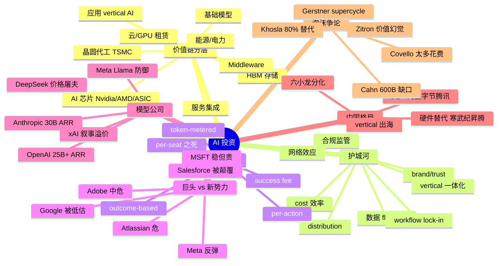

# 05 · 投资与商业模式

> 视角：钱往哪流、谁会赢、定价模式怎么变、护城河长什么样
> 写作时间：2026 年 5 月
> 关键词：价值链分层 · wrapper trap · outcome-based · vertical AI · $600B question

---

## 一句话总览

**AI 价值链的利润分布正在发生十年一遇的重排：基础设施层短期暴利但承受估值与折旧风险；模型层从「会被商品化」反转为「越往 agent 走越能整合赚厚利润」；应用层不再是 wrapper 笑话，而是分化成「死掉的薄壳」和「带着工作流锁定与数据 flywheel 的厚壳」两极。** 投资人能赚到钱的姿势只有四种：(1) 押 picks-and-shovels（Nvidia/CoreWeave/电力/HBM）；(2) 押模型 + 应用一体化（OpenAI/Anthropic 直接做 ChatGPT 与 Claude Code）；(3) 押有真实工作流嵌入的 vertical AI（Cursor/Harvey/Glean/Perplexity）；(4) 押「AI native 替代现有 SaaS 巨头」的反叛叙事。SaaS 的 per-seat 定价正被 outcome-based / token-metered / per-action 打成筛子，Salesforce 同时挂出三种价格表已是公开承认。

---

## 关键句提纲（10 条）

1. **Nvidia FY2026 全年营收 $215.9B、毛利率 71%、数据中心同比 +75%。** 这不是泡沫的描述，这是泡沫尚未破裂的描述——两者并不矛盾。
2. **OpenAI 25B+ 年化 / Anthropic 30B 年化（均为 2026 Q1 数据）**，三年内从零跑到 SaaS 用 20 年才到达的规模——但烧钱速度同样夸张，OpenAI 上半年 burn $9.7B。
3. **David Cahn 的「$600B question」从 2024 年的 $200B 缺口翻三倍**——基础设施投资与终端价值之间的剪刀差仍在扩大，但 OpenAI/Anthropic 营收曲线给了乐观派更多弹药。
4. **wrapper trap 是真的，但反例同样真。** Cursor 12 个月从 $100M ARR 跑到 $1B+，Harvey 从 $100M 到 $190M ARR + $11B 估值，Glean 9 个月翻倍到 $200M ARR——薄壳死于 80% 比例，厚壳估值溢价 9-12x ARR。
5. **per-seat is dying。** Salesforce 同时支持 per-user / per-conversation ($2)/per-action (Flex Credits, $0.10) 三套定价，标志企业软件迈入 outcome-based。
6. **DeepSeek 震撼一夜抹去 Nvidia $590B 市值**，但事后 SemiAnalysis 揭穿其实际硬件投入约 $1.6B、50,000 张 Hopper——叙事比数据跑得快得多，这本身就是投资机会。
7. **Ben Thompson 反转关键洞察**：模型商品化 → 应用层捡便宜 → 但模型公司向下做应用（ChatGPT/Claude Code）整合后利润反而比预期更高。Aggregation Theory 让位 Integration Theory。
8. **Vertical AI 估值 9-12x ARR vs 传统 SaaS 5-7x**，Bessemer Cloud 100 名单 AI 公司占总估值 42%（创历史新高）。
9. **MSFT Copilot 在 4.5 亿商业订阅里只渗透 3.3%（1500 万付费 seats），市场份额从 18.8% 跌到 11.5%**——巨头分发优势没有想象中那么自动转化为胜势。
10. **AI capex 2025 ~$500B、2026 预计逼近 $700B**——这是科技史上最大的一次资本支出。即便 ROI 兑现，回报周期也会以 5-10 年计算。

---

## AI 价值链分层（含利润分布预测）

| 层 | 代表玩家 | 当前利润 (2025-26) | 5 年后预测 | 主要护城河 | 风险点 |
|---|---|---|---|---|---|
| **能源 / 电力** | NextEra、Vistra、Constellation、SMR 玩家 | 中等，电网瓶颈推高现货价 | **极厚**：被严重低估，AI 数据中心耗电将进入电网长期赤字 | 物理资产、地理稀缺、监管 | 电改政策、SMR 落地不及预期 |
| **晶圆代工** | TSMC、三星、Intel Foundry | TSMC 一家独大、毛利 50%+ | 厚：AI 芯片几乎全在 TSMC，CoWoS 封装是真正瓶颈 | 工艺代差、CoWoS 产能 | 地缘、台海、3nm 以下良率 |
| **HBM / 存储** | SK Hynix、三星、美光 | 极厚：HBM3E 满产、价格垂直拉升 | 厚但价格回归：扩产周期 18-24 月 | 良率工艺、长期合约绑定 | 扩产过剩 |
| **AI 芯片** | Nvidia (~92%)、AMD、Google TPU、AWS Trainium、Cerebras、Groq（被 Nvidia $20B 收编）| Nvidia 一家通吃，毛利 75% | **份额下降**至 70-75%，但绝对值仍涨 | CUDA 生态、NVLink、整机柜系统 | 客户自研 ASIC、推理迁移 |
| **云 / GPU 租赁** | AWS、Azure、GCP、Oracle、CoreWeave、Lambda | 厚：Azure +33%、AWS 重新加速 | 厚但分化：超大规模云 + 专用 AI 云双轨 | 资本壁垒、网络效应、捆绑 | 折旧、利用率波动 |
| **基础模型** | OpenAI、Anthropic、Google DeepMind、xAI、Meta、DeepSeek、Mistral、月之暗面、智谱、阿里通义、字节豆包 | 高营收但高烧钱；OpenAI/Anthropic 营收 2025-26 翻 5-15 倍 | 头部 3-5 家整合下沉做应用，长尾被开源吞噬 | 算力、数据、人才、品牌、Agent 整合 | 模型商品化、Capex 黑洞 |
| **Middleware / 工具链** | LangChain、Pinecone、Weaviate、LlamaIndex、Modal、Replicate、Hugging Face | 弱：被模型方/云方挤压 | 多数被吞并/边缘化，少数作为 MCP 标准基础设施 | 开源社区、生态绑定 | 大厂下场、协议被 OpenAI/Anthropic 标准化 |
| **应用层 / vertical AI** | Cursor、Perplexity、Harvey、Glean、Notion、Granola、ElevenLabs、Suno、Lovable、Cognition、Replit、Hebbia | 两极：薄壳 80% 死亡，厚壳 ARR 飞起 | **赢家显著扩张**：3-5 个 vertical 跑出 $10B+ 公司 | 工作流锁定、数据 flywheel、品牌、distribution | 模型方下沉、巨头跟进、token 成本 |
| **服务 / 集成** | Accenture、Deloitte、TCS、Infosys；新型 AI 实施商 | 暴利：传统 IT 服务厂商靠咨询费收割 | 厚但人头被替代 | 客户关系、合规、垂直经验 | AI agent 取代咨询师 |

**利润迁移核心判断**：
- **2024-2026**：基础设施层最赚钱（Nvidia 是最大赢家），上层都在烧钱；
- **2026-2028**：模型层与应用层同时整合，OpenAI/Anthropic 学会用应用赚钱，Cursor/Harvey 学会用模型省钱；
- **2028+**：能源 + 工艺 + vertical AI + agent 服务化构成新格局，Nvidia 份额回落但绝对利润不减。

---

## 应用层 vs 模型层 vs 基础设施层：博弈分析

### 三种主流叙事

**叙事 A：应用层会赢（a16z / Sarah Wang / Sonya Huang）**
- 模型商品化趋势确定，剩下的差异化在用户体验、数据、工作流。
- a16z 的 *Top 100 Gen AI Consumer Apps*（第 6 版，2026 年 3 月）显示 ChatGPT 仍是 2.7x 第二名 Gemini，但 Lovable / Cursor / Bolt / Manus / Genspark 等垂直 agent 起势——证明在某个具体场景里击败 ChatGPT 并不困难。

**叙事 B：模型层会赢（Ben Thompson 修正版）**
- 当 agent 需要 model-harness 紧密集成时，OpenAI 与 Anthropic 的「模型 + Agent + 应用」一体化反而是不可分的整合产品。
- 数据点：Anthropic 在 2025 年 5 月才把 Claude Code 推到 GA，到 2026 年 2 月已是 $2.5B 年化。这不是 wrapper，这是模型公司亲手做的应用并直接吃下利润。

**叙事 C：基础设施会赢（Brad Gerstner / Bill Gurley / 跟进 Nvidia 派）**
- 「AI is the trade of the decade」，资本支出 2025 年 $500B、2026 年逼近 $700B 已经锁定。
- Altimeter 减仓 MSFT、加仓 Nvidia + SK Hynix + CoreWeave + Bloom Energy（电力），反映「工具与原材料」思路。
- 风险：折旧周期被低估。Nvidia GPU 实际有用寿命 3-4 年，但折旧通常按 5-6 年算，hyperscaler 财报隐藏未来减值。

### 我的综合判断

**短期（1-2 年）**：叙事 C 继续兑现。Nvidia 加 SK Hynix 加 TSMC 仍是最稳的赚钱路径。
**中期（2-4 年）**：叙事 B 占上风。模型公司向下做应用，整合利润 > 纯模型 API 利润。
**长期（4-7 年）**：叙事 A 在垂直领域兑现，少数厚壳 vertical AI 跑出 $10B+ 营收，薄壳几乎全死。

---

## wrapper trap：真伪与例外

「你只是个 GPT wrapper」是 2023-2024 年最致命的 VC dismiss。但 2025-2026 年事实给了反例：

| 公司 | ARR 增长 | 估值跳跃 | 它「不只是 wrapper」的关键 |
|---|---|---|---|
| **Cursor / Anysphere** | $100M (2025-01) → $500M (06) → $1B (11) → $2B (2026-02) | $2.5B → $9.9B → $29.3B → 谈判 $50B+ | 自研代码检索 / 多文件编辑基础设施、定制 inference 栈、留存率 90%+ NDR、在程序员日常工作流中长出 daily-active 习惯 |
| **Harvey** | $100M (2025-08) → $190M (2026-01) | $3B → $5B → $8B → $11B | 嵌入 AmLaw 100 法律工作流、$150M Azure 承诺、合规与企业安全姿态、专业训练 + 客户数据闭环 |
| **Perplexity** | <$100M (2025-03) → $232M (2025) → $500M (2026-04) | $14B → $18B → $20B → $21B | 自研搜索索引、检索基础设施、答案合成 pipeline、Computer agent 产品扩展 |
| **Glean** | $100M (2025-03) → $200M (12) | $4.6B → $7.2B | 企业知识图谱、20T+ tokens 年消耗、千万级 ACV 客户翻三倍、统一模型 hub |
| **Cognition / Devin** | 不公开 | $4B+ | 自主 agent 框架 + 自研模型 |
| **Granola** | 高增长（私募） | 数亿美金 | 会议笔记 vertical 工作流、上下文 + 个性化记忆 |

**关键判断**：被低估的一个洞察是——「wrapper」与否的真正分界线不是「有没有自研模型」，而是「**有没有用户每天打开它工作的不可替代理由**」。Cursor 没有自己的 LLM，但程序员每天工作 8 小时离不开它，这就是护城河。

**80% 死掉的薄壳通病**：(1) 没有数据飞轮；(2) 没有工作流深度集成；(3) 没有专有训练或微调；(4) 价格可被 ChatGPT/Claude 直接吃下；(5) 留存率低于 80% NDR。

---

## AI 时代的护城河新分类

| 护城河类型 | 含义 | 典型代表 | 投资可识别信号 |
|---|---|---|---|
| **数据 flywheel** | 用户用得越多，专有数据越多，模型越好 | Tesla（自驾）、Bloomberg AI、Harvey、Replit | 数据采集合约、数据回流频率、专有 RLHF 标注 |
| **workflow lock-in** | 嵌入用户日常工作流，离开成本极高 | Cursor、Glean、Notion AI、Granola | DAU/MAU > 60%、NDR > 120% |
| **distribution（已有用户基数）**| 直接把 AI 推给已存在的几亿用户 | Microsoft (Office)、Google (Workspace)、Apple、字节、阿里 | 渠道独占、捆绑销售比例 |
| **品牌 / 信任** | 在敏感场景中是默认选项 | OpenAI（消费者）、Anthropic（企业 / 编程）| Brand search volume、API 默认占比 |
| **合规 / 监管** | 受监管行业（金融、医疗、法律）需要审计、合规、地区数据驻留 | Harvey、Hippocratic AI、OpenEvidence、Glean | SOC2 / HIPAA / FedRAMP 等认证、央企 / 监管行业客户名单 |
| **vertical 模型 + 应用一体化** | 垂直行业自研专用模型 + 整合应用 | Perplexity 搜索栈、Cognition Devin、Tesla FSD | 自有训练数据、垂直 benchmark 领先 |
| **网络效应** | 多边市场（生成内容流通）| Suno（音乐）、Midjourney、Lovable、Civitai | 内容 / 模板 / Agent 互相调用次数 |
| **Cost / 算力效率** | 同等质量更便宜（DeepSeek 打法）| DeepSeek、Mistral、Cerebras inference | $/token 对比、同 benchmark 价格优势 |

最危险的「假护城河」：**单纯的 prompt 工程、UI 美观、垂直数据集（无飞轮）**——这些都能在 6 周内被复制。

---

## 定价模式革命：per-seat 之死

### 旧模式：per-seat（核心 SaaS 时代）

- Salesforce、Workday、ServiceNow、Atlassian、Slack 用 20 年训练买家：每个员工每月固定订阅。
- 边际成本极低，毛利 75-85%。

### 新模式：outcome-based / per-action / per-token / success fee

| 案例 | 旧定价 | 新定价 | 价格信号 |
|---|---|---|---|
| **Salesforce Agentforce** | per user $50-200/月 | $2 / 对话 + Flex Credits ($0.10/action) | 同时挂三种 |
| **Intercom Fin** | per seat | $0.99 / 解决的客服会话 | success fee |
| **Zendesk AI Agents** | per agent | per resolution | outcome-based |
| **GitHub Copilot** | $19-39 / seat / 月 | 加上 premium request usage（2025 起）| 混合 metered |
| **Microsoft 365 Copilot** | $30 / seat / 月 | 2026 涨价 + 引入 agent action 计费 | seat + metered |
| **Anthropic Claude Code** | per seat 订阅 | + token usage（重度用户实际花费数百 / 月）| effectively token-metered |
| **OpenAI ChatGPT** | $20 Plus / $200 Pro | 2026 引入 agent action 与 metered Sora 配额 | seat + metered |
| **Cursor** | $20-200 seat | 高耗用户 over-usage 加价 | seat + metered |

### 为什么 per-seat 必然崩塌

1. **AI agent 数量将远超人类员工**（Aaron Levie：100x ~ 1000x agents）—— per-seat 单位的逻辑前提不复存在。
2. **Token 是真实成本中心**——客户耗费弹性极大（重度用户 100x 普通用户）。
3. **Outcome 是真实价值锚点**——CFO 不愿为「使用了 AI」付费，只愿为「关掉了 5 个客服坐席」付费。
4. **AI native 公司天然按 token / action 卖**——形成竞争压力。

### 财务后果

- 收入预测变难：MRR / ARR 不再是稳定数列，更像消费品。
- 毛利率结构：模型 token 成本是真实 COGS，毛利从 75-85% 降到 50-70%。
- 估值倍数：成长性 > 稳定性，但留存性会被更严格审视。

---

## AI-native vs 现有巨头：谁稳谁危

### 看起来稳的（distribution + capital + data 三件套都有）

- **Microsoft**：Azure +33%、与 OpenAI 关系即便重谈仍是优势，但 Copilot 渗透 3.3% 是警示——分发不等于胜利。**评级：稳但被高估**。
- **Google**：模型自研能力顶级（Gemini）、TPU、Search + YouTube + Workspace + Android 五大资产、Waymo 隐藏期权。Gemini 付费用户 +258% YoY。**评级：被严重低估的真正赢家之一**。
- **Apple**：Apple Intelligence 推迟 + Siri 改造缓慢，但终端分发 + 隐私品牌 + 自研芯片让它在 on-device AI 与隐私 agent 仍有战略空间。**评级：观望，2026-2027 必须证明**。
- **Meta**：Llama 开源策略 + 推荐系统 AI + Reality Labs。Threads / Instagram 内嵌 AI、广告系统效率持续提升。**评级：稳，被低估的 AI 玩家**。
- **Amazon**：Bedrock 模型选择权、Anthropic 重金投资 + Trainium 芯片、AWS 持续放量。**评级：稳**。
- **Nvidia**：见后文。

### 危险区：被 AI native 反叛的传统 SaaS

- **Salesforce**：Agentforce 三套价格混乱说明它在被颠覆而非定义。AI native CRM（Attio、Clay、Day.AI）从下蚕食。**评级：中危**。
- **Workday / SAP**：HRIS / ERP 在 AI agent 自动化时代护城河变薄，但合规与数据深度仍是壁垒。**评级：中危但有防御**。
- **ServiceNow**：作为「企业自动化平台」反而在 agent 时代受益（成为 agent 调用的底层工作流引擎）。**评级：稳**。
- **Adobe**：Firefly 用「合规训练数据」差异化是聪明的姿态，但被 Midjourney / Sora / Runway 从消费侧蚕食，专业用户群仍稳。**评级：中危**。
- **Atlassian / Slack**：协作类被 Notion AI / Granola / Linear 等 AI native 全面挤压。**评级：危**。
- **Intuit / 财务软件**：被 AI agent 自动化记账与报税严重威胁。**评级：危**。
- **教育 / Chegg / Duolingo**：Chegg 已遭 ChatGPT 直接屠杀，Duolingo 正反向用 AI。**评级：分化**。

---

## 模型公司商业模式

### OpenAI

- **2026 年 4 月年化营收 $25B+**，2024 年仅 $6B。
- 收入结构：消费者订阅（ChatGPT Plus/Pro/Enterprise，5000 万 + 付费用户）约 60%、API 约 30%、Enterprise + Agents + Sora 等约 10%（向 50/50 演进）。
- 路径：**ChatGPT → Operator/Agents → Sora → Apps Store**，在做「AI OS」。
- 真问题：毛利仍为负或低；2025 上半年 burn $9.7B；预计 2029 年累计烧 $115B。靠 SoftBank/Stargate 输血。
- 最大的潜在变现：广告（如「The Information」泄露讨论）。

### Anthropic

- **2026 年 4 月年化 $30B**（已超 OpenAI）；从 $1B（2024-12）→ $9B（2025-12）→ $30B（2026-04）。
- 收入结构：**API + 企业 70%+，Claude Code 单独 $2.5B 年化**，消费者订阅 20% 不到。
- 路径：「企业级 + 编程 + 安全」三角，Claude Code 是飞轮放大器。
- 关键差异：训练成本约为 OpenAI 的 1/4（依其披露），毛利更健康。
- 风险：消费者品牌仍弱、对 AWS / GCP 双云依赖。

### xAI

- Grok 与 X 平台原生整合 + Tesla / Optimus 数据。
- Colossus 孟菲斯训练集群是单点最大 GPU 集群（H100/H200/B200 量级）。
- 估值近 $200B，营收尚不透明，更多是叙事溢价。

### Meta（Llama 系）

- 不卖 API，把开源作为防御性策略——目的是防止被锁在 OpenAI / Anthropic 之外。
- 最终变现：广告系统效率提升 + Reality Labs Agent 助手。

### Mistral / Cohere / Inflection

- Mistral：欧洲合规叙事 + 开源旗帜，估值约 $14B。
- Cohere：企业 RAG 与知识库定位，被 Glean/Anthropic/OpenAI 夹击。
- Inflection：被 Microsoft 实质 acqui-hire，已退出第一线。

### DeepSeek（杭州）

- V3/R1 让世界震惊；但实际硬件投入约 $1.6B、50,000 张 Hopper GPU。
- 没有商业化压力（量化投资母公司输血），开源策略本身是地缘工具。
- 影响最大：把行业 token 价格降低一个数量级，倒逼所有人重写成本曲线。

### 中国头部（详见下节）

---

## Nvidia 与硬件投资

### 当下数据（FY2026 全年，截至 2026 年 1 月）

- 营收 $215.9B（+65% YoY），数据中心 $62.3B 单季（+75% YoY）
- GAAP 毛利率 71.1%，单季达 75%
- 净利润 ~$43B 单季
- Blackwell（B200/GB200）满载，Rubin（R100）2026 年下半年量产

### 一家通吃可持续吗？

**支撑因素**：
- CUDA 生态：60 万 + 开发者锁定，所有顶级 AI lab 训练栈都长在 CUDA 上。
- NVLink + 整机柜系统：Nvidia 已从「卖芯片」上升到「卖整柜数据中心」（GB200 NVL72）。
- 软件栈：Triton、TensorRT、NIM 微服务、Omniverse、Cosmos 模型库——每一层都是钉子。
- $20B 收购 Groq（2025 年底）：把推理优化威胁内部消化。

**威胁因素**：
- **AMD MI300/MI350/MI450**：Meta + OpenAI 都签了 6 GW 部署协议。AMD 数据中心 AI 增长率预测 +80% CAGR。
- **Custom ASIC**：Google TPU、AWS Trainium、Microsoft Maia、Meta MTIA 都在大规模量产；ASIC 出货 +44.6% YoY，远超 GPU +16.1%。
- **Cerebras**：晶圆级芯片在某些大模型推理上 2x 速度，已与 OpenAI 签 $20B 协议、$23B 估值申请 IPO。
- **新一代推理专用**：Groq（被收）、Etched、Tenstorrent、SambaNova。
- **DeepSeek 类训练效率优化**：让全行业重新审视「堆 GPU 是否过度」。
- **客户自研**：所有 hyperscaler 都不希望 Nvidia 拿走 30-40% 的总 capex。

**5 年判断**：Nvidia 总营收继续增长（绝对值），市占从 92% 降到 70-75%，毛利从 75% 回到 60-65%。仍是最大 winner，但「一家通吃」叙事会被「Nvidia + 三家强 ASIC + 两家强 GPU 替代」的多极格局取代。

### Picks-and-shovels 衍生赢家

- **TSMC**：3nm/2nm + CoWoS 先进封装垄断。AI 芯片最大隐形赢家。
- **ASML**：EUV 光刻机独家。
- **SK Hynix / Micron / Samsung**：HBM 是真正瓶颈。
- **CoreWeave / Lambda / Crusoe**：GPU-as-a-service 暴利期。
- **Vertiv / Schneider / Eaton**：液冷与电力管理。
- **Constellation / Vistra / NextEra / 核电与 SMR**：电力是终极瓶颈。

---

## 中国 AI 投资格局

### 三大势力

**1. 大厂派**
- **阿里通义 Qwen**：开源 + 云业务（阿里云 AI 收入连续 6 季三位数增长）；估值方面，阿里整体被重估为中国最大 AI 受益者。
- **字节豆包 / Doubao**：To C 月活 1.4 亿+，Kimi 之后中国第一；产品层面已逼近 ChatGPT 国内体感；变现靠抖音生态。
- **腾讯混元 + 微信 AI**：分发优势顶级，但产品速度慢于字节、阿里。
- **百度文心**：跟跑，差距拉大。

**2. 六小龙 / Six Tigers**（融资烧钱期已结束，分化加剧）
- **DeepSeek**：开源旗手，量化母公司输血、不缺钱、不上市，价格屠夫。
- **Moonshot 月之暗面**：Kimi 是消费者第二，长上下文路线，2024-25 年高峰已过、用户与日活波动。
- **Zhipu / 智谱 AI**：To B 强、ChatGLM 系列；2025 上市路径明确但 GPU 受限风险大。
- **Minimax**：Talkie 海外消费应用 ARR 约 $70M（2024）；2026 寻 $4B+ 估值。
- **Baichuan / 百川**：医疗 / 企业 vertical 转向。
- **01.AI（零一万物）**：李开复主导，已大幅收缩、转向应用层。
- **StepFun 阶跃星辰**：多模态强项。

**3. 应用 / vertical AI**
- 海外赚钱头部：Talkie（Minimax）、Trip.com AI、SHEIN 个性化引擎。
- 国内：豆包、Kimi、夸克、智谱清言、即梦（字节图像）、可灵（快手视频）、海螺（Minimax）。

### 投资格局特征

- **GPU 是硬约束**：H20 出口限制 + 国产昇腾 / 寒武纪追赶中（仍差 1-2 代）。
- **资金来源**：阿里、腾讯、字节、米哈游、小米这些产业巨头是主要 LP；传统美元 VC 退场（高瓴、红杉中国分立）。
- **变现现实**：To C 流量起来快但付费率低；To B 项目制为主、续费低于美国。
- **DeepSeek 的全球地缘意义**：把中国 AI 拉回世界叙事中央，但商业上反而稀释了中国「闭源派」（豆包、Kimi）的护城河。
- **晚点 LatePost / 36Kr / 极客公园**报道反复揭示：六小龙的「做模型」叙事正在让位「做应用」「做 agent」叙事。

### 关键中国可投赛道

1. **基础设施替代**：寒武纪、海光、华为昇腾生态、HBM 国产替代（长鑫、长江存储）
2. **vertical AI**：跨境电商 SaaS + AI、医疗影像、金融合规、教育（多邻国式）
3. **AI 硬件 + 机器人**：宇树（Unitree）、智元（Agibot）、银河通用、跨维智能
4. **应用出海**：Talkie 模式、AI 视频生成（可灵 / 即梦海外版）

---

## 泡沫论 vs 价值论

### 泡沫论（Bear case）

**David Cahn（Sequoia）：「$200B → $600B 缺口」**
- 计算公式：Nvidia 年化营收 × 2（数据中心总成本约为 GPU 的 2 倍）= AI 必须创造的年终端价值。
- 2024 年 6 月更新：缺口从 $125B 跳到 $500B（OpenAI 占大头但仍杯水车薪）。
- 2026 年视角：OpenAI/Anthropic 营收已从论文写作时的 $4B 跑到 $55B+，缺口缩小但仍未消除。

**Jim Covello（Goldman Sachs）：「Too Much Spend, Too Little Benefit」**
- 2024 年 6 月报告：未来几年 AI 将花费 $1T+，但回报远不足以匹配。
- 2026 年立场：Covello 认为只有更确信——「FOMO 比股价表现更强地驱动 hyperscaler 决策」。
- 关键论点：「用极昂贵的技术取代低工资工作，是历次技术换代的反向操作」。

**Ed Zitron（Where's Your Ed At）：「价值幻觉」**
- 「一个 $50B 营收的行业假装自己是 $1T 的行业」。
- OpenAI 2025 上半年 burn $9.7B；预计 2029 累计烧 $115B。
- 数据中心建设落后：宣称的 114 GW 中只有 15.2 GW 真正在建。

**MIT / Acemoglu（学院派）**
- 经济学家 Daron Acemoglu 估算未来 10 年 AI 对全要素生产率贡献只有 0.06% / 年——远低于乐观派的 1-3% 估计。
- 大量工作被 AI 替代但非高生产力——回报溢出不大。

### 价值论（Bull case）

**a16z（Andreessen Horowitz）**
- AI 是「比互联网更大的平台 shift」；应用层和工具层会出现千亿级公司。
- Top 100 Consumer Apps 报告显示用户使用每半年扩张一次量级。

**Sequoia（Sonya Huang / Pat Grady）的 Act II / Act o1 / Act IV**
- 从 Act II 的「end-to-end 解决人类问题」到 Act o1「推理时代」到 2026「This is AGI」——叙事不断升级。
- 内部矛盾：Cahn 在算账，Huang/Grady 在押 Cursor、Harvey、Glean 等 portfolio 公司——这两种立场是同一家 VC 在做对冲。

**Brad Gerstner（Altimeter）**
- 「AI 是 supercycle，不是 bubble」；hyperscaler capex 2025 $500B、2026 ~$700B 已锁定。
- 押 Nvidia + SK Hynix + CoreWeave + Bloom Energy + Google + Meta。

**Foundation Capital：「$4.6T opportunity」**
- 把 Cahn 的 $600B 视为传统 IT 替代规模，反算 AI 重塑 SaaS / 服务业的潜在 TAM。

**Reid Hoffman / Vinod Khosla 等**
- Khosla：5 年内 AI 替代 80% 经济价值工作，未来 1B 营收公司只需 10 人。
- 资本回报周期会以 10-20 年看，不应用 SaaS 的 2-3 年视角衡量。

### 我的综合判断

**双方都对，时间尺度不同**：
- 1-2 年内：基础设施估值有可能调整 30-50%（一次「AI Q4 2026 / Q1 2027 调整」概率不低）。
- 3-5 年：头部模型 + 应用赢家整合，真实生产力红利兑现 20-30%。
- 7-10 年：AI 从 Cahn 的 $600B 缺口跑到 $4T+ 经济级影响。

短期估值过热是真的，长期价值兑现也是真的。投资人最危险的姿态是把两个尺度搞混。

---

## 不同立场和争议（核心 5+ 条）

1. **a16z（Marc Andreessen / Sarah Wang）**：应用层会赢，wrappers 是真公司，分发与体验决定胜负。立场：超级乐观应用派。
2. **Ben Thompson（Stratechery）**：模型成本下降利好应用，但模型公司同时下沉做应用反而能拿到整合利润。Aggregation 让位 Integration——精彩的中间立场。
3. **Vinod Khosla（Khosla Ventures）**：垂直 AI 模型 + 应用一体化是王道；现有大公司未来 10 年大规模消亡。立场：极端激进派。
4. **Cal Newport / Daron Acemoglu**：AI 投资过度，生产力红利被夸大，长期 TFP 贡献 < 0.1%/年。立场：学院怀疑派。
5. **David Cahn（Sequoia）vs Jim Covello（Goldman）vs Ed Zitron**：从内部 VC 算账派、卖方研究怀疑派、媒体批评派三个角度的同向论点——共同点：终端价值跑不赢 capex。
6. **DeepSeek / 开源派**：闭源模型护城河被严重高估，token 价格会持续指数级下跌，未来真正的护城河在分发与数据。
7. **Aaron Levie（Box）**：AI agent 不取代 SaaS 而与 SaaS 共生；token 价格 2026 趋近于零；per-seat 必须被重新发明。立场：温和实用派。
8. **Brad Gerstner / Bill Gurley**：基础设施 supercycle，「trade of the decade」是 picks-and-shovels。
9. **Sonya Huang / Pat Grady**：Act II → Act o1 → 2026 AGI；坚定相信 reasoning + agent 是新台阶，但内部 Cahn 在写缺口报告——两种立场并存。

---

## 前瞻假设（5 条可验证）

1. **【芯片格局】到 2027 Q4，Nvidia 数据中心市占从 92% 降到 75% 以下，但绝对营收仍 > $300B**——以 hyperscaler ASIC 出货比例与 AMD MI400/450 ramp 验证。
2. **【模型公司变现】到 2026 年底，OpenAI 至少推出广告产品，年化广告营收 $5B+**——以是否在 ChatGPT Free 引入 sponsored answer 验证。
3. **【SaaS 转型】到 2027 Q2，至少 30% 的传统 SaaS 公司主推 outcome-based / metered 定价（不只 add-on，而是新合同默认）**——以 Salesforce/Workday/HubSpot/Zendesk 财报披露混合定价占比验证。
4. **【中国格局】到 2026 年底，六小龙中至少 2 家被并购或退出第一线**（很可能是 01.AI、Baichuan、StepFun 中至少一家）——以一级市场新轮融资是否完成验证。
5. **【vertical AI 突破】到 2027 年底，至少出现 1 家 ARR > $5B 的 vertical AI 应用公司（非通用 chatbot）**——大概率是 Cursor、Harvey、Glean 之一，或者尚未出现的医疗 / 金融 vertical agent。

---

## Mermaid 脑图

---

## 来源库（25+ 条）

### VC / 行业报告
1. [Sequoia – AI's $600B Question (David Cahn, 2024-06)](https://sequoiacap.com/article/ais-600b-question/)
2. [Sequoia – Generative AI's Act Two (Sonya Huang, Pat Grady)](https://sequoiacap.com/article/generative-ai-act-two/)
3. [Sequoia – Generative AI's Act o1: Reasoning Era](https://sequoiacap.com/article/generative-ais-act-o1/)
4. [Sequoia AI Ascent 2024 Conference](https://www.sequoiacap.com/article/ai-ascent-2024/)
5. [Sequoia AI Ascent 2025 Conference](https://sequoiacap.com/article/ai-ascent-2025/)
6. [a16z – Top 100 Gen AI Consumer Apps (6th Edition, 2026)](https://a16z.com/100-gen-ai-apps-6/)
7. [a16z – State of Consumer AI 2025](https://a16z.com/state-of-consumer-ai-2025-product-hits-misses-and-whats-next/)
8. [Bessemer – State of AI 2025](https://www.bvp.com/atlas/the-state-of-ai-2025)
9. [Bessemer – Cloud 100 Benchmarks 2025](https://www.bvp.com/atlas/the-cloud-100-benchmarks-report)
10. [Foundation Capital – $4.6T Opportunity Reply to Cahn](https://foundationcapital.com/the-ai-hype-600b-question-or-4-6t-opportunity/)

### 模型公司财务
11. [SaaStr – OpenAI Crosses $12B ARR](https://www.saastr.com/openai-crosses-12-billion-arr-the-3-year-sprint-that-redefined-whats-possible-in-scaling-software/)
12. [OpenAI – $122B Funding (Accelerate Next Phase)](https://openai.com/index/accelerating-the-next-phase-ai/)
13. [SaaStr – Anthropic $14B ARR (14 Months from $1B)](https://www.saastr.com/anthropic-just-hit-14-billion-in-arr-up-from-1-billion-just-14-months-ago/)
14. [VentureBeat – Anthropic $30B Run Rate, 80x Growth](https://venturebeat.com/technology/anthropic-says-it-hit-a-30-billion-revenue-run-rate-after-crazy-80x-growth)
15. [Sacra – OpenAI Revenue & Funding Profile](https://sacra.com/c/openai/)
16. [Sacra – Anthropic Revenue & Funding](https://sacra.com/c/anthropic/)
17. [Sacra – Perplexity Revenue & Funding](https://sacra.com/c/perplexity/)
18. [TechCrunch – Cursor Anysphere $9.9B Valuation, $500M ARR](https://techcrunch.com/2025/06/05/cursors-anysphere-nabs-9-9b-valuation-soars-past-500m-arr/)
19. [Cursor – Series D $29.3B Valuation](https://cursor.com/blog/series-d)
20. [Harvey – Raises at $11B Valuation](https://www.harvey.ai/blog/harvey-raises-at-dollar11-billion-valuation-to-scale-agents-across-law-firms-and-enterprises)
21. [Glean – $200M ARR, Doubled in 9 Months](https://www.glean.com/press/glean-surpasses-200m-in-arr-for-enterprise-ai-doubling-revenue-in-nine-months)

### Stratechery / 思想领袖
22. [Stratechery – Checking In on AI and the Big Five (2025)](https://stratechery.com/2025/checking-in-on-ai-and-the-big-five/)
23. [Stratechery – AI Integration and Modularization](https://stratechery.com/2024/ai-integration-and-modularization/)
24. [Stratechery – OpenAI, Microsoft and the State of AI](https://stratechery.com/2025/openai-microsoft-and-the-state-of-ai/)
25. [Stratechery – Agents Over Bubbles (2026)](https://stratechery.com/2026/agents-over-bubbles/)
26. [TechCrunch – Box CEO Aaron Levie on AI & Enterprise SaaS](https://techcrunch.com/2025/10/29/box-ceo-aaron-levie-on-how-ai-is-changing-the-enterprise-saas-landscape/)
27. [Khosla Ventures – Vinod Khosla Thought Provoking](https://www.khoslaventures.com/entrepreneurs/thought-provoking)
28. [TechCrunch – Vinod Khosla at Disrupt 2025](https://techcrunch.com/2025/09/23/vinod-khosla-on-ai-moonshots-and-building-enduring-startups-all-at-techcrunch-disrupt-2025/)

### 泡沫论 / 反方
29. [Goldman Sachs – Gen AI: Too Much Spend, Too Little Benefit?](https://www.goldmansachs.com/images/migrated/insights/pages/gs-research/gen-ai--too-much-spend,-too-little-benefit-/TOM_AI%202.0_ForRedaction.pdf)
30. [Fortune – Goldman's Covello Says FOMO Driving AI Boom](https://fortune.com/2026/05/06/is-ai-a-bubble-goldman-sachs-skeptics-overhyped/)
31. [Where's Your Ed At – OpenAI's Money Going](https://www.wheresyoured.at/where-is-openais-money-going/)
32. [Computerworld – OpenAI to Burn Through $115B by 2029](https://www.computerworld.com/article/4054928/ai-bubble-watch-openai-to-burn-through-115b-by-2029.html)

### 硬件 / 基础设施
33. [Nvidia – Q4 FY2026 Financial Results ($68.1B Q4, $215.9B FY)](https://nvidianews.nvidia.com/news/nvidia-announces-financial-results-for-fourth-quarter-and-fiscal-2026)
34. [ServeTheHome – Nvidia Q4 FY2026 Earnings Detail](https://www.servethehome.com/nvidia-reports-q4-fy2026-earnings-data-center-and-proviz-drive-revenue-records/)
35. [The Motley Fool – Cerebras and Nvidia Rivals Make Moves](https://www.fool.com/investing/2026/04/21/cerebras-and-other-nvidia-rivals-just-made-key-mov/)
36. [Tom's Hardware – DeepSeek's 50,000 GPUs, $1.6B Buildout](https://www.tomshardware.com/tech-industry/artificial-intelligence/deepseek-might-not-be-as-disruptive-as-claimed-firm-reportedly-has-50-000-nvidia-gpus-and-spent-usd1-6-billion-on-buildouts)
37. [CapitalAI Daily – Altimeter Top Picks, $500B AI CapEx 2026](https://www.capitalaidaily.com/altimeters-brad-gerstner-reveals-google-nvidia-and-six-other-stocks-as-firms-top-picks-sees-ai-capex-jumping-to-500000000000-in-2026/)

### 定价模式
38. [Salesforce – Flexible Agentforce Pricing News](https://www.salesforce.com/news/press-releases/2025/05/15/agentforce-flexible-pricing-news/)
39. [SaaStr – Salesforce Now Has 3+ Pricing Models for Agentforce](https://www.saastr.com/salesforce-now-has-3-pricing-models-for-agentforce-and-maybe-right-now-thats-the-way-to-do-it/)
40. [Microsoft Q1 2026 Earnings, Copilot Adoption](https://www.heygotrade.com/en/blog/microsoft-q1-2026-earnings-reaction/)

### 中国 AI
41. [MIT Technology Review – Four Chinese AI Startups Beyond DeepSeek](https://www.technologyreview.com/2025/02/04/1110942/four-chinese-ai-startups-deepseek/)
42. [SCMP – Beyond DeepSeek: Moonshot, MiniMax New Frontier Labs](https://www.scmp.com/tech/big-tech/article/3334602/beyond-deepseek-moonshot-and-minimax-step-chinas-new-frontier-ai-labs)
43. [MIT Technology Review – China's Open-Source Bet (2026)](https://www.technologyreview.com/2026/04/21/1135658/china-open-source-models-ai-artificial-intelligence/)
44. [Interconnects – Ranking Chinese Open Model Builders](https://www.interconnects.ai/p/chinas-top-19-open-model-labs)

### Wrapper 辩论 / vertical AI
45. [VC Cafe – Are AI Wrappers Investable?](https://www.vccafe.com/2025/05/14/are-ai-wrappers-investable-the-case-for-and-against/)
46. [MarkTechPost – It's Okay to Be a Wrapper](https://www.marktechpost.com/2025/07/29/its-okay-to-be-just-a-wrapper-why-solution-driven-ai-companies-win/)
