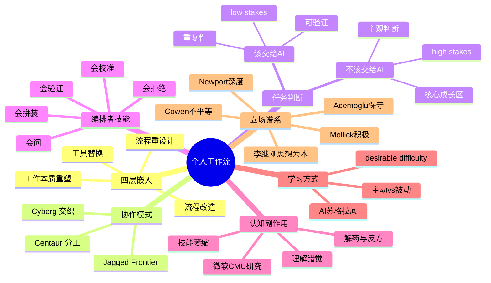

# 06 · 个人工作流与认知重塑

## 一句话总览

AI 不会"自动"提升你的生产力——它把"判断、提问、验证、拼装"四种元能力的杠杆放大十倍，同时把"无 AI 时代靠肌肉记忆完成的细活"杠杆变成负数；真正分化知识工作者的，不再是"会不会用 AI"，而是"在哪些任务上拒绝用 AI"。

## 关键句提纲（10 条）

1. AI 嵌入工作流有四个层级：工具替换（用 AI 写邮件）→ 流程改造（流程内插 AI 步骤）→ 流程重设计（围绕 AI 重组任务）→ 工作本质重塑（产出物本身改变）。绝大多数人卡在第一层。
2. Mollick 把人机协作分为 Centaur（清晰分工，人负责一段、AI 负责另一段）和 Cyborg（深度交织，每一句话每一步都在切换）。两种模式都有效，关键是匹配任务结构。
3. "Jagged Frontier"是 2025 年最重要的工作流隐喻：AI 能力边界是锯齿状的，难度看似相同的两个任务，一个落在 AI 能力内、一个落在外。不亲手实验，你永远画不出自己工作里这条锯齿线。
4. BCG × 哈佛 × 沃顿 758 名咨询师实验：在 AI 能力内的任务上，使用者多完成 12.2% 任务、快 25%、质量评分高 40%；在 AI 能力外的任务上，使用 AI 反而比不用低 19 个百分点。
5. AI 的最大平权效应不是让顶尖更顶尖，而是把"中下水平"拉到"中上水平"。同一实验中，下半区咨询师绩效跃升 43%，上半区只升 17%。
6. 微软 + 卡内基梅隆 2025 年 CHI 论文（319 名知识工作者，936 条真实用例）：对 AI 越自信的人批判性思考越少；高自信于自身能力的人才会保留批判性。AI 工作不是"少思考"，而是"思考重心从生成转向验证"。
7. Mollick 的四条铁律：始终把 AI 拉进会议（experiment everywhere）、永远做 human-in-the-loop、把 AI 当一个聪明但有偏差的人来对话、假设你今天用的是你这辈子最差的 AI。
8. AI 编排者 5 项核心技能：会问（提示能力）、会验证（critical evaluation）、会拼装（multi-step composition）、会决定不用（meta judgment）、会持续校准（calibration）。
9. 程序员工作流已经从"主 IDE + AI 侧栏"翻转为"主 AI 终端 + 偶尔翻代码"，2026 年 90%+ 工程团队至少使用一种 AI 编程工具，近半数同时用两种。
10. 认知卸载（cognitive offloading）的副作用是真实的：依赖 AI 的程序员能交付能跑的代码但概念理解下降；ChatGPT 学习者在 45 天后保留率显著低于无 AI 学习者。学习的快感与真理解之间出现系统性偏差（illusion of explanatory depth）。

## 嵌入层级（Mollick 4 层）

**Level 1：工具替换（Substitution）**
直接用 AI 完成原本就会的小任务。写邮件、改语法、生成 PPT 大纲。生产力提升 10-30%，但工作流没变。这是 95% 用户停留的层级。典型特征：每次都打开网页、复制粘贴、关闭。

**Level 2：流程改造（Augmentation）**
在已有流程里插入 AI 步骤。研究员每篇论文先让 AI 出摘要+5 个反对论点；产品经理每次需求文档先让 AI 扮演用户挑刺；销售每次回复前先让 AI 列三个客户可能反应。生产力提升 30-80%，但产出物的形态没变。

**Level 3：流程重设计（Process Redesign）**
为了发挥 AI 优势重组任务顺序与角色分工。例：原来"读 100 篇论文 → 整合 → 写综述"变成"先让 AI 出综述 → 我去找它没说对的地方 → 这些反例变成新论点"。Karpathy 的"先用 AI 大量探索，再人手收敛"是典型。生产力提升 2-5 倍。

**Level 4：工作本质重塑（Reinvention）**
产出物本身改变。咨询师从"写 50 页 deck"变成"交付一个客户可以问问题的 AI 助手 + 5 页核心洞察"；分析师从"季度报告"变成"实时仪表板 + AI 解读层"；老师从"批改作业"变成"设计 AI 无法替代的评估"。这一层很少人到达，但价值跃升一个数量级。

> 数据：Mollick + BCG 实验中，受过 prompt 培训组在 Level 3 出现率最高，绩效远高于仅 Level 1。

## Centaur vs Cyborg（人机协作两种模式）

**Centaur（半人马）模式**

像棋类比赛中的人机协作：人负责战略与终局，AI 负责中盘计算。任务有清晰的人/机分界。
- 例：你决定数据分析方法，AI 跑代码画图；你定文章骨架，AI 填段落；你列调研问题，AI 整合答案。
- 适合：你已是该领域专家，知道哪些任务自己更强、哪些 AI 更强。
- 风险：分工固化，错过 AI 已经反超你的子任务。

**Cyborg（赛博格）模式**

像同声传译：人和 AI 在每一句话上都在交织。
- 例：写到一半被卡住，让 AI 续一句，看哪句对路然后改写；调试时一边看 AI 建议一边手改；想问题时把半成形的想法丢给 AI 让它反推。
- 适合：高度迭代、边界模糊的创造性任务。
- 风险：边界感丢失，最后产出的"思想"不知道是谁的。

> Mollick 自己写 *Co-Intelligence* 时是混合模式：构思阶段 Cyborg、定稿阶段 Centaur。Karpathy 公开的工作流（点拍照问书名、上传 PDF 让 LLM 解析）也是 Cyborg 倾向。

## 任务该 / 不该交给 AI 的判断准则

**该全交给 AI**（除非有保密/合规约束）：
- Low-stakes（错了可逆）：邮件初稿、会议纪要、命名建议、PPT 模板。
- 可验证（有客观标准）：单元测试代码、数据格式转换、术语解释。
- 有 ground truth：翻译、规范化引文、SQL 改写。
- 重复性高：100 份简历分类、批量改图。

**坚决不该全交给 AI**：
- High-stakes 不可逆：法律意见的最终判断、医疗诊断的最终决定、招聘的最终拍板。
- 主观判断且影响他人：性能评估、给下属的反馈、产品战略。
- 需要个人信任的关系性输出：给老板/伴侣的关键沟通。
- 你正在学习中的核心技能：在你成为该领域中级以上之前，把它交给 AI 等于永远到不了中级。

**Jagged Frontier 实战法则**：
不要先信任 AI、再发现它错。先假设 AI 在这个具体子任务上的位置未知，做一次试错（小成本验证），把答案对照 ground truth，写进自己的"AI 能力地图"。这个地图随模型每次升级都要重画。

## AI 编排者技能集

### 1. 会问（Prompting as expression）

李继刚的概括最精准：提示词的本质是表达。模型输出由你输入的清晰度决定，技巧只占 20%。能写好提示的人不是会"咒语"，而是能把模糊想法翻译成结构化表达。

**操作**：把每次提示都当成一次自我对齐——你能把这件事说清楚吗？说不清楚说明你没想清楚。

### 2. 会验证（Critical evaluation）

微软 2025 研究的核心发现：AI 时代知识工作的认知重心从"生成"转向"验证 + 整合 + 监管"（verification, response integration, task stewardship）。

**操作**：对每条 AI 输出问三个问题——这个事实可以独立 verify 吗？它是否在 jagged frontier 之外？模型的"自信语气"是否在掩盖空洞？

### 3. 会拼装（Multi-step composition）

单次提示已经是 2023 年的思路。2025 年的高手在编排"AI 链"：第一个 prompt 出方案，第二个 prompt 自我批评，第三个 prompt 整合，第四个 prompt 出最终输出。Deep Research 内部就是这种模式（Clarification → Prompt rewriting → Multi-step research，5-30 分钟一份分析师级报告）。

**操作**：把任务拆成 3-5 步，每步问"这步交给 AI 还是人"，再决定怎么拼。

### 4. 会决定不用 AI（Meta judgment）

最反直觉的技能。AI 时代的稀缺品不是"会用 AI 的人"，而是"知道什么时候不用 AI 的人"。Cal Newport 的论点：写作的最大思考压力本身就是脑力训练，把它外包给 AI 等于训练肌肉时让别人替你举铁。

**操作**：每次手伸向 AI 之前停 3 秒——这件事是不是我的核心技能成长区？是不是 high-stakes 的不可逆判断？

### 5. 会持续校准（Calibration）

模型每 3 个月升级一次，你 6 个月前的 jagged frontier 地图已经过时。Mollick 第四条铁律"假设你今天用的是你这辈子最差的 AI"的本质是：定期回去试那些"AI 之前做不好"的任务，看它现在能不能做了。

**操作**：每月一次"AI 边界回测"——重新喂给它 3 个去年它失败的任务，更新地图。

## 个人工作流案例

### 程序员：从侧栏到主控台

2023：IDE 是主，Copilot 是侧栏自动补全。
2024：Cursor 把 AI 拉到编辑器中央，agent mode 出现。
2025-2026：Claude Code、Cursor agent 成为主入口，开发者"先问 AI 大方向，再翻代码 review"。industry survey：90%+ 工程团队至少用一种 AI 编程工具，近半同时用两种以上。某位资深开发者公开自评：Claude Code 引入后绩效提升 30-40%，每月节省一周工时。

Simon Willison 提出的"vibe coding"（向 LLM 抛出疯狂想法、让它接近能跑就放手）是新一代 prototyping 范式，他的 tools.simonwillison.net 上有 77 个 HTML+JS 工具全部由 AI 生成。

**风险**：Addy Osmani 警告——"能交付的代码"和"概念理解的代码"开始分叉，初级开发者跳过基础调试训练，遇到 AI 不会的问题就僵住。

### 研究员/分析师：Deep Research 流

OpenAI Deep Research（2025 年 2 月发布）开启了"多步自主研究"范式。一个"30 分钟搜索 + 综合"任务约等于人类 5-8 小时。Anthropic Claude Cowork 同样针对知识工作者：跨多日上下文管理、本地文件、多步任务端到端。

**新工作流**：
- 不再"开 10 个 tab 搜资料"，而是 deep research 跑底稿 → 人手挑出值得深挖的 5 处 → 第二轮窄聚焦 → 整合出报告。
- 节省的时间 70% 流向"挑 hypothesis"和"挑反例"，而不是流向"做更多报告"。

### 写作者：first draft 角色翻转

旧逻辑（Stephen King 等）："关上门为自己写第一稿，打开门为世界编辑。"
新逻辑（David Perell + Tyler Cowen）：写作者应避免让 AI 写第一稿——那会"磨平你的怪癖"，而怪癖正是你区别于 AI 的唯一资产。AI 用来当**编辑、研究助手、批评者**，而不是 ghostwriter。

Perell 个人方法："Speaking is the first draft"——先口述再让 AI 转写整理结构。Mollick 自己写书：卡顿处用 Cyborg 模式让 AI 续一句，但骨架和大量段落仍是人手。

### 产品/设计师：AI 协作

设计师工作流：Figma + AI plugin 生成多版本布局变体；产品经理用 AI 扮演"5 种用户人格"挑需求文档漏洞；快速原型阶段用 v0.dev / Lovable 把 idea → 可点击 demo 时间从 2 周压到 2 小时。

### 咨询师：Wharton/BCG 实验数据

实验 18 个 in-frontier 任务（创意提案、市场分析、数据 summary、写作）：用 AI 组多 12.2% 任务、快 25%、质量评分高 40%。
1 个 out-of-frontier 复杂经营任务：用 AI 组比对照组**少 19 个百分点**正确率，因为 AI 给的"听起来合理但错"的答案被照单全收。
下半区绩效跃升 43%、上半区 17%——平权效应主要发生在中下层。

### 知识工作者通用：Second Brain + AI

Tiago Forte 体系（CODE：Capture-Organize-Distill-Express）+ AI 整合：AI 自动打标签、跨笔记发现关联、几秒钟从几百条笔记蒸馏洞察。Forte Labs 2025 年开"3 周 AI 第二大脑"项目，把 PKM 从"人手分类"升级到"AI 主动参与每个阶段"。

中文圈：李继刚的"技能系列"（ljg-card 内容铸卡、ljg-learn 概念解剖、ljg-paper 论文阅读器、ljg-rank 降秩引擎、ljg-writes 写作引擎、ljg-roundtable 圆桌讨论等）展示了"提示词工程化"的另一条路径——用 Lisp 风格的结构化提示打造可复用的"AI 微服务"。

## 认知副作用（Cognitive Offloading）

### 经验数据

- **微软 + CMU 2025 CHI 论文**（319 名知识工作者，936 用例）：信任 AI 越多 → 批判思考越少；自信于自己能力越多 → 批判思考越多。"AI 把例行任务自动化、把异常留给人，剥夺了人通过例行积累判断力的机会，等异常真的出现时，人的认知肌肉已经萎缩。"
- **学习保留**：使用 ChatGPT 学习的学生 45 天后保留率显著低于无 AI 组（多份独立实验已复现）。
- **编程实证**：实验组让 AI 写代码完成度高、概念测试低于不用 AI 组。
- **元认知偏差**：illusion of explanatory depth——AI 解释让人主观感觉自己懂了，但客观测验显示并没懂。

### 反方观点

Mollick + Co-Intelligence 阵营：AI 解放认知带宽做更高阶的事（决策、创意、关系），认知"萎缩"的是不该用人脑做的低杠杆部分。Cowen：AI 是不平等放大器，对真正爱学的人，AI 加速学习；对原本就被动的人，AI 让他们彻底放弃。两者并不矛盾——结果取决于使用者元意识。

### 解药

1. **强制保留"无 AI"时段**（Cal Newport 的 deep work block）。
2. **学新技能时刻意延迟用 AI**（先自己撞墙 30 分钟再问）。
3. **把 AI 输出当假设而非答案**（每次主动找一个反例）。
4. **教别人是最强解毒剂**——你能把 AI 的输出讲给同事并被挑战，说明你真消化了。

## 学习方式重塑

### AI 让学习快但浅？

主观速度快——5 分钟看懂一篇论文；客观深度浅——3 周后想用却用不出。原因：理解的形成需要 desirable difficulty（有意为之的困难），AI 把困难磨掉了。

### "Feeling of understanding" vs 真理解

读 AI 解释时多巴胺奖励来自"清晰感"而非"建构感"。判断方法：你能不参考 AI、向不懂的人讲解吗？能在新场景中迁移用吗？两个问题都"是"才是真懂。

### 主动 vs 被动学习

被动：让 AI 给我 summary、key points、cheatsheet。
主动：让 AI 当苏格拉底——只问问题不给答案；让 AI 出 10 道考题考自己；让 AI 扮演反方与自己辩论。

后者把 AI 从"信息源"变成"压力测试机"，是 2025 年学习派显著的范式跃迁。

## 不同立场和争议

**Ethan Mollick（积极 cyborg 派）**：
"Always invite AI to the table." 鼓励大量、不受限制地用，因为不用就不知道边界。低估 AI 的人比高估的人付出更大代价。

**Cal Newport（深度工作派）**：
AI 工具不取代深度工作，它们放大它——把 shallow work 外包给 AI 留出时间做 deep work。但若把 deep work 也外包，结果是浅薄、易被替代的认知废人。

**Andrej Karpathy（个人 LLM stack 必备派）**：
LLM 已是个人计算的新一层。文件上传、语音点拍、自定义指令、记忆库——这套 stack 的熟练度本身就是新型识字（new literacy）。

**Tyler Cowen（不平等放大派）**：
AI 让顶尖更顶尖（年轻天才比以往任何时候都强），让平庸更平庸（年轻人在被 AI 的便利消解判断力）。average is over 的 2.0 版本。

**Daron Acemoglu（宏观保守派）**：
未来 10 年 AI 对 TFP 的累计提升不超过 0.66%-0.8%，远低于市场预期。AI 被过度用于自动化（替代人）而非赋能（augment 人），社会层面的红利没那么大。

**李继刚（提示词哲学派）**：
真正重要的是人的思想和认知，AI 只是表达工具。要更好用 AI，关键是提升自己的思考深度和知识储备——核心是"你"，不是模型。

## 前瞻假设（5 条）

1. **2027 年前后，"AI 编排"会从软技能变成硬岗位需求**。Gartner 已显示 40%+ 新增 AI 岗包含 prompt design / evaluation / orchestration 元素。简历上"会写 SQL"的位置会被"会编排多 agent 工作流"占据。
2. **个人 RAG 与"AI 第二大脑"会形成两极分化**：一极是工具栈深度玩家（笔记 + agent + 个人 LLM），一极是直接用大平台默认配置（ChatGPT + Memory）。中间路线萎缩。
3. **学校与企业的核心评估方式会被迫改变**。能用 AI 完成的考试不再有意义；现场口试、情境演练、长期项目会回潮，类似"防作弊"反而推动教育走向真理解。
4. **认知卸载会成为公共健康议题**。类似屏幕时间，会出现"AI 时间"测量、儿童 AI 暴露指南、"无 AI 周"运动。Microsoft / Apple 可能在 OS 层加入 cognitive engagement metrics。
5. **"AI 拒绝者"成为新精英标签**。当 AI 普及到每个角落，刻意保留无 AI 写作、无 AI 思考、无 AI 决策的少数人会以"思想质量"作为差异化资产，类似有机食品或慢生活在效率时代的位置。

## Mermaid 脑图

## 来源库

1. Ethan Mollick, *Co-Intelligence: Living and Working with AI*, Portfolio/Penguin Random House, 2024. https://www.penguinrandomhouse.com/books/741805/co-intelligence-by-ethan-mollick/
2. Mollick, "I, Cyborg: Using Co-Intelligence", One Useful Thing, 2024. https://www.oneusefulthing.org/p/i-cyborg-using-co-intelligence
3. Dell'Acqua, McFowland, Mollick, et al., "Navigating the Jagged Technological Frontier", HBS Working Paper, 2023, Organization Science 2025. https://papers.ssrn.com/sol3/papers.cfm?abstract_id=4573321
4. Lee et al. (Microsoft + CMU), "The Impact of Generative AI on Critical Thinking", CHI 2025. https://www.microsoft.com/en-us/research/wp-content/uploads/2025/01/lee_2025_ai_critical_thinking_survey.pdf
5. Randazzo, Lifshitz-Assaf, Kellogg, Dell'Acqua, Mollick et al., "Cyborgs, Centaurs and Self-Automators", SSRN 2024. https://papers.ssrn.com/sol3/papers.cfm?abstract_id=4921696
6. Andrej Karpathy, "How I Use LLMs", YouTube/educational content, 2025. Coverage: https://www.analyticsvidhya.com/blog/2025/03/how-andrej-karpathy-uses-llms/
7. Simon Willison, "How I use LLMs to help me write code", Substack 2025. https://simonw.substack.com/p/how-i-use-llms-to-help-me-write-code
8. Simon Willison, "2025: The year in LLMs". https://simonw.substack.com/p/2025-the-year-in-llms
9. Cal Newport, "Is AI Making Us Lazy?", calnewport.com. https://calnewport.com/does-ai-make-us-lazy/
10. Cal Newport, "AI and Work (Some Predictions)". https://calnewport.com/ai-and-work-some-predictions/
11. Cal Newport, "Deep Work in the Age of AI", The Deep Life Podcast Ep. 370. https://www.thedeeplife.com/podcasts/episodes/ep-370-deep-work-in-the-age-of-ai/
12. Tyler Cowen on Dwarkesh Patel, "The #1 bottleneck to AI progress is humans". https://www.dwarkesh.com/p/tyler-cowen-4
13. Tyler Cowen, "Artificial Intelligence in the Knowledge Economy", Marginal Revolution 2024. https://marginalrevolution.com/marginalrevolution/2024/12/artificial-intelligence-in-the-knowledge-economy.html
14. Daron Acemoglu, "The Simple Macroeconomics of AI", NBER w32487, 2024. https://www.nber.org/papers/w32487
15. Daron Acemoglu, "Don't Believe the AI Hype", Project Syndicate. https://www.project-syndicate.org/commentary/ai-productivity-boom-forecasts-countered-by-theory-and-data-by-daron-acemoglu-2024-05
16. Dan Shipper, *Chain of Thought*, Every. https://every.to/chain-of-thought
17. Every podcast, "The AI Sandwich: Where Humans Excel in an AI World". https://every.to/podcast/transcript-the-ai-sandwich-where-humans-excel-in-an-ai-world
18. David Perell on AI and writing (X/perell.com). https://perell.com/
19. Every, "How David Perell Uses ChatGPT to Write for Millions". https://every.to/chain-of-thought/how-david-perell-uses-chatgpt-to-write-for-millions
20. Tiago Forte, "The AI Second Brain", buildingasecondbrain.com. https://www.buildingasecondbrain.com/ai-second-brain
21. OpenAI, "Introducing Deep Research", Feb 2025. https://openai.com/index/introducing-deep-research/
22. Anthropic, "Claude Cowork". https://claude.com/product/cowork
23. Anthropic Economic Index, Sep 2025 + Jan 2026 reports. https://www.anthropic.com/research/anthropic-economic-index-september-2025-report
24. Addy Osmani, "Avoiding Skill Atrophy in the Age of AI". https://addyo.substack.com/p/avoiding-skill-atrophy-in-the-age
25. 404 Media / Fortune coverage of Microsoft cognitive atrophy study, Feb 2025. https://www.404media.co/microsoft-study-finds-ai-makes-human-cognition-atrophied-and-unprepared-3/
26. Nature, "Artificial intelligence and illusions of understanding in scientific research", 2024. https://www.nature.com/articles/s41586-024-07146-0
27. 李继刚访谈："当我们说「提示词」时，到底在说什么？" 36kr, 2024-12. https://36kr.com/p/3095526094797189
28. 李继刚 "Prompt 之神"专访（新浪科技）。https://www.sina.cn/news/detail/5096952243683638.html
29. MIT Sloan, "What is the jagged AI frontier?". https://mitsloan.mit.edu/ideas-made-to-matter/working-definitions/what-is-jagged-ai-frontier
30. Ethan Mollick + Stanford GSB Masterclass on Co-Intelligence. https://www.gsb.stanford.edu/insights/co-intelligence-ai-masterclass-ethan-mollick
