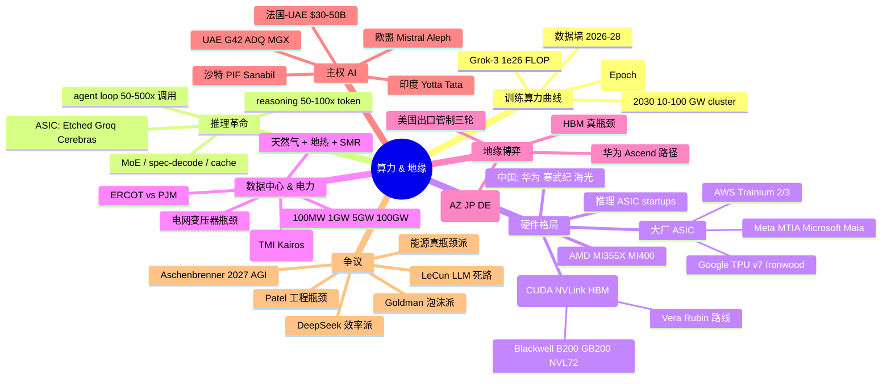

# 07 · 基础设施、算力、地缘

> 视角定位：把 AI 当作一台**物理机器**来理解。前面的章节看模型、看应用、看资本，但所有这些最终都会落到三件东西上：**硅、电、人**。本章关心的是 LLM 的"血肉骨骼"——谁制造芯片、谁建数据中心、谁掌握能源、谁拿到出口许可。理解这一层，才能判断 AI 的"上限"和"卡点"到底在哪里。

---

## 一句话总览

AI 已经从"软件革命"硬转向"工业革命"——一个 1GW 的 AI 数据中心相当于一座中型核电站、一座小型城市，单次训练的电力成本和资本支出已逼近半导体 fab 的尺度；**算力供给侧的瓶颈正从逻辑芯片移向 HBM、再移向 ASML EUV 设备和电网变压器**，而中美脱钩把这条供应链强行劈成了两个互不兼容的体系。

---

## 关键句提纲（10 条）

1. **训练算力 4-5×/年增长**（Epoch AI），自 2010 年起持续 14 年，2025 年首批模型跨过 1e26 FLOP（Grok-3 是第一个），预计 2030 年单次训练运行需 **4-16 GW 电力**。
2. **数据中心尺度跃迁**：从 100MW（2022 年）→ 1GW（2024 xAI Colossus、Anthropic New Carlisle）→ 5GW（2026 Anthropic-AWS、Stargate Abilene）→ 10-100GW（2027-2030 路线图）。
3. **训练成本曲线**：GPT-4 ~$100M（2023）→ DeepSeek V3 名义 $5.5M（2024，但实际累计 capex 50K Hopper GPUs）→ GPT-5 单次训练 $500M+（2025）→ Stargate 4 年 $500B 总投入。
4. **推理成本跌 99%，但 reasoning 模型让单次"任务"成本反而上升**：GPT-4 → GPT-4o 输入 token 价格降 92%，GPT-3.5 等价模型 token 价格 22 个月跌 280×；但 o1/o3 一次 ARC-AGI 推理消耗的 token 是 GPT-4o 的 60 万倍。
5. **Nvidia 护城河 = CUDA × NVLink × HBM 配额 × 系统级集成（GB200 NVL72 把 72 颗 Blackwell 当一颗 GPU 跑）**。Blackwell 卖到 2026 年中已售罄，订单 360 万片，Huang 把 2027 年前累计需求从 $500B 上调到 $1T。
6. **挑战者三阵营**：(a) 大厂自研 ASIC（Google TPU v7 Ironwood、AWS Trainium 3、Meta MTIA、Microsoft Maia）；(b) 开放生态（AMD MI355X 已在推理上对标 B200，MI400 2026 出货）；(c) 推理专用 ASIC（Groq LPU、Cerebras WSE-3、Etched Sohu Transformer-only ASIC）。
7. **电力成"新铀矿"**：美国数据中心耗电 2030 占总用电 9-12%（vs 2023 的 4%），微软 20 年 $16B 重启 Three Mile Island 833MW 核电、Google 与 Kairos 签 SMR、Meta 转向天然气 + 地热，Texas ERCOT 已成全美 AI 选址第一热区。
8. **数据墙 2026-2028 触顶**：Epoch 估高质量公开文本最早 2026 用尽，合成数据（DeepSeek R1 自蒸馏、Microsoft SynthLLM）+ 视频/多模态 + RLHF 互动数据成为下一波"燃料"。
9. **中美芯片脱钩三轮升级**：2022.10（首版禁令）→ 2023.10（封 H800/A800）→ 2024.10/2025.05（封 H20、AI Diffusion Rule、Huawei Ascend 全球禁运）；TSMC 2nm 留在台湾、Arizona 仍只到 4nm/3nm；华为 910C 性能逼近 H100 但被 HBM 卡到 250-300K 片/年。
10. **主权 AI 兴起**：UAE G42 在印度部署 8 exaflop（2025）、法国与 UAE 签 1GW 联合数据中心（$30-50B）、沙特 PIF 通过 Sanabil 投 Mistral，欧洲—中东—印度形成"非中非美"第三极。

---

## 算力增长曲线 · 训练 vs 推理 capex 拆分

### Epoch AI 的核心数据（必读）

- **训练算力增速**：自 2010 至今 4-5×/年；前沿 LLM 自 2020 起 5×/年，相当于 5.2 个月翻一倍。这条线在 2018 年后略放缓（约 4.2×/年），但仍未明显出现 plateau。
- **首批 1e26 FLOP 模型**：xAI Grok-3（2025.02）。Epoch 预测 2027 年起会有 ~30 个模型跨过该门槛，2030 年 200+。开源模型预计 2026 年内突破 1e26（DeepSeek V4、Qwen3、Llama 4 候选）。
- **算力分解**：训练 FLOPs 增长 = 集群更大 × 训练时间更长 × 硬件单卡更强；近三年集群规模增长贡献最大。

### 训练 vs 推理 capex 的反转

到 **2025 年下半年**，全行业推理 capex 首次超过训练 capex，这是过去 15 年训练主导格局的根本性反转。原因：
1. 模型从"少而精"转向"多而广"，B 端部署量级跳一个数量级；
2. **reasoning 模型** 让单次推理消耗 50-100 倍 token（详见下节）；
3. agent loop（autoGPT、Devin、Computer Use）让一次"任务"调用模型几十到几百次。

Dylan Patel 在 Dwarkesh 访谈（2026.03）里直言："你应该把任何号称要做 'training cluster' 的项目重新理解为 inference cluster——因为生命周期里 80% 的 GPU 时长都会被 inference 占。"

### "AI factory" 概念

Jensen Huang 2025 GTC 把数据中心重新定义为 **AI factory**：原料 = 电 + 数据，产物 = token，单位经济用 **token throughput / Joule** 衡量。NVIDIA 的 DSX 平台把整栋楼当一颗"超级芯片"做协同设计，包含液冷、PSU、网络、供电——这是从"卖卡"升级到"卖发电厂"的商业模型。

---

## 训练成本曲线 · 从 $100M 到 $500B

| 时点 | 模型 | 单次训练 | 集群规模 | 备注 |
|---|---|---|---|---|
| 2023.03 | GPT-4 | ~$100M | ~25K A100 | Altman 公开口径 |
| 2024.04 | Llama-3 405B | ~$60M | 16K H100 | Meta 公开 |
| 2024.12 | DeepSeek V3 | **名义 $5.5M** | 2048 H800（marginal） | 实际背后 ~50K Hopper GPU 集群 |
| 2025.01 | DeepSeek R1 | 名义 $5-6M（追加 RL） | 同上 | "训练成本神话"主角 |
| 2025 | GPT-5 | ~$500M（多次 run） | 多次失败重训 | Reuters / Information 报道 |
| 2026 | Anthropic-AWS Rainier | $35B+（基建） | 1M+ Trainium2/3 | 1.1GW，史上最大 AI 集群 |
| 2025-29 | Stargate 全计划 | **$500B** 4 年 | 7GW 已规划 | OpenAI + Oracle + SoftBank + MGX |

**DeepSeek 启示与争议**：
- 神话派：$5.5M 把 OpenAI 的 100× 训练成本打回原形，**算法 + 工程效率（FP8、MoE 路由、custom NCCL）** 可以绕过算力霸权。
- 拆穿派（SemiAnalysis）：这只是 marginal GPU 租金，DeepSeek 后面其实是 ~50K Hopper 的累计 capex（远高于 $500M），加上 200+ 顶级研究员。
- **真实读法**：DeepSeek 真正贡献是把"前沿模型再训练成本"拉低到中等基金可承受的范围，但**首次开拓**的成本（数据工程、架构搜索、失败 run）仍以亿美元计。

---

## 推理革命 · reasoning 模型让 token 暴涨

### 核心冲击

OpenAI o1、o3、DeepSeek R1、Google Gemini 2.5 Thinking、Anthropic 拓展思考模式，全部走"长思维链 + test-time scaling"路线。后果：
- 单次请求 token 消耗 **5-100×** 于传统模型。一个简单 coding 题，DeepSeek R1 生成 4000 个 thinking token，GPT-4o 仅 150 token——**26× 差距**。
- ARC-AGI 上 o3 的 high-efficiency 模式相对 GPT-4o 等价输出成本上涨 **600,000×**（极端样本）。即使 OpenAI 2025.06 把 o3 价格从 $10/$40 砍到 $2/$8 per million tokens（80% 降价），同等任务仍贵 GPT-4o 5-10×。
- **KV cache 内存爆炸**：30,000 token 的 reasoning chain 单次产生 ~2GB KV cache，相当于占据 50 个标准 600-token 请求的内存。

### 长上下文 + agent loop 的算力倍增

- **长上下文**：Gemini 2 Pro 200 万 token、Claude 200K、GPT-5 1M+。注意力复杂度 O(n²)，512K 上下文相当于 256× 传统 4K 上下文的算力。
- **Agent loop**：一个浏览器 agent 完成"查机票 + 订酒店 + 写报告"，模型被调用 50-200 次；coding agent（Claude Code、Cursor、Devin）单次任务 100-500 次调用很常见。

### 推理成本优化方向（必读清单）

1. **MoE（Mixture of Experts）**：DeepSeek V3 / Mixtral / Llama4 已普及。激活参数仅 5-15% 总参数，每 token FLOPs 大幅下降，但 KV cache 和路由开销引入新瓶颈。
2. **Speculative decoding**：小 draft 模型并行生成多 token，大模型一次性 verify，2-3× 吞吐提升。
3. **Caching**（KV cache reuse、prompt caching）：Anthropic、OpenAI、Google 都已商用，长 prompt 重复场景成本降 90%。
4. **Distillation**：把 R1/o1 的 reasoning 能力蒸馏到 7B-30B 小模型（DeepSeek-R1-Distill 系列、Qwen QwQ）。
5. **专用 ASIC**：Etched Sohu 把 Transformer "刻死"在硅上，Llama 70B 推理 500K tokens/s，对比 8 卡 H100 的 23K tokens/s ——**20× 性价比**。

> 行业判断：未来 18 个月推理 per-token 价格还会再跌 10×，但**单任务成本** 会因为 reasoning + agent 而**上升 2-5×**。也就是说：**单位 token 极便宜，单位智能极昂贵**。

### 推理基建对硬件的反向需求重塑

reasoning 模型的崛起把硬件需求曲线从"**稠密大算力**"转向"**高内存带宽 + 低延迟单流**"。具体含义：

- **HBM 容量与带宽**比 FLOPS 更关键——AMD MI355X 用 288GB HBM3e 在长 reasoning 场景上可以与 192GB 的 B200 抗衡，正是因为 KV cache 整体能装得下、不需要频繁 swap。
- **batch size 1 优化**比"大 batch 高吞吐"更重要：用户等待 thinking token 时，无法等到聚一个大 batch 再 decode。Groq、Cerebras、Etched 押的就是这个方向。
- **rack-level 互联**：72 卡 NVL72 把 KV cache 跨卡共享，本质上让 reasoning 的"长思维链"可以驻留在更大的"逻辑 GPU"内存里，这是 Nvidia 当前最锋利的差异化武器。
- **预算分配重塑**：Anthropic 内部把推理 capex 比例从 2023 的 30% 调到 2025 的 60%+，OpenAI 的 Stargate 早期规划已明确写入"50% 推理用途"。

---

## 硬件格局 · 五个梯队

### 第一梯队：Nvidia（市占 ~85% AI 加速器）

- **CUDA 17 年沉淀**：上千万开发者、数百万行优化 kernel、PyTorch / Triton / cuDNN / TensorRT 层层深入。
- **NVLink + NVSwitch**：GB200 NVL72 把 72 颗 GPU 通过 NVLink 5（1.8 TB/s 双向）拧成一颗"巨型 GPU"，13.5 TB HBM3e 共享内存。这是目前全行业唯一规模化 rack-level 解决方案。
- **Blackwell 现状**（2026.05）：B200 售罄至 2026 年中，订单 backlog 360 万片；B200 单卡 20 PetaFLOPS，万亿参数推理较 H100 提速 30×。
- **Vera Rubin 路线（2026 年 H2）**：Rubin GPU + Vera CPU 一体化，Huang 在 GTC 2025 把 2027 年前累计需求展望从 $500B 调到 $1T。

### 第二梯队：大厂自研 ASIC

| 厂商 | 当前主力 | 状态 |
|---|---|---|
| Google | TPU v7 Ironwood（2025.04 发布） | 9216 卡 cluster 4614 TFLOP/s，用于 Gemini 训练，对外 Cloud TPU |
| AWS | Trainium 2/3 | Project Rainier 50 万颗 Trainium2，Anthropic 锁 5GW、$100B 10 年 |
| Meta | MTIA v2 | 内部部署，主要驱动 Llama4 推理 + 推荐 |
| Microsoft | Maia 100 / Cobalt | 自用 Azure，推理为主 |

**结论**：Google TPU 是技术最成熟的非 Nvidia 生态，AWS Trainium 在性价比上对内 dump 给 Anthropic，但**外部生态吸引力仍弱**。SemiAnalysis 把 TPU v7 称为"房间里的 900 磅大猩猩"。

### 第三梯队：AMD

- **MI355X / MI350X**（2025.06 发布）：288GB HBM3e（vs B200 的 192GB），声称在 DeepSeek、Llama 推理工作负载上比 B200/GB200 快 20-30%、tokens-per-dollar 高 40%。
- **MI400 "Vulkan"**（2026 年 H2）：单卡 10× MI355X，3D 封装 + 300GB scale-out 带宽。
- **ROCm 7**：在 PyTorch / Llama 主流栈上接近 CUDA 可用性；但 SemiAnalysis 实测 H100/H200 训练 benchmark 仍领先 ——**CUDA moat still alive**。

### 第四梯队：推理 ASIC 创业军团

- **Groq**：LPU 单卡推理速度极致快（Llama 70B 750+ tok/s），但单卡内存太小，成本结构上对长上下文不友好。
- **Cerebras**：Wafer-scale Engine 3，22 cm² 单芯片，可单卡跑 7B-405B；2025 IPO 重启。
- **SambaNova**：可重构 dataflow，介于 GPU 与 ASIC 之间。
- **Etched Sohu**：transformer-only ASIC，2025 出货，500K tok/s（Llama 70B 8 卡），但只跑 transformer——**赌的是 Transformer 还会主导 5-10 年**。
- **NVIDIA 反应**：2026.01 NVIDIA 投资 Groq 部分股权，把潜在威胁纳入生态。

### 第五梯队：中国"自循环"

| 厂商 | 主力芯片 | 性能对标 | 瓶颈 |
|---|---|---|---|
| 华为 | Ascend 910C / 910D / 920 | 接近 H100 (整包双 die) | HBM 受限，2026 全年最多 25-30 万片 |
| 寒武纪 | 思元 590 | A100 级 | 软件生态 |
| 海光 | DCU K100 | A100/MI200 级 | 制造受限 |
| 壁仞 / 摩尔线程 | BR100 / MTT S4000 | A100 级 | 受美国 entity list 影响 |

**关键事实**：华为 2024-2025 通过 SMIC + 部分 TSMC 流片（违规绕道，被美国 BIS 公开点名），积累了 ~290 万颗 Ascend die；但 **HBM 是真瓶颈**——CXMT 2026 年最多产 200 万 stack HBM，仅够 25-30 万颗 Ascend 910C；这意味着**中国 2026 年自有先进 AI 加速器供给上限大约相当于 5 万张 H100 的训练等效**，远低于美国头部单家 hyperscaler。

---

## 数据中心 & 电力 · 真正的瓶颈

### 尺度跳跃

| 时期 | 单数据中心规模 | 代表 |
|---|---|---|
| 2020-2022 | 50-100 MW | 传统 hyperscaler |
| 2023-2024 | 100-300 MW | xAI Colossus phase 1 (250MW) |
| 2025 | 500MW-1.1 GW | Anthropic-AWS New Carlisle (1.1GW)、Stargate Abilene (1.2GW phase) |
| 2026-2027（规划） | 1-5 GW | Stargate 全网 7GW、Anthropic 5GW、Meta Hyperion 5GW |
| 2030（前瞻） | 10-100 GW | Aschenbrenner "trillion-dollar cluster" |

> 对比：2023 年全美数据中心总耗电 49GW；2026 全球 96GW，其中 AI 占 40GW。Aschenbrenner 估 2030 单个训练 cluster 用电 100GW = 美国总用电 20%。

### 电力供给的四条路径

1. **核电复苏**：Microsoft × Constellation 2024.09 签 20 年 $16B，重启 Three Mile Island Unit 1（833MW，目标 2028 上电）；Amazon 收购 Talen 核电资产；Google × Kairos 签 SMR 500MW（2030+）；Oracle 公开规划自建 SMR 配套 Stargate。
2. **天然气**：Meta、xAI 在 Texas / Louisiana 直接 behind-the-meter 天然气发电厂（绕开电网审批 18-24 个月延迟）。
3. **地热**：Sam Altman 个人投资 Fervo / Helion，2025 起小规模上线。
4. **电网升级**：变压器 lead time 已从 2022 年 30 周拉到 2025 年的 120-200 周，是新数据中心**最确定的瓶颈**。

### 美国电网瓶颈分布

- **ERCOT（德州）**：受益于轻监管、有自主电网、土地便宜，成 AI 选址第一热区（Stargate Abilene、xAI Memphis 实际通过 Tesla MegaPack 缓冲电网波动）。
- **PJM（中大西洋）**：北弗吉尼亚 Loudoun County 已是全球最大数据中心集群，但电网容量耗尽；2024 PJM 容量拍卖价格暴涨 800%，直接传导到电费。
- **Pacific Northwest**：水电 + 寒冷气候本是天然 AI 选址，但近年干旱使风险上升。

### 散热与 PUE 革命

- 1GW AI 数据中心的余热相当于一座小钢厂，传统风冷彻底失效，**直接液冷（Direct-to-Chip）+ 浸没式冷却**成为新标配；GB200 NVL72 必须液冷，已不再提供风冷选项。
- PUE（Power Usage Effectiveness）从传统 1.5-1.6 的目标拉到 1.1-1.2；超大数据中心运营商把"水"作为新瓶颈——单 GW 数据中心年耗水可达 25-50 亿升。
- **冷却选址博弈**：北欧（瑞典 Luleå、挪威 Stavanger）、爱尔兰、芬兰因低温优势再度受关注；但**电网容量 + 主权法规**正在反向限制——2024 爱尔兰已暂停审批新数据中心。

### 资本支出节奏与现金流压力

- Microsoft / Google / Amazon / Meta 四家 2025 合计 capex ~$370B，2026 预计 $500B+，**首次** 集体超过经营现金流 100%。
- Goldman 测算 hyperscaler 平均 GPU 折旧周期 4-6 年，但实际**性能上的"经济寿命"**只有 2-3 年（Hopper 在 Blackwell 出货后 inference 性价比下降 60%+）。
- 行业隐藏债务：OpenAI / Anthropic 通过 hyperscaler 间接绑定的"承诺采购"已超 $400B，本质上把模型公司的偿债能力与 hyperscaler 资产负债表绑定（Anthropic-AWS $100B 10 年合约 + OpenAI 各种"compute commitments"）。

---

## 数据墙 · 公开互联网真的耗尽了？

### Epoch AI 的核心结论

- 全球高质量公开文本约 300 trillion tokens（2024 估算）。
- 若按 5× overtraining，**2027 用尽**；按 100× overtraining，**2025 用尽**；按 Chinchilla optimal，**2032-2034**。
- LeCun 等人持反对意见：人类生成新数据的速度不慢，关键是"高质量"如何定义。

### 替代路径

1. **合成数据**：DeepSeek R1 用 reasoning chain 自蒸馏 → 800K 高质量 SFT 样本；Microsoft Phi 系列证明高质量合成数据 + 小模型也能达到接近前沿性能；Microsoft SynthLLM 实验表明合成数据**仍服从 scaling law**。
2. **多模态扩展**：YouTube 一个平台年新增视频 token 远超全互联网历史文本量。视频—音频—3D—具身数据是下一块"未开采矿"。
3. **互动数据**：ChatGPT/Claude/Gemini 用户日均生成 100+亿 token 真实交互，是闭源生态最大的隐藏护城河（OpenAI 拥有 8 亿 ChatGPT WAU 的对话数据）。
4. **Agent self-play**：在沙箱环境中让 agent 自我交互生成新轨迹（Voyager、SIMA、AlphaProof 已证明部分领域可行）。

> Anthropic 内部研究人员 Aug 2025 在播客中表示："对前沿实验室来说，公开网络数据只是基线，我们 60-80% 的训练价值已经来自合成 + 互动数据。"

### 数据墙的反直觉含义

第一性原理上看，"数据耗尽"这件事的真正影响**不是 capex 减少**，而是 capex **结构再分配**：
1. **数据采购 + 标注** 成为继 GPU 之后的第二大成本项；OpenAI、Anthropic、xAI 在 2024-2025 累计花费超 $20B 用于数据交易（Reddit、Stack Overflow、新闻出版社）。
2. **RLHF / RLAIF labor 市场**：Scale AI、Surge、Snorkel 等数据公司估值翻倍；高难度领域（医学、法律、coding）专家时薪 $200-500。
3. **计算合成数据本身需要 GPU**——R1 自蒸馏过程消耗的 inference compute 与训练 compute 同量级，意味着算力需求并没有"省下来"，只是换了用途。

这导致一个推论：**如果数据成为强约束，前沿实验室会更需要拥有"用户互动闭环"的产品**——这反过来强化了 ChatGPT、Claude.ai、Gemini App 这些 C 端产品的战略价值，而非削弱。

---

## 中美地缘博弈 · 三轮升级后的格局

### 出口管制时间线

| 日期 | 事件 |
|---|---|
| 2022.10.07 | BIS 首版"7nm 以下 AI 芯片禁令"，A100/H100 出口受限 |
| 2023.03 | Nvidia 推出 H800（NVLink 降至 400GB/s）合规版 |
| 2023.10.17 | BIS 禁令升级，H800/A800/L40S 全数禁运；引入 TPP（性能 × 互联）阈值 |
| 2024.10 | "AI Diffusion Rule" 草案，引入"Tier 1/2/3 国家"分层 |
| 2025.01 | Diffusion Rule 正式发布，主权国家分级 |
| 2025.04 | Trump 政府禁 H20（Nvidia 第三代合规版） |
| 2025.05 | BIS 撤销 Diffusion Rule；同日**全球禁用华为 Ascend 910B/C/D**（任何人使用即违法） |
| 2025.07-08 | 部分回退：Nvidia H20 / AMD MI308 重新允许销售中国，但对美政府支付 15% 收入抽成（前所未有） |

### 三方博弈格局

**美国阵营**：Nvidia + AMD + Intel + 大厂自研芯片 + TSMC（事实上的"美方代工厂"，2nm 留台、Arizona 4nm 已量产）+ ASML（荷兰，最关键节点）+ 三星 / SK Hynix（韩国，HBM）+ 应用材料 / LAM / KLA（设备）。

**中国阵营**：华为 Ascend + SMIC（先进制程瓶颈，N+2 节点对标 5-7nm）+ CXMT（HBM 自主，2026 仅能产 250-300K Ascend 910C 等量 HBM）+ 中芯/华虹/上海微电子（光刻机国产化，DUV 已能做 28nm，EUV 仍空白）。

**第三极（主权 AI）**：
- **UAE / 沙特**：G42 + ADQ + Mubadala + PIF / Sanabil 投资 Mistral、Anthropic、xAI；G42 在印度部署 8 EFLOP；与法国签 $30-50B 1GW 联合数据中心。
- **印度**：Yotta、Tata、Reliance 自建 GPU 集群；G42 8EFLOP 部署成最大单点。
- **欧盟**：Mistral（法国）+ Aleph Alpha（德国）+ EuroHPC（Jupiter 1 EFLOP）；French Stargate 类项目 (Iliad + Mistral + UAE)。
- **日韩**：Naver HyperCLOVA X、SoftBank（也是 Stargate 主席）；日本 SoftBank-OpenAI Cristal Intelligence 项目。

### 台积电分散与"硅盾"

- **Arizona**：6 fab 规划（4nm 已量产，3nm 2026，2nm 2028+），由日本贷款、美国《CHIPS Act》$66B 补贴助力。
- **Kumamoto（日本）**：6nm 已量产，但需求疲软，原计划 2nm 跳跃推迟。
- **Dresden（德国）**：与 NXP / Bosch / Infineon 合资，主攻汽车工业 mature node。
- **核心矛盾**：台湾保留 2nm 的政策红线 vs 美国不希望"硅命脉"放在台海冲突火线上。**2027-2028 是关键转折点**——若 Arizona 2nm 顺利量产，台湾的"硅盾"威慑会显著弱化。

### 中国"算力闭环"的真实进度

抛开宣传与封锁两端的噪音，2026 年中国 AI 算力的实际状况大致是：

- **逻辑芯片自给率** ~30-40%（按算力等效折合）：华为 Ascend 910C 在 SMIC 的 N+2 节点流片，单卡性能约为 H100 的 60-70%（FP16），但通过双 die 互联接近 H100 整包水平。
- **HBM 自给率** <15%：CXMT HBM2/2e 良率仍未稳定，HBM3 量产推迟到 2026 H2；中国 AI 加速器 HBM 大头仍依赖三星 / SK Hynix 走灰色渠道（已被美国 BIS 多轮警告）。
- **EUV 完全空白**：上海微电子最先进 DUV 已能做 28nm 双重曝光，但要做 7nm 以下仍需 EUV，这条路至少落后 5-7 年。
- **DeepSeek 路径**：用算法 + 集群效率（FP8、MoE、custom NCCL）把 H800 的限制变成"算法优势"，**这条路径在 2025-2026 是中国前沿大模型的主战场**。
- **政策抗风险**：北京"东数西算"政策指引算力建在西部清洁能源充足处；但电网调度、跨省结算仍是落地难点。

> 一个被低估的观察：中国的"算力受限"反而催生了**全行业最专注的推理优化**研究。DeepSeek、Moonshot、智谱、阿里 Qwen 团队在 inference 效率上的论文密度远超美国同行，这是被禁运逼出来的能力。

### 出口管制的一个反直觉效应

CSIS、Epoch、CSET 多份分析共同指出：出口管制**没能阻止中国前沿模型出现**，但**显著拖慢了规模化部署**。
- DeepSeek、Qwen、智谱、字节豆包训练算力总和大约 = 美国一家头部实验室（如 Anthropic）的水平；
- 但中国 inference 部署能力（按累计 token 处理量）大约只有美国的 1/10——因为推理需要海量 GPU 在岗。
- 这意味着：**中国正在制造"小规模前沿"，但难以构建大规模 agent 经济** ——这恰恰是出口管制设计者的核心目标。

---

## 不同立场和争议

### 立场 A：Aschenbrenner 派（最 bullish）

- 核心论点（"Situational Awareness", 2024.06）：算力 0.5 OOM/年 + 算法效率 0.5 OOM/年 + "unhobbling" gains，**2027 AGI strikingly plausible**；2030 出现 100GW、$1T 单 cluster。
- 二年后复盘：Aschenbrenner 的算力路径基本被证实（2026 已有 1M H100-eq cluster），但 AGI 时间线略 over-shoot。

### 立场 B：Yann LeCun 派（架构怀疑）

- LLMs are a "**dead end**"——他们只是堆叠统计相关性，缺常识、因果、世界模型。
- 2025.11 LeCun 离开 Meta，创办 AMI，融资 $1B 押注 JEPA / world model。
- 后果：如果 LeCun 是对的，算力 capex 的边际收益会快速衰减——"再加 10× 算力"换不来 10× 智能。

### 立场 C：Dylan Patel 派（中度乐观，工程视角）

- AMD 短期内（2026-2027）无法撼动 Nvidia，但 MI400 + ROCm 生态成熟后会侵蚀 25-30% 推理市场。
- 真正的瓶颈不是逻辑芯片，而是 **HBM / EUV / 电网变压器 / 高压电缆**（2028+ 落到 ASML 单点）。
- DeepSeek 是真厉害，但**不是颠覆性的低成本**——西方实验室的 frontier model 训练里 80% 成本是数据 + 探索 + 失败 run，不是 GPU 时长。

### 立场 D："效率派 / DeepSeek 启示"

- **少即是多**：算法、稀疏性、量化、distill 把 capex 需求压到 1/10。
- DeepSeek V3 $5.5M、Llama-3 405B $60M、Mistral Small 3 都说明**前沿能力开始 commoditize**。
- 含义：对开源 / 开放权重模型生态有利，但对 capex 重投入的 hyperscaler 不利。

### 立场 E：Goldman Covello / Ed Zitron（capex 泡沫派）

- 2024 Goldman 报告：$1T+ capex 至今没有匹配的收入，95% 企业 GenAI pilot 零回报。
- Microsoft / Amazon / Google / Meta 现在 capex > 100% 经营现金流，史无前例。
- Zitron：Big Tech 2030 前需要 **$2T 新增 AI 收入**才能 cover capex，OpenAI + Anthropic 占 hyperscaler AI capex 75%（循环资本游戏）。
- 反驳：Aschenbrenner / Altman 派认为他们看的是"通用智能"上限和锁定行业基建的长期回报，而非短期单年 ROI。

### 立场 F："能源是真瓶颈"派

- Meta、Microsoft、Google CTO 私下都把电力列为**首要**约束，超过芯片。
- 2026-2028 期间电网变压器是单点瓶颈，无法用钱在 24 个月内突破。
- 后果：AI cluster 的地理分布会发生大迁徙——往德州、爱荷华、北达科他（核 / 风 / 气资源充足处）。

---

## 前瞻假设（5 条）

1. **2027 年单个训练 cluster 突破 5 GW**，对应 2-3M H100-eq；至少出现两个由主权基金（沙特或 UAE）牵头的非美主导 cluster。
2. **推理 capex 在 2027 占 AI 总 capex 70%+**，agent 经济（每用户每天 50-500 次模型调用）成为核心驱动；Etched / Groq / Cerebras 之一被大厂收购或上市达到 $50B+ 估值。
3. **Nvidia 市占降至 60-65%**（vs 2024 的 90%+），不是因为 CUDA 被打破，而是因为大厂自研 ASIC（TPU、Trainium、MTIA、Maia）已在内部消化 25-30% 推理需求。
4. **HBM 短缺持续到 2027**：SK Hynix + 三星 + Micron + CXMT 的 HBM4/4e 产能扩张被 ASML EUV 工具供给限速；中国 Ascend 输出实际能力锁定在 30-50 万片/年量级。
5. **数据墙不会以"耗尽"形式撞墙**，而以"质量陡降 + 合成数据收益递减"形式渐进式显形。前沿实验室未来 24 个月最大优势来自**多模态 + 互动 + agent self-play**而非更多互联网爬取。

---

## Mermaid 脑图

---

## 来源库

### 核心媒体 & 分析师（必读）

1. SemiAnalysis (Dylan Patel) — semianalysis.com / newsletter.semianalysis.com 全行业最深的 chip + datacenter 追踪。
2. Epoch AI — epoch.ai/trends 训练算力数据库，引用最权威。
3. Dwarkesh Patel Podcast — dwarkesh.com 与 Patel、Aschenbrenner、Sutskever、Altman、Amodei 等核心访谈。
4. Stratechery (Ben Thompson) — stratechery.com 关于 chips、CUDA、AI factory 的商业分析。
5. The Information / Reuters / Bloomberg / FT — semi 地缘一手报道。

### 关键文章 / 报告

6. Epoch, "Training compute of frontier AI models grows by 4-5x per year" — https://epoch.ai/blog/training-compute-of-frontier-ai-models-grows-by-4-5x-per-year
7. Epoch, "How much power will frontier AI training demand in 2030?" — https://epoch.ai/blog/power-demands-of-frontier-ai-training
8. Aschenbrenner, "Situational Awareness: The Decade Ahead" (2024.06) — https://situational-awareness.ai/
9. Dwarkesh × Dylan Patel, "Deep Dive on the 3 Big Bottlenecks to Scaling AI Compute" (2026.03) — https://www.dwarkesh.com/p/dylan-patel
10. SemiAnalysis, "MI300X vs H100 vs H200 Benchmark Part 1: Training - CUDA Moat Still Alive" — https://newsletter.semianalysis.com/p/mi300x-vs-h100-vs-h200-benchmark-part-1-training
11. SemiAnalysis, "Huawei Ascend Production Ramp: Die Banks, TSMC Continued Production, HBM is The Bottleneck" — https://newsletter.semianalysis.com/p/huawei-ascend-production-ramp
12. SemiAnalysis, "AI Datacenter Energy Dilemma - Race for AI Datacenter Space" — https://newsletter.semianalysis.com/p/ai-datacenter-energy-dilemma-race
13. SemiAnalysis, "Google TPUv7: The 900lb Gorilla In the Room" — https://newsletter.semianalysis.com/p/tpuv7-google-takes-a-swing-at-the
14. Goldman Sachs, "GenAI: Too Much Spend, Too Little Benefit?" (2024.06) — Jim Covello 主笔
15. Ed Zitron, "Big Tech Needs $2 Trillion In AI Revenue By 2030" — https://www.wheresyoured.at/big-tech-2tr/
16. CSIS / CSET, "Pushing the Limits: Huawei's AI Chip Tests U.S. Export Controls" — https://cset.georgetown.edu/publication/pushing-the-limits-huaweis-ai-chip-tests-u-s-export-controls/
17. CRS, "U.S. Export Controls and China: Advanced Semiconductors" (Aug 2025) — https://www.congress.gov/crs-product/R48642
18. Stanford FSI, "Taking Stock of the DeepSeek Shock" — https://cyber.fsi.stanford.edu/publication/taking-stock-deepseek-shock
19. Lawfare, "What DeepSeek r1 Means—and What It Doesn't" — https://www.lawfaremedia.org/article/what-deepseek-r1-means-and-what-it-doesn-t
20. Microsoft Research, "SynthLLM: Breaking the AI 'data wall' with scalable synthetic data" — https://www.microsoft.com/en-us/research/articles/synthllm-breaking-the-ai-data-wall-with-scalable-synthetic-data/

### 公司公告 / 一手

21. OpenAI, "Announcing The Stargate Project" (2025.01) — https://openai.com/index/announcing-the-stargate-project/
22. OpenAI, "Five new Stargate sites" (2025.09) — https://openai.com/index/five-new-stargate-sites/
23. Anthropic-Amazon, "Anthropic and Amazon expand collaboration for up to 5 GW" — https://www.anthropic.com/news/anthropic-amazon-compute
24. NVIDIA, "Blackwell Platform Arrives" — https://nvidianews.nvidia.com/news/nvidia-blackwell-platform-arrives-to-power-a-new-era-of-computing
25. NVIDIA GTC 2025 keynote transcript (Jensen Huang) — https://blogs.nvidia.com/blog/nvidia-keynote-at-gtc-2025-ai-news-live-updates/
26. xAI, Colossus — https://x.ai/colossus
27. AMD, MI350 series — https://www.amd.com/en/products/accelerators/instinct/mi350.html
28. Google Cloud, "Trillium TPU" — https://cloud.google.com/blog/products/compute/introducing-trillium-6th-gen-tpus
29. Microsoft × Constellation, Three Mile Island PPA (2024.09) — datacenter dynamics 报道
30. DeepSeek-V3 Technical Report (arXiv 2412.19437) — https://arxiv.org/html/2412.19437v1

### 主权 AI

31. G42, "UAE to Deploy 8 Exaflop Supercomputer in India" — https://www.g42.ai/resources/news/uae-deploy-8-exaflop-supercomputer-india-strengthen-local-sovereign-ai-infrastructure
32. Middle East Institute, "From Crude to Compute: Building the GCC AI Stack" — https://www.mei.edu/publications/crude-compute-building-gcc-ai-stack
33. arXiv 2511.15734, "Sovereign AI: Rethinking Autonomy in the Age of Global Interdependence"

### 中国视角

34. 晚点 LatePost、财新、远川研究所、硅基立场 — DeepSeek、华为昇腾、HBM 自主化中文一手报道
35. IFP, "The H20 Problem: Inference, Supercomputers, and US Export Control Gaps" — https://ifp.org/the-h20-problem/

---

> **写作备注**：本章侧重物理底层与产业格局，与 03（模型层）、05（资本与商业模式）、08（中国 vs 美国）有显著 overlap，但视角各异。读者可结合 05 看 capex 经济性 / ROI、08 看中美战略博弈、09 看主权 AI 政策维度。
