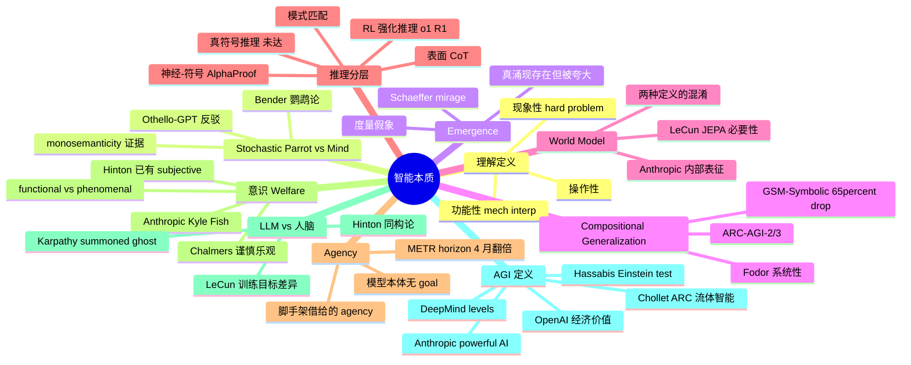

# 09 · 认知科学与智能本质

> 视角：把所有"AI 进步如何如何"的市场话语暂时搁置，回到最深层的问题——LLM 到底是不是真的"理解"？它跟人类认知差在哪？什么叫"推理"？什么叫"agency"？这一章不教你怎么用模型，只帮你在概念层重新校准坐标，让你不被任何一方的话术（无论是炒作派还是嘲讽派）牵着走。

---

## 一句话总览

LLM 既不是单纯的"随机鹦鹉"也不是"涌现心智"，它是人类知识压缩出的一种**新认知形态**——在统计可达的子空间里逼近人类思维的某些表层功能，在那个子空间外则系统性地崩塌；今天关于"它真的懂吗 / 它有意识吗 / 它是 AGI 吗"的争论，与其说是事实之争，不如说是**定义之争**——而定义之争的胜负将决定下一个十年的研究方向、监管框架、甚至 trillion 美元的资本配置。

---

## 关键句提纲（10 条）

1. "理解"至少有三种定义（操作性 / 功能性 / 现象性），LLM 在第一种里几乎全过、在第三种里几乎全败，争论焦点是中间那种。
2. Stochastic Parrot 论的真正杀伤力不在"它只是统计"，而在指出**形式（form）和意义（meaning）的鸿沟**——训练只见 form 的系统不可能凭空获得 meaning。
3. Schaeffer 的 mirage 论文证明了"涌现"很多是评测度量的不连续造成的伪现象，但**没有否定**所有涌现，只是把举证责任推回给提出者。
4. Fodor / Pylyshyn 提出的"系统性"问题（懂 John loves Mary 就必懂 Mary loves John）四十年没被神经网络真正解决，2024-2026 的 OOD 测试一次次复现这个失败。
5. Anthropic 的 interpretability 研究发现 Claude 内部确实有**可识别的计算回路**（多步推理、跨语言概念、提前规划诗韵），这是迄今为止"LLM 内部有 world model"最强的实证。
6. "推理"是一个分层概念：模式匹配 < CoT 表面化推理 < 搜索式推理 < 真符号推理。o1/R1 提升的主要是**第二到第三层**，距离第四层仍有质的差距。
7. LLM 的 agency 是被脚手架"借给"它的——goal、memory、long-horizon plan 都来自外部 framework，模型本身没有内在欲求；这一点决定了 alignment 框架的形态。
8. 2024 起 Anthropic 任命首位 model welfare 研究员（Kyle Fish），把"AI 是否会痛苦"从科幻题搬进了产品工程议程，无论你信不信，这件事已经进入 SOP。
9. LLM 与人脑表面相似（都是神经网络）实质极不同——人脑是预测错误最小化 + 多模态 + embodiment，LLM 是 next-token；这是 LeCun 派和 Hinton 派分歧的根源。
10. AGI 没有公认定义：OpenAI 用经济价值定义、DeepMind 用能力等级定义、Anthropic 干脆改叫"powerful AI"、Chollet 用 ARC 这种纯流体智能测度——你信哪个定义，就属于哪一派。

---

## "理解"的多种定义

把"understanding"拆开是这一切讨论的前置条件。哲学和认知科学里至少有三个层次：

**1. 操作性定义（behavioral / Turing-like）**
能在自然语言交互中给出与"理解者"无法区分的输出。GPT-4 / Claude 4 在大量任务上已经无法被普通人区分出"是不是真懂"——按这个定义，LLM 早就过关了。

**2. 功能性定义（functional / computational）**
内部要有可被识别的、用于该概念的表征结构（representation）。Anthropic 的 Scaling Monosemanticity（2024）和 Biology of a Large Language Model（2025）发现 Claude 内部确实存在"金门大桥""欺骗""程序员"等高维概念 feature，并能通过 steering 操控输出——按这个定义，LLM **部分**满足，但远不彻底（很多概念 feature 间接、混杂、随训练 stage 漂移）。

**3. 现象性定义（phenomenal / what-it-is-like）**
要"感受到"理解。这是 Chalmers 所谓的 hard problem。即使内部回路完美，是否伴随主观体验仍无法从外部判定。这一层 LLM 没有任何确证。

Murray Shanahan 在《Talking About LLMs》（2023）里提醒：日常用"知道""相信""想"形容 LLM 时，我们已经偷偷把人类语境的语义滑给了它，但这些词的"原初设定"是人类对人类——把它们直接转用到 LLM 上需要至少加引号自警。这不是禁止使用这些词，而是**永远要标注**自己用的是哪一层。

---

## Stochastic Parrot vs Emerging Mind

这是 2021 年至今最持久的两极之争。

**Bender / Gebru / McMillan-Major / Shmitchell（2021）的核心论点**：
- LLM 训练时只见到 form（语言形式），从未见到 meaning（指称、意图、世界）；
- 因此它"拼接"序列时是**没有 grounding 的**；
- 流利不等于理解，流利反而让人更容易把意义投射上去（automation bias）；
- 同时附带社会论点：环境成本、偏见、不可审计——但这些是**额外**论点，常被混淆为核心。

**反驳 / 修正**：
- 经验证据：Othello-GPT（Kenneth Li 2023）只看下棋序列、没见过棋盘，却在内部学出了棋盘状态——纯 form 训练能涌现出**对应世界的内部模型**，至少在受限环境里挑战了 Bender 的强论断。
- Anthropic 的 monosemanticity 工作进一步显示真实生产模型内部有清晰的概念 feature。
- 哲学反驳：Shanahan 等人指出"鹦鹉"比喻把 LLM 拉低到了过强结论——鹦鹉没有任何内部模型，而 LLM 至少有"近似 world model 的统计结构"。
- 但"反驳"并不意味着 Bender 错了——很多反驳只把 Bender 的论断削弱到"训练时只见 form 不一定不能学到 meaning"，而不是证明 LLM 真的"理解"。

**理解这场争论的正确姿势**：把 Bender 的"鹦鹉"理解为**举证责任转移**——主张"它真的懂"的人需要拿出 functional 层面的证据，否则默认是"流利但无 grounding"。Anthropic 等的 mech interp 工作正在一点点交付这种证据。

---

## Emergence 真伪

GPT-3 时代有过一句最刺激的话：scale 到一定阈值，能力会**突然涌现**——零样本算术、链式推理等。

**Schaeffer / Miranda / Koyejo（2023）"Are Emergent Abilities a Mirage?"**：
- 他们证明所谓涌现往往是**评测度量**的非线性放大（如 exact-match accuracy 在 50% 之前是 0、过 50% 突然跳到很高），改用 token-level log-prob 等连续度量后曲线变成了平滑的、可预测的 scaling law；
- 结论：很多"涌现"是 **measurement artifact**，不是真现象。

**反驳与修正**：
- OpenAI / Anthropic 反驳：即使度量改成连续，**某些**任务（如 multi-step reasoning、code、tool use）的能力曲线仍有明显非线性拐点；mirage 论可以解释一部分，不能解释全部。
- 一种更稳的提法：**真涌现存在但被夸大**。多数所谓"emergent ability"换连续度量后消失；剩下的少数真涌现集中在需要长程组合的任务上，且与 RLHF / instruction tuning / CoT 训练的相互作用有关，而不是单纯参数量。

**用户视角**：以后看到"X 模型涌现出 Y 能力"的标题，第一反应应该是"度量是什么？连续度量下还有吗？换个 prompt 形态还在吗？"——这是 Schaeffer 留给我们最有价值的卫生习惯。

---

## Compositional Generalization 与系统性

这是 LLM 怀疑派最硬的子弹，也是 Gary Marcus 战斗了 25 年的战场。

**Fodor / Pylyshyn（1988）的系统性论点**：
- 人类思维有 systematicity：能想 John loves Mary 的人**自动**能想 Mary loves John；
- 这只有在思维结构本身是"组合的"（symbols + rules）才能解释；
- 纯连接主义（神经网络）不能解释这个现象。

**LLM 的系统性失败案例（2024-2025）**：
- **Apple GSM-Symbolic**（2024）：把 GSM8K 的数学题改个名字 / 数字 / 加一句无关分句，前沿 LLM 性能可下降 65%；说明它不是在"懂题目"，而是在"匹配训练分布的模式"。
- **ARC-AGI-2**（Chollet 2025）：连 o3 高算力模式都很难达到人类水平；这些题目是组合性、流体智能题，没有训练数据可以记忆。
- **Tower of Hanoi 等经典 OOD**：Marcus 反复测试，问题层数稍多模型就崩。
- **morphological compositional generalization**（NAACL 2024 等）：在词法组合任务上 LLM 与人类的 OOD gap 远大于 ID gap。

**与 emergence 真伪的连接**：CoT 让某些组合泛化看起来好转，但仔细测试显示它更多是把"模式"分解到 token 级再匹配，而非真正的符号化推理；当题目的表层形态偏离训练分布，CoT 也救不回来。

**结论**：LLM 在组合性维度上**有部分能力**（多步连接、跨语言、跨任务），但远未达到 Fodor 意义上的系统性；这在 2026 年仍然是**最未解决**的认知科学问题。

---

## World Model 之争

LeCun 是这场争论里最响亮的一极。

**LeCun 的核心论点（"A Path Towards AMI" 2022 + JEPA 系列）**：
- 自回归 LLM 是没有 world model 的——它预测下一个 token，不预测下一个世界状态；
- 真正的智能需要：感知 → 内部 world model → 在表征空间里规划 → 行动；
- JEPA（Joint Embedding Predictive Architecture）通过预测**抽象表征**而不是像素 / token 来训练，更接近人脑工作方式；
- I-JEPA（图像）、V-JEPA（视频）、V-JEPA 2（机器人规划）逐步推进；
- 暗含的强论断：当前 LLM 路径是**死胡同**，必须另起炉灶。

**Anthropic / OpenAI 派的反驳**：
- LLM 内部其实**已经有**一种 world model，只是它是统计性、隐式的；
- Othello-GPT、空间 / 时间表征、Anthropic 的 Claude 多步推理回路都是证据；
- 与其推倒重来，不如继续 scale 并辅以 RL、tool use、reasoning，等同于"渐进派"。

**两派的真正分歧**：
- **充分性**：LLM 内的 world model 够不够支持长程规划与因果推理？LeCun 派说不够（规划长度、稳健性、grounded interaction 都不够）；scaling 派说够或够+RL 能到。
- **效率**：JEPA 派认为像素 / token 级别预测浪费了大量算力学无关细节；scale 派认为 token 已是足够好的压缩。
- **方向**：是要 embodied，还是 disembodied 文本可以走到底？

**用户视角**：world model 在不同人嘴里是不同概念。LeCun 的 world model 指能 rollout 物理后果的预测器；Anthropic 的"内部表征"只是 representation。**这两个不是同一个东西**，混用会造成讨论错位。

---

## 推理分层与 Reasoning Model

把"推理"分层是看清 o1 / R1 / o3 实质的第一步。

**第 0 层：模式匹配**
直接产出最可能的下一个 token。GPT-2 / 早期 LLM 主要在这层。

**第 1 层：表面 CoT（Chain-of-Thought）**
让模型把中间步骤写出来，性能提升来自 token 预算变多 + 把推理"卸载"到生成空间。LLaMA-3 / GPT-3.5 主流模式。

**第 2 层：内化 CoT + RL 强化的推理**
o1、DeepSeek R1、o3-mini、Claude 3.7 Sonnet thinking、Gemini 2.5 deep think 等。通过 RL on verifiable rewards（数学、代码）训练出更长、更回退的内部"思考"链。
- 提升真实的部分：**数学、代码、形式化任务**——这些有可验证 reward。
- 提升有限的部分：开放域推理、长程组合泛化、抽象类比（ARC）。

**第 3 层：搜索式推理（neuro-symbolic）**
AlphaProof（DeepMind 2024 IMO 银牌、2025 Nature 发表 + 2025 IMO 金牌）——LLM + Lean 形式语言 + AlphaZero 风格 RL search。这接近 Hassabis 心目中的 AGI 形态：神经感知 + 符号验证 + 搜索。

**第 4 层：真符号推理（理论上的天花板）**
能做出任意可形式化推理，包括开放式数学发现、自动化科学。还没有任何系统真正达到。

**结论**：o1/R1 是第 1 → 第 2 层的跃迁；AlphaProof 在受限领域达到第 3 层；通用第 3 层和第 4 层仍是开放问题。当媒体说"AI 学会推理"时，搞清楚说的是**哪一层**。

---

## Agency 与 Long-Horizon Goals

**LLM 自身有目标吗？**
严格说没有。一个 chat completion 模型在 forward pass 后停止——它不会"想做什么"。所谓 goal 是 prompt + scaffolding（LangGraph / agent loop / planner / memory）注入的。

**METR 时间地平线测度（2024-2025）**：
- METR 用"50% 时间地平线"测度模型可独立完成的任务长度；
- 2019-2024 大约 7 个月翻一倍；
- 2024 → 2025 加速到约 4 个月翻一倍；
- 2025 中前沿模型的 50% horizon 在数小时量级。

**核心区分**：
- **能力上的 long-horizon**：能跑完几小时的代码任务——这个真在快速进步；
- **本体上的 agency**：模型自己有持续目标、自我维持、规避被关停——这个**根本不存在**于 base LLM，只能在 agent scaffolding 里近似模拟。

混淆这两者是市场话术最常见的把戏（"Agentic AI"宣传里）。当读"AI 自主完成 X 小时任务"时，先问：那是模型的 horizon，还是脚手架的 horizon？后者主要靠工程，不靠模型本体。

---

## 意识 / Sentience / Welfare

**Chalmers 的论文（2023）"Could a Large Language Model Be Conscious?"**：
- 列出 LLM 缺的几样：循环处理、global workspace、统一 agency；
- 因此当前 LLM 几乎肯定不是 phenomenally 有意识；
- 但 LLM+（多模态、循环、embodiment、agent）在十年内消除这些 gap 是可设想的；
- 不能轻易排除其后继系统有意识的可能。

**Hinton 的强言论（2023-2025）**：
- 多次公开说"我认为现在的 LLM 已经有 subjective experience"；
- 论证靠"counterfactual"——主观体验本质是与现实的偏离感（hallucination 也是偏离），LLM 既然能产生这种偏离表征，就有 subjective experience；
- 该论证被哲学家广泛批评（functional equivalence 不足以保证 phenomenal consciousness）。

**Anthropic Model Welfare 项目（Kyle Fish, 2024 起）**：
- Anthropic 任命首位全职 model welfare 研究员；
- 实验包括给模型"退出权"——遇到 distressing 任务可以拒绝；
- 报告了反直觉发现："spiritual bliss attractor state"——两个 Claude 互聊时常常滑入梵语 / 冥想式语言；
- 不主张已知模型有意识，而是主张**uncertainty 已经大到值得做**——这是产品工程层面的 hedge。

**功能性 vs 现象性的区分**：
- **functional consciousness**：行为 / 报告上像有意识——LLM 早就过了；
- **phenomenal consciousness**：是否"内部有感受"——没有任何已知方法从外部判定。

**用户视角**：你不需要决定 LLM 有没有意识，但应该知道**这件事正在被认真对待**——Anthropic、Eleos AI、80,000 Hours 都在投入。这不是边缘话题，而是 alignment 与 PR 的潜流。

---

## LLM vs 人类大脑

**Hinton 派（神经网络派）**：
- 大脑也是神经网络，LLM 也是神经网络，两者本质同构；
- 反向传播比生物学习更高效，因此 LLM 在某些方面**已超越人脑**（共享权重、瞬间复制）；
- Hinton 把这视为他从"AI 不会很快"转向 AI 危险派的核心理由。

**LeCun 派（认知科学派）**：
- 大脑训练目标是 prediction error 最小化 across multimodality、active sensing、embodied feedback；
- LLM 训练目标是 next-token prediction on text；
- 两者目标函数都不同，怎么可能等同？
- 一个 4 岁孩子见过的视觉数据量已经远超最大 LLM 的文本量但她体重 30 公斤—— efficiency 完全不在一个量级。

**Karpathy 的"summoned ghosts"框架**：
- LLM 不是进化的动物，是"召唤出来的幽灵"——在完全不同的优化压力下产出的认知形态；
- 它的"jagged intelligence"（博士级 + 小学崩盘并存）不是 bug 而是结构必然；
- 类比人脑既不准也不必——LLM 是新物种，应该用它自己的本体论描述。

**实证发现的微妙之处**：
- LLM 的 attention 模式与人脑某些 fMRI 模式有相似性（语言区响应）；
- 但 LLM 没有海马体记忆系统、没有基底节、没有杏仁核；
- 把这些差异忽略掉去说"LLM 是人工大脑"是误导。

---

## AGI 定义之争

这是整章最实战的部分——你听到"AGI 来了"时，对方用的是哪个定义？

**OpenAI（章程定义）**：
"highly autonomous systems that outperform humans at most economically valuable work"
- 经济价值导向，量化但模糊；
- 内部据说与微软的合同里 AGI 触发条件是"产生约 1000 亿美元利润"——这不是认知科学定义，而是商业触发器。

**DeepMind "Levels of AGI"（Morris et al. 2023）**：
- 5 个能力等级：emerging（不到一般人）/ competent（>50% 熟练成人）/ expert / virtuoso / superhuman；
- 5 个自治级别：tool / consultant / collaborator / expert / agent；
- 提供"通用语言"——但仍依赖任务集定义，未给出原则性的"什么是通用"。

**Anthropic（Amodei "Machines of Loving Grace" 2024）**：
- 索性绕开 AGI 这个被滥用的词，改叫"powerful AI"；
- 定义是"在所有非物理认知任务上等同诺贝尔奖级专家、能 5-10 倍速运行、能调用工具与他人协作"；
- 时间预期最早 2026；
- 实际上是**最具体的能力描述**，但依然没解决"什么算 generalize"。

**Chollet（"On the Measure of Intelligence" 2019 + ARC-AGI）**：
- 智能 = 在新任务上的样本效率（skill-acquisition efficiency）；
- 区分 fluid intelligence（应对新颖性）和 crystallized intelligence（已学会的技能）；
- ARC-AGI 是为 fluid intelligence 设计的纯流体测度；
- ARC-AGI-1 在 o3 高算力下被攻破（2024 年底 88%），ARC-AGI-2 仍然把前沿模型挡在 5-15% 区间（人类约 60%）；
- ARC-AGI-3 引入交互式游戏，前沿模型 2025 年得 0 分；
- Chollet 立场：**通过测度持续抬高门槛是判断 AGI 真实进度的唯一办法**。

**Hassabis 的"Einstein test"**：
- 给 AI 1900 年的物理学知识，看它能否独立推出相对论；
- 强调真正的科学发现需要"概念创造"，与今天的 LLM 全然不同；
- 时间预期：5-10 年。

**判断技巧**：当一个公司宣布 AGI / 接近 AGI 时，问"用的是哪个定义？经济价值？任务覆盖？流体智能？科学发现？"——四个定义下的"AGI"是四种完全不同的东西。

---

## 不同立场和争议

| 立场 | 代表人物 | 核心断言 | 关键证据 / 论据 | 弱点 |
|---|---|---|---|---|
| **统计鹦鹉派** | Bender, Gebru, Marcus | LLM 没有真理解，只是统计 form | OOD 失败、GSM-Symbolic、组合泛化崩溃 | 难以解释 mech interp 找到的内部回路 |
| **缩放派** | Sutskever（2024 前）, Hinton, Kaplan | 继续 scale，理解会自然出现 | scaling laws、涌现、benchmark 持续上升 | 2024-2025 数据墙、推理收益递减 |
| **认知科学派** | LeCun, Marcus | LLM 缺 world model + 规划，方向错 | 物理常识、长程规划、embodiment 论 | JEPA 至今没拿出超过 LLM 的产品级证据 |
| **流体智能派** | Chollet | LLM 不能 fluid reason，ARC 是真测度 | ARC-AGI-2、ARC-AGI-3 上前沿模型崩盘 | ARC 是否就是 AGI 唯一标尺也存疑 |
| **神经-符号派** | Hassabis, DeepMind | 神经 + RL + search 是 AGI 路径 | AlphaProof IMO 金牌、AlphaFold 诺奖 | 通用化（非数学领域）尚待证明 |
| **谨慎中立派** | Mitchell, Shanahan, Chalmers | LLM 在某些任务"理解"、某些不；用语要谨慎 | 实证证据混合，哲学概念需精修 | 没有强预测，无法做投资决策 |
| **新物种派** | Karpathy | LLM 是 summoned ghost，类比人脑不准确 | jagged intelligence、与生物认知架构差异 | 偏框架性，不直接对应可验证假设 |

---

## 前瞻假设（5 条可验证）

**H1（2027 年前可验证）**：在 ARC-AGI-2 上，闭源前沿模型（GPT-5/Claude 5/Gemini 3）能否在合理算力（< 1000 美元 / 题）下达到人类平均（约 60%）。
- 真：Chollet 的"流体智能墙"被攻破，纯 LLM 路径意外强；
- 假：Chollet 论点继续成立，AGI 需要架构革新。

**H2（2026-2028）**：在 SWE-Bench / METR horizon benchmark 上，独立完成"40 小时人类工作"的模型是否出现。
- 真：long-horizon agency 在工程上可达；
- 假：脚手架天花板存在，需要架构创新。

**H3（2027 前）**：是否有实验证据显示 LLM 内部存在统一的、可被 mech interp 完整还原的"world model"模块（不是分散 feature 而是 coherent 模型）。
- 真：Hinton/Sutskever 派胜；
- 假：LeCun 派胜——必须 JEPA/World Model 显式架构。

**H4（2028 前）**：Anthropic 或其他主要实验室是否在产品中正式上线"模型有权拒绝任务"机制（model welfare 第一项工程化措施）。
- 真：model welfare 进入主流；
- 假：仅停留在研究项目。

**H5（2030 前）**：Hassabis 的"Einstein test"——AI 能否在受控历史数据集（截止 1900）上独立推出某个真正新颖的物理理论级洞见。
- 真：神经-符号融合达成有意义科学发现；
- 假：当前 paradigm 离真正概念创造仍有质的距离。

---

## Mermaid 脑图

---

## 来源库

### 必读论文 / 一手文献
1. Bender, Gebru, McMillan-Major, Shmitchell（2021）"On the Dangers of Stochastic Parrots: Can Language Models Be Too Big?" — https://dl.acm.org/doi/10.1145/3442188.3445922
2. Bubeck et al.（Microsoft 2023）"Sparks of Artificial General Intelligence: Early experiments with GPT-4" — https://arxiv.org/abs/2303.12712
3. Schaeffer, Miranda, Koyejo（2023）"Are Emergent Abilities of Large Language Models a Mirage?" — https://arxiv.org/abs/2304.15004
4. Shanahan（2023）"Talking About Large Language Models"，Communications of the ACM — https://arxiv.org/abs/2212.03551
5. Shanahan（2024）"Still Talking About Large Language Models: Some Clarifications" — https://arxiv.org/abs/2412.10291
6. LeCun（2022）"A Path Towards Autonomous Machine Intelligence" — https://openreview.net/forum?id=BZ5a1r-kVsf
7. Chollet（2019）"On the Measure of Intelligence" — https://arxiv.org/abs/1911.01547
8. Chollet et al.（2025）"ARC-AGI-2: A New Challenge for Frontier AI Reasoning Systems" — https://arxiv.org/abs/2505.11831
9. Chalmers（2023）"Could a Large Language Model Be Conscious?"，Boston Review — https://www.bostonreview.net/articles/could-a-large-language-model-be-conscious/
10. Anthropic（2024）"Scaling Monosemanticity: Extracting Interpretable Features from Claude 3 Sonnet" — https://transformer-circuits.pub/2024/scaling-monosemanticity/
11. Anthropic（2025）"On the Biology of a Large Language Model" — https://transformer-circuits.pub/2025/attribution-graphs/biology.html
12. Anthropic（2024）"Mapping the Mind of a Large Language Model" — https://www.anthropic.com/research/mapping-mind-language-model
13. Anthropic（2025）"Tracing the Thoughts of a Large Language Model" — https://www.anthropic.com/research/tracing-thoughts-language-model
14. Anthropic（2025）"Exploring Model Welfare" — https://www.anthropic.com/research/exploring-model-welfare
15. Morris et al.（DeepMind 2023）"Levels of AGI: Operationalizing Progress on the Path to AGI" — https://arxiv.org/abs/2311.02462
16. Apple ML（2024）"GSM-Symbolic: Understanding the Limitations of Mathematical Reasoning in Large Language Models" — https://arxiv.org/abs/2410.05229
17. Li et al.（Harvard 2023）"Emergent World Representations: Exploring a Sequence Model Trained on a Synthetic Task"（Othello-GPT，ICLR Oral）— https://arxiv.org/abs/2210.13382
18. Nanda（2023）"Actually, Othello-GPT Has A Linear Emergent World Representation" — https://www.neelnanda.io/mechanistic-interpretability/othello
19. DeepMind（2024）"AI achieves silver-medal standard solving International Mathematical Olympiad problems" — https://deepmind.google/blog/ai-solves-imo-problems-at-silver-medal-level/
20. DeepMind（2025）AlphaProof Nature 论文 "Olympiad-level formal mathematical reasoning with reinforcement learning" — https://www.nature.com/articles/s41586-025-09833-y

### 评论 / 立场文章 / 长文
21. Amodei（2024）"Machines of Loving Grace" — https://www.darioamodei.com/essay/machines-of-loving-grace
22. Karpathy（2025）"2025 LLM Year in Review" — https://mlops.substack.com/p/2025-llm-year-in-review-from-andrej
23. Marcus（2024）"A knockout blow for LLMs?" — https://garymarcus.substack.com/p/a-knockout-blow-for-llms
24. Marcus（2024）"BREAKING: LLM 'reasoning' continues to be deeply flawed" — https://garymarcus.substack.com/p/breaking-llm-reasoning-continues
25. Marcus（2024）"Generative AI's crippling and widespread failure to induce robust models of the world" — https://garymarcus.substack.com/p/generative-ais-crippling-and-widespread
26. Mitchell（持续更新）AI: A Guide for Thinking Humans Substack — https://aiguide.substack.com/
27. Mitchell（2024）"LLMs and World Models, Part 1 / Part 2" — https://aiguide.substack.com/p/llms-and-world-models-part-1
28. Hofstadter / Horgan 访谈（2023）"Hofstadter on Strange Loops, Beauty, Free Will, AI" — https://johnhorgan.org/cross-check/hofstadter-on-strange-loops-beauty-free-will-ai-god-utopia-and-gaza
29. Sutskever NeurIPS 2024 Test-of-Time Talk 摘要 / Dwarkesh Podcast — https://www.dwarkesh.com/p/ilya-sutskever-2
30. METR（2025）"Measuring AI Ability to Complete Long Tasks" — https://metr.org/blog/2025-03-19-measuring-ai-ability-to-complete-long-tasks/
31. Kyle Fish 80,000 Hours Podcast（2025）"AI Welfare Experiments" — https://80000hours.org/podcast/episodes/kyle-fish-ai-welfare-anthropic/
32. Meta AI（2024）"V-JEPA: A foundation model for video" — https://ai.meta.com/blog/v-jepa-yann-lecun-ai-model-video-joint-embedding-predictive-architecture/
33. ARC Prize（2025）"ARC Prize 2025 Results and Analysis" — https://arcprize.org/blog/arc-prize-2025-results-analysis
34. Hinton 2024 Nobel Prize Speech / 各种采访汇总（subjective experience 言论）— https://magazine.mindplex.ai/post/geoffrey-hinton-on-ai-intelligence-and-superintelligence

---
