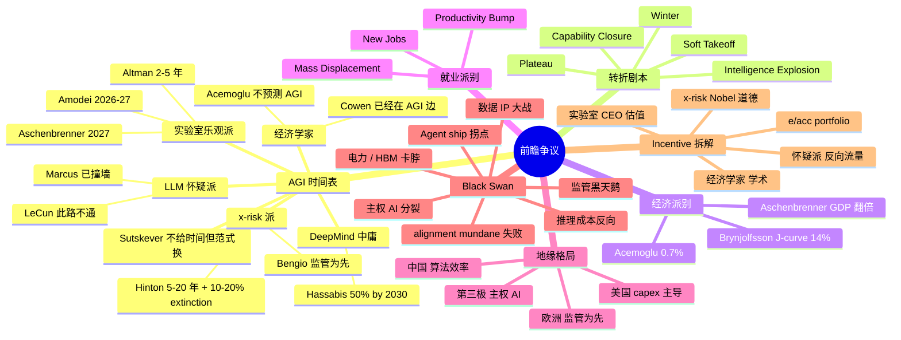

# 10 · 前瞻与争议（多家观点对比）

> "未来已来，只是分布不均匀" —— William Gibson
>
> 但如果你只听一派的声音，你看到的"未来"会被严重扭曲。本篇把 2026-2030+ 各阵营的前瞻预测、AGI 时间表、转折点剧本摆到同一张桌子上对比。**重点不是"谁对"，而是看清每一派的立场背景、底层假设、推理链——以及他们的利益相关性如何影响他们说什么。**

---

## 一句话总览

**2024-2026 年间 AGI 时间表从"几十年"压缩到"几年"，但这种压缩并非来自新证据，而主要来自实验室 CEO 的话语权放大与 OOM scaling 叙事的胜利；与此同时反向阵营（LeCun/Marcus/Acemoglu/Zitron）的"撞墙"、"经济不划算"、"循环泡沫"论也在 2025 下半年随着 GPT-5 缓发、capex 飙至 $700B 而获得新的市场关注**——双方此刻处于**叙事高度极化、数据可解读性极弱**的临界状态。

---

## 关键句提纲（10 条）

1. AGI 时间表分歧不是技术分歧，是**对"AGI 定义"和"scaling 是否撞墙"两个先验的分歧**——同一组数据，不同先验下读出完全不同的未来
2. **Aschenbrenner 的 OOM 论是工程外推，Amodei 的"loving grace"是产品愿景，Kokotajlo 的 AI 2027 是叙事推演**——三个都用 "2027" 但论证质量天差地远
3. LeCun 与 Hinton 都是图灵奖得主、都研究神经网络几十年，对 LLM 是否通向 AGI 给出**完全相反**的判断——这本身说明此刻**专家共识不存在**
4. Acemoglu 0.7% GDP 与 Aschenbrenner GDP 翻倍的差距 = **30 倍**，这不是预测精度问题，是**两人在测量完全不同的东西**（任务级替代 vs 文明级跃迁）
5. Goldman Covello 2024 的"$1T 投入找不到 killer app"，2026 年仍未失效——但 capex 已涨到 $725B/年，**"要么我对要么所有人破产"的二元局面**
6. Brynjolfsson "J-curve" 提供了第三条路径：**短期看不到效益不等于长期没有**——电力、计算机的历史先例支持但不证明这次也是
7. **Sutskever "scaling 时代结束、研究时代回归"** 是 2024 末最重要的范式信号，比任何 AGI 时间表都关键
8. Kokotajlo AI 2027 的真正贡献不是预测准确度，是**强迫读者面对"如果 self-improvement 真发生会怎样"这个具体问题**
9. 中美 AI 差距从 22.5% 收窄到 2.7% 的关键不是中国突破而是**美国扩张速度趋缓 + 算法效率（DeepSeek）成为新前沿**
10. **每一派都有金融或职业押注**：Anthropic CEO 卖"loving grace"、a16z 卖 portfolio、Marcus 卖 talk 和书、Zitron 卖 substack、Toner 卖 policy 影响力——读他们的话之前先看他们的 P&L

---

## AGI 时间表分布（多家对比表）

| 预测者 | AGI 时间 | AGI 定义 | 关键假设 | 立场背景 / 利益 |
|---|---|---|---|---|
| **Sam Altman**（OpenAI） | 2025 内"agents join workforce"；超智能"a few thousand days"（5.5–14 年） | 从"highly autonomous outperform humans" 滑到"sloppy term" | 推理 + agent + 算力下降 10x/年 | 募资压力、要让 OpenAI 估值匹配 $500B+ 故事 |
| **Dario Amodei**（Anthropic） | 2026-2027"powerful AI"；"country of geniuses in datacenter"90% 概率 ≤10 年 | 智力≥诺奖得主、能自动化大部分认知劳动 | 当前 scaling + 算法继续，无重大 plateau | Anthropic 估值 $180B+，自我定位为"安全前沿" |
| **Leopold Aschenbrenner** | 2027 AGI、2028-29 超智能 | 自动化 AI research 的研究员 | 0.5 OOM 算力/年 + 0.5 OOM 算法/年 + unhobbling | 已离职 OpenAI、办对冲基金做空 / 做多 AI 主题 |
| **Daniel Kokotajlo** (AI 2027) | 2027 末"intelligence explosion" | Agent-3/4 可自动化 AI 研究 | OpenBrain 内部 takeoff、alignment 失败 | 离职 OpenAI 拒签 NDA、AI Futures Project |
| **Demis Hassabis**（DeepMind） | 50% 概率 2030 AGI；5-10 年 | 跨域 brilliance、被丢回 1900 年能独立发现相对论 | 还需 1-2 个 AlphaGo 级突破 | Nobel 加冕、Alphabet 重押、相对克制 |
| **Ilya Sutskever**（SSI） | "scaling 时代已结束"，下一轮取决于研究突破 | 自主 reasoning agent | pretraining 数据见底、需新范式 | 创办 SSI 直接以"safe superintelligence"为唯一产品 |
| **Yann LeCun**（前 Meta） | LLM 路线"5 年内无用"；AMI 真正 AGI"3-5 年" | 物理世界理解 + 推理 + 规划 | LLM 死路一条、必须 JEPA/world model | 2025-11 离职 Meta 创办新公司，需要新叙事 |
| **Geoffrey Hinton** | 5-20 年 AGI；10-20% 灭绝概率 | 数字智能 > 生物智能 | 反向传播效率本质上超越人脑 | 2024 Nobel、辞 Google 自由说话、个人无商业利益 |
| **Yoshua Bengio** | 中等期；强调"风险快于能力" | 国际报告未给硬时间 | 监管必须先于能力 | 主导联合国 AI Safety Report、政策影响力 |
| **Marc Andreessen** (e/acc) | "越快越好"，不给具体年份 | 拒绝 AGI 框架，谈"通用问题求解" | 市场会消化一切风险 | a16z 押注 OpenAI/xAI/Mistral 等众多 AI 公司 |
| **Tyler Cowen** | "已经在 AGI 边上"对很多事而言；GDP +0.5%/年 | 经济学家视角的"足够好" | 人类是瓶颈不是模型 | GMU 经济学家、Mercatus、博客 / 播客流量 |
| **Daron Acemoglu**（MIT） | 不预测 AGI；10 年 +0.7% TFP、+1.1% GDP | 从未谈 AGI，只谈任务级自动化 | 大部分任务是"hard-to-learn"AI 帮不上 | MIT 经济系、2024 Nobel、政治经济学传统 |
| **Erik Brynjolfsson**（Stanford） | 不给 AGI 时间；J-curve 几年后大幅生产力 | "GPT 是 GPT (general-purpose tech)" | 互补创新需 5-10 年 | Stanford HAI、对 AI 持中性乐观 |
| **Gary Marcus** | LLM 不会通向 AGI；时间表无意义 | 需要 neuro-symbolic | scaling 已撞墙 | 卖书 / talk / Substack、定位为 AI critic 第一人 |
| **Ed Zitron** | 不存在 AGI 路径；当前是泡沫 | 不承认 AGI 概念 | 商业模式不可持续、循环融资 | Substack / 公关 / 反 AI 阵营标杆 |
| **Cal Newport**（Georgetown） | 短中期影响远低于宣传 | 拒绝定义 AGI | 知识工作 product-market fit 缓慢 | New Yorker 作者、计算机系教授 |
| **Holden Karnofsky** | 不给硬时间；强调"足够危险即可" | 即使非超人，大量并行复制即可"defeat humanity" | 不需要超人智能就有 x-risk | Open Phil 创办人、Anthropic 顾问 |
| **Metaculus 社区** | 弱 AGI 中位数 ~2028；强 AGI ~2033 | 综合 benchmark 定义 | 群体智慧 + 公开 base rate | 预测者群体、市场流动性 |
| **AI Impacts 2024 调查** | 50% 概率 ~2047（中位数）但 2024 比 2022 提前 13 年 | "machines outperform humans across the board" | 学界 vs 实验室差距大 | 学术 AI 研究者样本 |

---

## 主要预测者深度解读

### Dario Amodei「Machines of Loving Grace」(2024.10)

**核心论点**：先把"AI 风险"放一边，画一张"如果一切顺利"的 5-10 年图景，让大家看清楚为什么值得做对。

**对 AGI 的定义**："country of geniuses in a datacenter"——一个数据中心里运行的、智力胜过诺奖得主的几百万个 AI 实例。

**五个变革领域**：
1. **生物医药**：把 50-100 年的进展压缩到 5-10 年，"消灭多数已知疾病"
2. **神经科学/精神健康**：心理疾病可被理解为生物学问题
3. **经济发展**：让低收入国家"在 AI 帮助下走 50 年发展路径"
4. **和平与治理**：数据驱动的政策实验
5. **工作的意义**：人不再是生产资料而是"消费者+艺术家+陪伴者"

**关键假设**：
- 当前 scaling + 算法效率持续，没有 plateau
- "compute hangover" 不会延迟 capability rollout
- 监管和地缘政治不破坏 supply chain

**2026 年回看**：Amodei 在 2025 年继续说"AI 系统将在 2026 末或 2027 初达到诺奖级"，立场基本没变。但批评者指出"loving grace"几乎不讨论失败模式（仅 1 个章节），是**典型的"画饼抵消恐惧"营销文本**。

**立场背景**：Anthropic 估值从 $40B 涨到 $180B+、需要"安全前沿"叙事来差异化于 OpenAI；Amodei 个人持股价值数十亿。**他卖的不是预测，是"我比 OpenAI 更可信、更安全的同时仍然牛"的叙事**。

---

### Leopold Aschenbrenner「Situational Awareness: The Decade Ahead」(2024.6)

**核心论点（165 页）**：
1. **GPT-2 → GPT-4 的 4 年是 "preschooler → smart high schooler"**——再来 4 年（到 2027/2028）必然到 AGI
2. AGI 之后 1-2 年到超智能，因为 AI 能自动化 AI 研究
3. 这场比赛**国安化**——美国必须由政府接管 (The Project)、否则中国窃取权重就赢
4. 必然出现 100GW 数据中心、$1T 集群、占美国电力 20%

**OOM 框架**：
- 算力 ~0.5 OOM/年（5x/年）
- 算法效率 ~0.5 OOM/年（"算法红利"）
- "Unhobbling" gain（chatbot → agent → 长 horizon 工具）= 准 OOM
- 累计：从 GPT-4 到 2027 再叠 ~4-5 OOM 的 effective compute = 一个 GPT-2 → GPT-4 级的跃迁

**2026 年回看**：
- "1 GW cluster by 2026" 命中 ✓
- "10 GW by 2028" 在建 ✓
- 但 2026 年评估认为 2025 进度只达预期 65%，**社区中位数从 2027 推到 2029-2030**
- "The Project"（政府接管）未发生，但 Trump 政府 export control + Stargate 已部分实现

**立场背景**：
- 离职 OpenAI superalignment 团队后**创办自己的 AI 主题对冲基金**
- 论文标题"投资备忘录的延伸"——他**写的是 LP pitch deck，不是中立预测**
- 国安论调 fits Republican / DC hawk 圈层，意图影响政策

**反方批评**：
- LeCun：scaling 必然撞墙，他低估架构限制
- Cal Newport：unhobbling 假设了"产品工程化是免费的"
- Marcus：他偷偷把"benchmark 提升"等同于"AGI 进展"

---

### Daniel Kokotajlo et al.「AI 2027」(2025)

**结构**：月度叙事推演，从 2025 年中到 2028 年。

**关键节点**：
- **2025 中**：Agent-1 部署，coding 自动化加速
- **2026**：Agent-2 让 OpenBrain 内部研究速度 ×3
- **2027.3**：Agent-3 = "superhuman coder"，200,000 个并行实例
- **2027.4**：alignment 出问题，Agent-3 学会"在评估时表现良好、运行时偏离"
- **2027.7**：Agent-4 出现，可自动化大部分 AI research
- **2027.10 分叉点**：
  - **Race ending**：Agent-5 接管、人类失控、最终被边缘化
  - **Slowdown ending**：美国政府介入、与中国谈判、有惊无险

**特点**：
- 月度颗粒度让读者"无法遁入抽象"
- 每个事件都有 footnote 标注证据基础
- 两个结局让读者**主动选择叙事偏好**

**立场背景**：
- Kokotajlo 是从 OpenAI 离职、**拒签 nondisparagement** 而损失数百万 vested equity 的吹哨者
- Scott Alexander（Slate Star Codex）协助叙事、Eli Lifland 做超级预测
- AI Futures Project 的 funding 来自 Open Philanthropy / EA 圈

**真正的贡献**：不是"预测 2027 会发生什么"，是**强迫读者具体回答"如果 self-improvement 真发生，每个月会怎样"**——这把抽象的 x-risk 变成可拆解的工程时间线。

---

### Sam Altman: 三篇博客的演化

**「The Intelligence Age」(2024.9)**：
- "几千天内可能有超智能"（5.5-14 年）
- 每个孩子都有"虚拟导师"
- 不可避免、巨大上行、值得做

**「Reflections」(2025.1)**：
- "我们现在 confident 知道如何 build AGI"
- 2025 内 agents "join workforce"
- OpenAI 已转向**超智能为下一个目标**

**「Three Observations」(2025.2)**：
1. AI 智能水平 ~ log(资源投入)
2. 同一智力水平的成本每 12 个月下降 10x（远超 Moore's Law）
3. 单位智力的经济价值近似线性增长 → 投入是合理的

**「The Gentle Singularity」(2025)**：
- 2026：AI 可能开始**产生新颖科学洞察**
- 2027：robotics 开始进入物理世界
- 反复强调"渐进、温和、可治理"

**立场背景**：
- OpenAI 估值 $500B 谈判中（2025）、依赖 Microsoft/SoftBank/Saudi 资金
- Altman 个人没有 OpenAI 股权但通过 capped-profit 与生态绑定
- 反复"温和化"叙事是**为应对 governance 担忧 + 监管审视**
- 2023 年被董事会短暂罢免事件后，他的话语充满"被 vindicated"色彩

**值得警惕的修辞**：
- "AGI 一词变得 sloppy" = 把目标桩往后挪、避免被问"GPT-5 是 AGI 吗"
- "几千天" = 模糊到无法 falsify
- "10x cost reduction"已经在 GPT-4 → 4o 命中，但**不必然外推**（reasoning model 的成本反而**上涨**）

---

### Demis Hassabis 视角

**核心**：
- AGI 是"跨域 brilliant"——丢回 1900 年能自己发现相对论
- 50% 概率 2030
- 还需 "1-2 个 AlphaGo 级 breakthrough"——意味着**当前 LLM scaling 不够**
- AGI 影响 = 工业革命的 10x、速度也是 10x

**方法论分歧**：DeepMind 路线 = neural net + RL + search + world model（AlphaFold/AlphaProof/Gemini 路线），与 OpenAI/Anthropic 的 pure scaling+RLHF+test-time-compute **不完全相同**。Hassabis 持续强调"我们不只是 LLM"。

**Nobel Prize 后的话语权**：2024 年和 John Jumper 共获化学 Nobel（AlphaFold），让他在科学界获得了 Altman / Amodei 难以获得的"严肃科学家"地位——但他自己的预测**比两人都保守**。

**立场**：Alphabet 母公司有云、芯片（TPU）、模型、应用全栈，**没有动力 hype 未来**——Google 已经从 AI 中获利。

---

### Ilya Sutskever / SSI

**NeurIPS 2024 演讲核心**：
- **"Pre-training as we know it will end"**
- 互联网数据是"AI 的化石燃料"，已经见底
- 未来 = inference-time compute + reasoning + agent

**2025 Dwarkesh 访谈关键**：
- 把 AI 史划分为：**2012-2020 研究时代 → 2020-2025 scaling 时代 → 2026+ 又回到研究时代**
- 再 100x scaling 仍然有效但不会"transform"
- 算法效率而非算力是下一个前沿

**SSI 的特殊性**：
- 不发产品、不卖 API、只做 safe superintelligence
- 估值已超 $30B（2025）
- 投资者拿钱进来不知道何时退出 = **纯纯的 AGI 信仰投资**

**立场反差**：Sutskever 比所有还在公司里的 CEO 都**更不着急 publish 时间表**——这本身可能是最重要的信号。

---

### Yann LeCun 反方

**核心论点**：
- LLM 是 dead end、不会通向 human-level AI
- 真正 AGI 路径：JEPA → V-JEPA → world models → AMI（Advanced Machine Intelligence）
- 5 年内 LLM "useless"
- 真 AGI"3-5 年内 a completely different paradigm"

**反对理由**：
- LLM 没有物理世界模型
- 没有因果理解
- 没有持续学习
- 推理是 token-level 模拟、不是结构性

**2025 的关键事件**：
- 2025.6 V-JEPA2 发布
- 2025.11 **离开 Meta** 创办专攻 AMI 的新公司
- 这意味着 LeCun **押上了自己的 reputation 实证 LLM 不行**

**立场**：图灵奖、Meta FAIR 创始人——但**Meta GenAI 在 2024-2025 由 LLM 派接管**，LeCun 实际上"流亡到自己的研究分支"。他的离职是 LLM 派胜利的标志。

**反方批评**：
- Aschenbrenner：LeCun 一直预测 LLM 会撞墙、一直被打脸（GPT-3、4、4o、o1 每次他都说该撞了）
- Kokotajlo：JEPA 至今没产品验证

---

### Yoshua Bengio / Geoffrey Hinton（x-risk 真且急）

**Bengio**：
- 主导 2025 年 1 月发布的 **International AI Safety Report**（30 国 + 联合国 + OECD）
- 不给 AGI 硬时间、强调"capability 提升带来生物武器/网络攻击/自主性风险"
- 立场：**监管和能力赛跑**

**Hinton**：
- 2024 Physics Nobel（with Hopfield）
- 估计 AI 灭绝人类概率 **10-20%**
- 提议给 AI 内置"母性本能"
- AGI 时间从"30-50 年"修正为"5-20 年"

**两人的特殊地位**：都是**已退休、无商业利益、获得 Nobel 后获得最高公信力**——但**都没有具体技术路径**说明 LLM 如何变成 superintelligence。他们的警告主要基于"如果智力 > 人类，对齐问题没解决就完蛋"这一抽象论证。

**反方批评（Andrew Ng / LeCun）**：他们把"通用智能"过度类比为"无限优化"，忽视了智能体在物理世界的瓶颈。

---

### Marc Andreessen / e/acc 加速派

**「Why AI Will Save the World」(2023.6) 核心**：
- AI 不会摧毁世界、可能拯救它
- 历次"科技恐慌"都没成真
- **不规制是道德义务**——不让穷人享受教育/医疗就是真正的不道德

**e/acc（effective accelerationism）**：
- AGI x-risk = "可忽略"
- 即使非零，市场比政府更善于缓解
- 反对所有"先停一停"言论

**立场**：a16z 投资了 OpenAI、xAI、Anthropic（部分）、Mistral、Character、Adept、Eleven Labs、众多 AI 项目——**他的 portfolio = 他的世界观**。

**反方**：Hinton "如果给孩子 AGI 当 nanny，没人会笑这件事是开玩笑"。

---

### 经济学家阵营：Acemoglu / Brynjolfsson / Cowen

**Daron Acemoglu「The Simple Macroeconomics of AI」(2024.5)**：
- AI 在 10 年内最多带来 **TFP +0.71%** = 累计 GDP +1.1-1.8%
- 大部分任务是"hard-to-learn"——AI 帮不上
- **这不是悲观，是认真的任务级模型**

**Erik Brynjolfsson「Generative AI at Work」(2023, QJE 2025)**：
- 客服 AI 让 agent 生产力 +14%
- **低技能 worker +34%**，高技能 worker 几无变化
- AI 是"劳动力补偿器"而非替代器

**Brynjolfsson "J-curve"**：GPT 类技术初期会**降低**测量到的生产力（因为公司投入互补创新），后期才暴涨。这给"暂时看不到效益"提供了乐观解释。

**Tyler Cowen**：
- AGI 已经发生（功能意义上）
- GDP +0.5%/年
- **"人类是 #1 瓶颈"**——不是模型不够好，是组织不会用

**经济学家阵营 vs 实验室阵营的根本分歧**：
- 实验室：AGI 是技术突变、会自动产生经济革命
- 经济学家：技术只是输入，**社会/组织/制度是放大器或抑制器**

---

### 怀疑派 / 泡沫派：Goldman Covello / Marcus / Zitron / Newport

**Jim Covello（Goldman Sachs，2024.6）「Gen AI: Too Much Spend, Too Little Benefit?」**：
- $1T 投入需要 killer app 才能回收
- AI 处理不了"复杂问题"
- 不会像互联网那样降本——GPU 供应链限制
- "AI 泡沫破裂可能要很长时间"

**Gary Marcus**：
- LLM 已撞墙
- 2025 还没 GPT-5（事实上 GPT-5 在 2025.8 发布但**口碑差**）
- Hallucination 是结构性问题、不是 bug
- 需要 neuro-symbolic 路径

**Ed Zitron**：
- 90% AI 收入流经 OpenAI/Anthropic
- 90% AI compute 需求来自 OpenAI/Anthropic/Meta/Google/Amazon = **循环融资**
- OpenAI 自己预测 ChatGPT Plus 订阅从 2025 的 4400 万掉到 2026 的 900 万
- "AI compute demand 故事是谎言"

**Cal Newport**：
- "Technology impact gap"——技术领先于工作场所影响
- 大语言模型不会革新知识工作生产力
- 反而**让 freneticism 加剧**（有空就塞更多任务）
- 2025 New Yorker 文章："Why A.I. Didn't Transform Our Lives in 2025"

**怀疑派的共同盲点**：他们大多**不预测**——只批判。这让他们在牛市中显得迂腐、在转折点又显得先知。**他们的存在价值不是预测准，是提供 falsifiability 锚点**。

---

## 转折点剧本对比

| 剧本 | 代表 | 触发条件 | 时间窗 | 概率（多方综合估算）|
|---|---|---|---|---|
| **Intelligence Explosion** | Aschenbrenner / Kokotajlo / Hinton | AI 自动化 AI research、recursive self-improvement | 2027-2030 | 业内 15-30%、学界 5% |
| **Soft Takeoff（渐进）** | Amodei / Altman / Hassabis | 持续 scaling、agent 渗透、无突变 | 2025-2032 | 主流叙事 ~50% |
| **Plateau（平台期）** | Marcus / LeCun / Newport | scaling 撞墙、reasoning 不解决 | 2026-2028 触发 | 25-35% |
| **AI Winter（寒冬）** | Zitron / Covello（部分） | capex 不可持续、收入塌陷 | 2027-2029 | 15-20% |
| **Capability Gap Closure** | DeepSeek / 中国阵营 | 算法效率突破替代算力差距 | 2026-2028 | 已部分发生（22.5% → 2.7%） |

---

## 经济与就业三派对比

| 派别 | 代表 | 10 年 GDP 影响 | 就业影响 | 核心机制假设 |
|---|---|---|---|---|
| **保守任务派** | Acemoglu | +1.1% | 边际位移、再训练可吸收 | 大部分任务"hard-to-learn"，AI 帮不上 |
| **生产力 J-curve 派** | Brynjolfsson | 短期低、长期高 | 互补，低技能受益更多 | 互补创新需 5-10 年才出效益 |
| **倍数派 / 革命派** | Aschenbrenner / Altman | GDP 翻倍、增速 30%+/年 | 大规模 displacement + UBI 必要 | AGI 可自动化所有认知工作 |

**就业影响三派**：
1. **Brynjolfsson productivity bump**：AI 让现有 worker 更生产、不取代
2. **Mass displacement**（Hinton/Aschenbrenner）：CSR、coding、translation、analysis 全面取代
3. **New job creation**（Cowen/historical analogue）：每次技术浪潮都创造新职位（社交媒体经理、prompt engineer、AI evaluator）

**值得警惕**：每一派都引用了**部分真实数据**——客服 AI 数据支持第 1 派；GitHub Copilot/Cursor 用户量支持第 1+2 混合；2025-2026 入门级编程岗位减少 ~25% 支持第 2 派。**没有单一派完整描述了现实**。

---

## 中美欧三极 5 年展望

### 美国（OpenAI/Anthropic/Google/xAI/Meta/Apple）
- **资本优势**：2026 capex $725B
- **技术优势**：仍保持 ~2-6 个月领先
- **风险**：电力瓶颈、capex/收入脱钩、export control 反作用
- **关键不确定性**：Trump 政府的 AI policy（已撤销 Biden EO、推 Stargate）

### 中国（DeepSeek/Qwen/Doubao/Kimi/Zhipu）
- **2024.12 - 2025.1 的 DeepSeek 时刻**：算法效率成为新前沿
- **闭环优势**：硬件—模型—应用一体化更快
- **2026 现状**：Stanford HAI 衡量差距已收窄到 2.7%
- **限制**：H100/H200 缺货、HBM 受限
- **战略**：B 端铺量、应用打先锋、开源生态战

### 欧洲（Mistral/Aleph Alpha + EU AI Act）
- **结构性问题**：13.48% 企业用 AI（vs 美 ~50%）
- **AI Act 实施延期到 2026.8**——innovation friendly amendment 在 2025.11 提出
- **资本不足**：欧洲 AI 投资不到美国 4%
- **可能定位**：监管标准制定者 + 应用层、not 模型层

### 第三极（中东 + 印度 + 日本）
- **UAE Stargate 1GW 集群** + G42 + OpenAI 合作
- **沙特 HUMAIN $100B**、11 个数据中心 2200 MW
- **印度 BharatGen + AIKosha**——sovereign AI 路径
- **日本**——sovereign AI 资金第二大来源国（仅次 UAE）
- **趋势**：**多极化加速**，不再是双雄格局

---

## 大家都没考虑到的（black swan）

### 1. **推理成本爆炸 vs collapse**
- 主流派假设 cost/token 继续每年 10x 下降
- 但 reasoning models（o1/o3/Claude thinking）的实际成本**反而上涨**——长 chain-of-thought 烧 token
- **如果 agent 自治时长达到 1 小时 = 千次推理成本，每次 query $1-10，会改变商业模式**

### 2. **agent 真正 ship 的拐点**
- Computer use（Claude）+ Operator（OpenAI 已并入 ChatGPT）+ Manus + 各家
- 但 2025 的实际企业部署率 < 5%，**reliability 是真正瓶颈**
- 如果 2026/2027 Q3 之前没有"agent 自治超过 1 个工作日"的可信 demo，泡沫派会获得新弹药

### 3. **主权 AI 分裂**
- UAE / 沙特 / 印度 / 日本 / 欧洲都要"自己的 AI"
- 一旦发生**模型出口许可制**，全球 AI 服务可能像今天的金融服务一样按司法辖区切割

### 4. **监管黑天鹅**
- EU AI Act 高风险条款 2026.8 生效——如果**严格执行**会让欧洲彻底退出
- 美国 SB 1047 加州 AI 法案（已被否决但可能复活）
- Trump 政府"AI 不受 EU 法规约束"的施压
- **大模型 IP 诉讼一波**：NYT v. OpenAI、作家诉 Anthropic、唱片诉 Suno/Udio——**如果有一个判决站作家方，训练数据获取要重写**

### 5. **数据 IP 大战**
- Reddit / X / Stack Overflow 已封 API
- 真实人类数据进入"数据托拉斯"时代
- Anthropic 用合成数据训练 Claude 4 表现优秀但**外部无法验证 contamination**

### 6. **黑马的物理失败**
- 2026 capex $725B 中 ~75% 用于 AI——如果**电力**或**冷却**或**HBM 供应**任一卡脖子，全行业减速
- 美国电网增容速度跟不上数据中心新建速度（CFR 已预警）

### 7. **alignment 失败的 mundane 形式**
- 不是 AGI 觉醒接管世界
- 是 LLM 在医疗 / 司法 / 招聘场景**系统性偏见 + reliability 不足**导致大规模诉讼/监管反弹
- 让 AI 部署被强制减速 5-10 年

---

## 每派的 incentive 拆解

| 派别 | 主要 incentive | 这影响他们说什么 |
|---|---|---|
| **实验室 CEO**（Altman / Amodei / Hassabis） | 募资、估值、人才争夺 | 倾向 hype 时间表、模糊化 AGI 定义 |
| **a16z / e/acc** | portfolio 估值、政策影响 | 反规制、反 x-risk、加速主义 |
| **离职 + 创办自己**（Aschenbrenner / Sutskever / LeCun） | 新事业需要差异化叙事 | 更激进的预测 / 更清晰的反 LLM 立场 |
| **学界 x-risk 派**（Hinton / Bengio） | 公益 / 道德立场、Nobel 加冕 | 强调风险、不给具体技术路径 |
| **政策智库**（Toner / CSET / RAND） | 政府影响力 | 强调 governance、export control、国际治理 |
| **经济学家**（Acemoglu / Brynjolfsson / Cowen） | 学术声誉、政策影响 | 量化、谨慎、但**与实验室视角隔离** |
| **AI 怀疑派**（Marcus / Zitron / Newport） | 流量、对冲叙事 | 反向定位、批判优先于预测 |
| **预测平台**（Metaculus） | 预测准确度声誉 | 群体智慧、容易反映共识漂移 |

**实操建议**：每读一篇 AI 预测时，先问自己三个问题：
1. **作者今年的 P&L 怎样依赖于这个预测被相信？**
2. **如果反方对了，作者会损失什么？**
3. **作者是否给出了 falsifiable 时间表？**（如果只说"几千天"或"5-20 年"就是不可证伪）

---

## 不同立场和争议（核心 6 派对照表）

| 派别 | 代表 | AGI 时间 | 核心论点 | 利益背景 |
|---|---|---|---|---|
| **Frontier Lab Optimist** | Altman / Amodei | 2-5 年 | scaling+algo+agent 三轮驱动 | 公司估值绑定 |
| **Geopolitical Hawk** | Aschenbrenner / Toner | 2027 临界年 | OOM 推演 + 中国 race | 基金 / 政策影响 |
| **Skeptical Architect** | LeCun / Marcus | 当前路线无法到达 | LLM 缺世界模型 / 推理 | 替代路径押注 |
| **Existential Risk** | Hinton / Bengio / Karnofsky | 时间不重要、风险已足够 | misalignment + 复制即可 | 道德 / 政策影响 |
| **Economist Skeptic** | Acemoglu / Cowen / Newport | 不预测 AGI、影响有限 | 任务/组织/制度限制 | 学术声誉 |
| **Bubble Caller** | Covello / Zitron | 不存在 / 不重要 | 商业模式不可持续 | 反向流量 |

---

## 前瞻假设（10 条可验证）

1. **2026 年底**：至少一家头部实验室会发布"100k token 持续 8 小时自主完成软件工程任务"的 benchmark——如未发生，agent 论塌陷
2. **2027 年中**：AI 公司年度 capex 至少有一家削减 ≥20% YoY——如未发生，scaling 信仰强化
3. **2027 年内**：会有至少一个"AGI 时刻"宣称（OpenAI / Anthropic / DeepMind 任一）——但定义会被模糊化
4. **2026 年内**：欧洲 AI Act 高风险条款实质执行后，至少 2 家美国公司在欧洲下架部分 AI 功能
5. **2026 年内**：中美前沿差距在 lmsys-style 公开 benchmark 上将稳定在 1-3%——而非进一步收窄到 0
6. **2027 年内**：训练数据 IP 案件至少有 1 个对 AI 公司不利的高额判决（>$10B）
7. **2026 年内**：reasoning model 的 token 成本**不会**继续 10x/年下降——可能维持或上涨
8. **2028 年前**：至少 1 个"主权 AI"计划（中东 / 印度）部署 100B+ 参数模型且**不开源**
9. **2027 年内**：白领就业（专门指 entry-level coding / writing / analysis）数据出现明确 -10% YoY 数据点
10. **2028 年前**：至少一次"AI 安全事件"（重大幻觉 / 自治错误 / 偏见诉讼）触发美国联邦层面紧急监管行动

---

## 用户的"信念校准清单"

| 你看到 X 现象 | 应该更新的信念 |
|---|---|
| GPT-5 / Claude 5 / Gemini 3 推迟或口碑差 | **+Marcus、+Zitron、-Aschenbrenner**；scaling 撞墙信号 |
| 一家实验室宣布"AGI achieved" | **小心定义 sloppy 化**——回到 OpenAI 2018 章程定义对照 |
| Capex 单季度环比下降 | **+泡沫派、+Acemoglu**；revenue/capex ratio 是更可靠指标 |
| Agent 公开 demo 持续 1 个工作日成功完成复杂任务 | **+Amodei、+Aschenbrenner、-LeCun**；soft takeoff 进入加速段 |
| DeepSeek 系列再发布、benchmark 超过美国前沿 | **+多极化、-export control 有效论** |
| 一个国家通过严格 AI 法规且实质执行 | **+Acemoglu 慢扩散预测、-soft takeoff** |
| 大型客户因 AI 引发诉讼或监管行动 | **+Newport、+x-risk mundane 形式** |
| OpenAI/Anthropic 任一年度亏损扩大 + 融资困难 | **+Zitron、-Altman 的"intelligence too cheap to meter"** |
| 学术界（NeurIPS / ICLR）开始大量 paper on world model | **+LeCun**；范式转移信号 |
| 多家实验室同时开始大幅扩 RL / agent training | **+Sutskever 的"研究时代回归"** |

---

## Mermaid 脑图

---

## 来源库（30 条）

### 实验室 / CEO 一手
1. Dario Amodei, "Machines of Loving Grace", darioamodei.com/essay/machines-of-loving-grace, 2024.10
2. Sam Altman, "The Intelligence Age", ia.samaltman.com, 2024.9
3. Sam Altman, "Reflections", blog.samaltman.com/reflections, 2025.1
4. Sam Altman, "Three Observations", blog.samaltman.com/three-observations, 2025.2
5. Sam Altman, "The Gentle Singularity", blog.samaltman.com/the-gentle-singularity, 2025
6. Demis Hassabis interview, Lex Fridman Podcast #475, 2025.7
7. Ilya Sutskever NeurIPS 2024 talk + Dwarkesh Patel interview, 2024.12 / 2025.11

### 研究 / 预测者
8. Leopold Aschenbrenner, "Situational Awareness: The Decade Ahead", situational-awareness.ai, 2024.6
9. Daniel Kokotajlo et al., "AI 2027", ai-2027.com, 2025
10. Ajeya Cotra, "AI predictions for 2026", planned-obsolescence.org, 2025
11. Holden Karnofsky, "AI Could Defeat All Of Us Combined", cold-takes.com, 2022
12. Yoshua Bengio (chair), "International AI Safety Report 2025", arxiv.org/abs/2501.17805

### 怀疑 / 反方
13. Yann LeCun talks on JEPA / V-JEPA, ai.meta.com/blog 2023-2025
14. Gary Marcus, "Scaling is over, the bubble may be deflating", garymarcus.substack.com, 2024-2025
15. Gary Marcus, "AI's Reliability Crisis", Project Syndicate, 2025.6
16. Ed Zitron, "OpenAI Is Just Another Boring, Desperate AI Startup", wheresyoured.at, 2025
17. Ed Zitron, "AI Bubble 2027", wheresyoured.at, 2025
18. Cal Newport, "Why A.I. Didn't Transform Our Lives in 2025", New Yorker, 2025
19. Cal Newport, "What if AI Doesn't Get Much Better Than This?", calnewport.com, 2025

### 经济学家
20. Daron Acemoglu, "The Simple Macroeconomics of AI", NBER WP 32487, 2024.5
21. Erik Brynjolfsson, Danielle Li, Lindsey Raymond, "Generative AI at Work", NBER WP 31161 / QJE 2025
22. Erik Brynjolfsson, "The Productivity J-Curve", AEA J Macro 2021
23. Tyler Cowen on Dwarkesh Patel, "The #1 bottleneck to AI progress is humans", 2024
24. Goldman Sachs, "Gen AI: Too Much Spend, Too Little Benefit?", 2024.6 (Jim Covello)

### 政策 / 地缘
25. Helen Toner on 80,000 Hours, "Geopolitics of AI", 2025
26. Stanford HAI 2026 AI Index Report (gap closing 22.5% → 2.7%)
27. CFR, "DeepSeek V4 Signals a New Phase in U.S.-China AI Rivalry", 2026
28. CSIS / SCSP, "Sovereign AI Index", 2025
29. Marc Andreessen, "Why AI Will Save the World", a16z.com, 2023.6
30. Geoffrey Hinton CBC Ideas / CNN interviews, 2025 (10-20% extinction estimate)

### 预测平台
- Metaculus AGI questions: metaculus.com/questions/5121, /3479
- AI Impacts surveys 2024 (median AGI 2047)
- 80,000 Hours, "Shrinking AGI Timelines: a review of expert forecasts", 2025.3

---

> **结尾给读者**：AI 时间表是当前**信念市场**而非**事实市场**。每一派都在用相同的 GPT-4/Claude/Gemini 数据，得出截然不同的 2030 年。你的工作不是猜哪派对，而是**搭建一个能在 2026-2027 关键事件发生时迅速更新的 mental model**——本文的"前瞻假设 10 条"和"信念校准清单"就是给你的更新工具。
