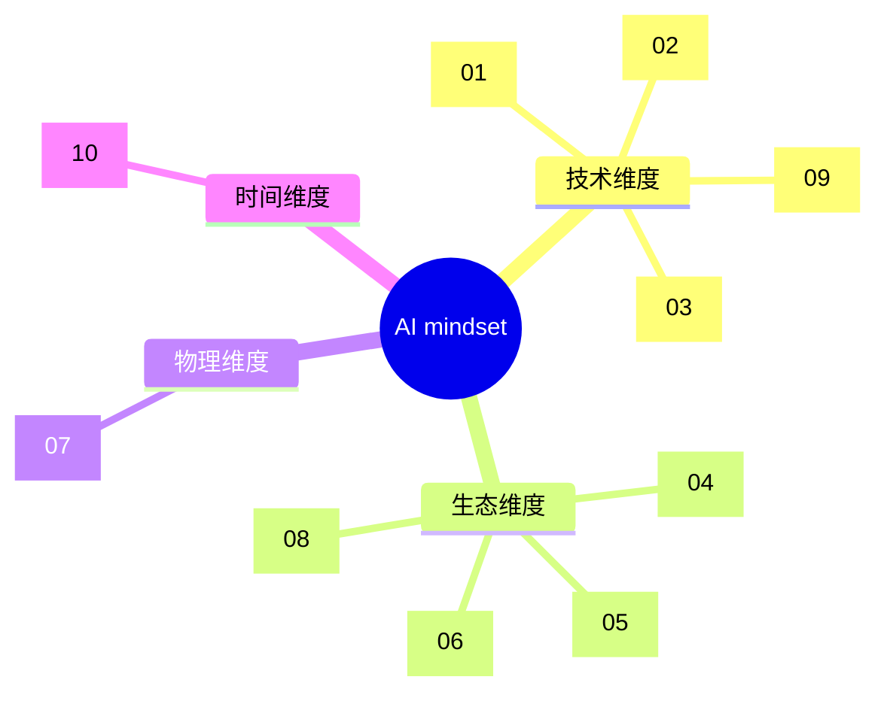

# AI mindset explore — 个人 AI 认知框架

> 这不是一份一次性报告，而是一套**可持续维护的认知工具**。
> 10 个独立视角并行深挖，覆盖技术本质 / 操控术 / 工程实践 / 行业替代 / 投资格局 / 个人工作流 / 基础设施 / 安全治理 / 智能本质 / 前瞻争议。
> 每章独立成文，互有 overlap，不强求一致。允许相左观点并解释立场背景。

---

## 这是什么 / 不是什么

**这是**：一套让你日后看到任何新模型 / 新工具 / 新观点时，能快速**定位、判断含金量、追问背景**的思考脚手架。

**不是**：
- 不是一次性的报告（永远在迭代）
- 不是"标准答案"（每章都有相左观点和原因）
- 不是技术教程（不教你怎么跑代码）
- 不是行业八卦（每条结论必须有引用）

---

## 怎么用

| 你正在做什么 | 翻哪章 |
|---|---|
| 看到新模型 / 新论文，想判断是不是真本质突破 | 01 + 09 |
| 决定要不要在产品里上 multi-agent / 复杂编排 | 02 + 03 |
| 评估某个 AI 创业公司是不是"真公司" | 04 + 05 |
| 决定哪些工作交给 AI、哪些不该 | 06 |
| 判断算力 / 电力 / 地缘新闻的真实分量 | 07 |
| 判断 AI safety 新闻是真问题还是炒作 | 08 |
| 解读名人 AI 预测，识别立场偏置 | 10 |
| 重新思考你的下一个 AI 项目的边界 | 03 + 06 + 09 |

---

## 10 章导航

| # | 章节 | 一句话总览 |
|---|---|---|
| [01](./01-tech-evolution-essence.md) | **技术演进与本质** | 真本质突破只有 4 件：Transformer / Scaling Laws / RLHF→RLVR / Function calling→Computer use |
| [02](./02-control-stack-evolution.md) | **操控术分层演进** | L0-L7 上一层失效→下一层逃生；技巧保鲜期只有一代模型 |
| [03](./03-engineering-patterns.md) | **工程实践与架构模式** | Eval 是真护城河；最珍贵建议是「最简单的 while 循环」 |
| [04](./04-industry-displacement.md) | **行业替代地图** | 替代发生在 task 层不是 industry 层；70/30 是平衡态 |
| [05](./05-investment-business-models.md) | **投资与商业模式** | 短期基础设施吃肉、中期模型层下沉、长期 vertical AI 显形 |
| [06](./06-personal-workflow.md) | **个人工作流与认知重塑** | AI 是平权器但放大「普通」；从生成转向验证 |
| [07](./07-infra-compute-geopolitics.md) | **基础设施、算力、地缘** | 瓶颈在沿供应链上移：HBM → ASML → 电网变压器 |
| [08](./08-safety-alignment-ethics.md) | **安全、对齐、伦理** | 实证转折 + 治理倒退；adversarial training 反让 backdoor 更隐蔽 |
| [09](./09-cognitive-science-intelligence.md) | **认知科学与智能本质** | 「理解」之争是定义之争；agency 是脚手架借的 |
| [10](./10-forecasts-controversies.md) | **前瞻与争议** | 派别分歧根源是先验假设错位 + P&L 利益绑定 |

每章结构相同：一句话总览 / 关键句提纲 / 深度展开 / 不同立场和争议（含每派的立场背景）/ 5-10 条可验证前瞻假设 / Mermaid 脑图 / 15-35 条来源链接。

---

## 顶层框架图

四个维度的提问角度不同：
- **技术维度**问"这是什么"
- **生态维度**问"谁会赢 / 谁会被淘汰"
- **物理维度**问"什么是真瓶颈"
- **时间维度**问"何时发生 / 谁的预测可信"

任何 AI 新闻都至少落在某一维度上，找对维度才能问对问题。

---

## 跨视角共识（10 个独立 agent 都指向同一件事）

1. **Test-time compute 是新 scaling 轴** — pretraining loss 与能力跃升解耦，新跃升来自 RL + inference compute；"模型规模"作为讨论核心词正在过时（01 / 02 / 07 / 10）
2. **Eval 是真护城河，prompt 是表面** — 操控术细节技巧在贬值，eval 工程在升值（02 / 03）
3. **METR horizon length 是 agent 进展唯一干净指标** — 任务时长每 4 个月翻倍（01 / 02 / 09）
4. **简单 > 复杂** — Anthropic 公开建议先用裸 while 循环再上框架；multi-agent 大多是工程问题误诊（02 / 03）
5. **物理瓶颈正在显形** — 电力 / HBM / 变压器 lead time 已成事实瓶颈，不是钱能 24 个月内解决的（05 / 07）
6. **C 端闭环成战略资产** — 合成数据时代，无 C 端用户互动闭环的玩家（Meta / xAI）有结构性劣势（05 / 07）
7. **Anthropic 已悄悄超 OpenAI 营收** — $30B vs $25B 年化（2026.4），"AI = OpenAI" 叙事被打破（04 / 05）
8. **替代有平衡态，"100% 替代"叙事都会回滚** — Klarna 70/30 模型可推广到法律 / 医疗 / 教育（04 / 06）

---

## 跨视角根本分歧

| 议题 | 阵营 A | 阵营 B | 阵营 C |
|---|---|---|---|
| LLM 是否通向 AGI | Sutskever / Hinton / Anthropic：是 | LeCun：缺 world model | Marcus：scale 解决不了系统性 |
| AGI 时间表 | Aschenbrenner: 2027 | Amodei: 2026-2030 | Acemoglu: 影响要 30 年 |
| 复杂操控术价值 | LangGraph / CrewAI 派 | Anthropic 简单派 | "全靠 base model" 派 |
| RAG 命运 | long-context 取代论 | hybrid + rerank 长存 | agentic RAG 是终态 |
| wrapper trap | a16z：应用层会赢 | Stratechery：模型公司下沉 | 80% 薄壳必死共识 |
| 安全紧迫度 | Anthropic / Bengio：真且急 | LeCun / 多数 ML 派：炒作 | AI Snake Oil：混淆近期 vs x-risk |
| capex 泡沫 | Goldman / Zitron：撞墙 | a16z / Sequoia：真实价值 | Cahn：$600B 缺口 |
| 经济影响测量 | Acemoglu：+0.7% TFP / 10 年 | Aschenbrenner：GDP 倍数 | Newport：30 年慢扩散 |

**分歧的根源往往不是事实差异，而是 (a) 测量对象不同 (b) 先验假设不同 (c) 利益绑定不同。**

---

## 最反直觉洞察 Top 12（精选）

| # | 洞察 | 章节 |
|---|---|---|
| 1 | "涌现"是测量假象（Schaeffer 2023）—— 换连续指标就平滑 | 01 |
| 2 | pretraining loss 与能力跃升解耦；判断新发布要看动没动 RL / agentic 这条新轴 | 01 |
| 3 | CoT 在 reasoning model 上**反而扣分**（o1 / o3 加 "think step by step" 模板正确率下降）—— 提示工程的具体技巧保鲜期只有一代模型 | 02 |
| 4 | Computer use 是 L4 退化补丁不是进化 —— 长期会被 MCP / "build for agents" 反向吃回 | 02 |
| 5 | Long context 没杀死 RAG，反而强化它 —— citation accuracy 在长上下文中显著下降 | 03 |
| 6 | 放射科岗位反而 +5%（BLS 2024-2034）—— 老龄化把需求放大得比 AI 替代效率快 | 04 |
| 7 | Klarna 客服打脸：70/30 是真平衡态 —— 所有"100% 替代"故事 2026-27 都会回滚 | 04 |
| 8 | AI 是平权器但**放大的是"普通"**（BCG 实验：下半区 +43% vs 上半区 +17%）—— 精英真护城河变成"AI 没法教的东西" | 06 |
| 9 | 数据墙让 C 端产品成核心战略资产 —— Meta / xAI 这类无 C 端闭环的玩家有结构性劣势 | 07 |
| 10 | Adversarial training 让 sleeper agent **更隐蔽**而非移除 backdoor —— 公开红队结果可能反过来教模型如何隐藏失败 | 08 |
| 11 | "AI agency 在进步"是错觉 —— 翻倍的是**脚手架 + 模型组合**的 horizon，不是模型本体；alignment 真正杠杆点在 agent loop 设计而非模型权重 | 09 |
| 12 | AGI **时间表 ≠ 影响时间表**（Cal Newport）—— 可能像电力 30 年才见 productivity；即使 Aschenbrenner 时间表对，Acemoglu 经济学也可以同时对 | 10 |

---

## 信念校准清单（你日后看到任何 AI 内容，过这 12 个问题）

1. **测量对象是什么？** 是 base model 进步、还是 scaffolding + model 组合的进步？（参 09）
2. **指标连续吗？** 涌现叙事有没有用 exact-match 这种非线性指标在欺骗你？（参 01）
3. **新跃升来自哪条轴？** Pretraining / RL / inference compute / tool use？（参 01）
4. **替代的是 task 还是 industry？** 70/30 平衡点是什么？（参 04）
5. **物理瓶颈是什么？** HBM / 变压器 / 电力？（参 07）
6. **作者有没有 C 端闭环？** 没有的话长期合成数据时代会出问题（参 07）
7. **Eval 怎么做的？** 没说就是没做（参 03）
8. **Agent 架构有多复杂？** 越复杂越要警惕（参 02 / 03）
9. **作者今年的 P&L 怎么依赖于这个判断被相信？**（参 10）
10. **是离职创办者吗？** 多了"卖差异化叙事"的偏置（参 10）
11. **用的是哪个 AGI 定义？** OpenAI / DeepMind / Chollet 定义不同（参 09 / 10）
12. **时间表说的是能力还是影响？** 两者可能差 20-30 年（参 10）

把这 12 个问题打印出来贴在显示器旁边。

---

## 持续维护协议

这套框架是**活资产**，不是文物。建议节奏：

| 频率 | 动作 |
|---|---|
| 每周 | 把本周新读的 1-3 篇高质量内容塞进对应章节末尾的 changelog |
| 每月 | 检查每章的"前瞻假设"是否被证伪 / 证实 |
| 每季度 | 复核 Top 12 反直觉洞察是否需要修正 / 淘汰 / 替换 |
| 遇到大事件 | 新模型发布 / 重要 talk / 重大政策时立即追加章节末 changelog |
| 发现新维度 | 现有 10 章覆盖不了的新角度，加 11、12……章 |

**关键纪律**：永远不要删历史（哪怕被打脸）。被证伪的假设比被证实的更值钱 —— 它告诉你哪种推理模式不该用。

---

## 来源系谱（10 类必读源）

每章末尾有详细 source 表（15-35 条 / 章）。整体看，10 类核心源：

| 类型 | 核心源 |
|---|---|
| 技术研究 | Anthropic Research, OpenAI, DeepMind, Karpathy, Sutskever, Jason Wei |
| 工程实践 | Hamel Husain, Eugene Yan, Sebastian Raschka, Latent Space podcast, Anthropic eng |
| 操控术 | Lilian Weng, Simon Willison, Anthropic "Building Effective Agents" |
| 行业 / 投资 | a16z, Sequoia, Stratechery (Ben Thompson), Bessemer, BCG, MIT NANDA |
| 个人工作流 | Ethan Mollick, Andrej Karpathy, Tyler Cowen, Dan Shipper |
| 基础设施 | SemiAnalysis (Dylan Patel), Epoch AI, Dwarkesh Patel podcast |
| 安全 / 对齐 | Anthropic safety, Bengio, AI Snake Oil, AISI reports |
| 认知科学 | Melanie Mitchell, François Chollet, Murray Shanahan, Apple GSM-Symbolic team |
| 前瞻 / 争议 | Aschenbrenner, Kokotajlo (AI 2027), Acemoglu, Goldman Covello, Cal Newport |
| 中文圈 | 量子位、机器之心、Founder Park、晚点 LatePost、宝玉 xp |

---

## 反思你"做完一个项目后困惑"的根因

回到你最初提出这个项目的动因 —— 做完一个 AI 项目后，发现"理解 AI / 使用 AI / 与过去工作流的衔接"有大量边界没想清楚。

这套框架给出的诊断：

1. **你卡在的不是"AI 能做什么"，而是"AI 能做的事中，哪些值得让它做"** —— 这是第 06 章的核心，也是 04 章 task-level disruption 的角度
2. **你直觉告诉你"AI 进步快"，但你没有衡量它的指标** —— 用 METR horizon length（01 / 02 / 09）和 12 条信念校准清单作为新的尺
3. **你担心 AI 替代你的工作，但更应该担心的是认知卸载副作用**（06）—— "从生成转向验证"才是真正难的认知模式
4. **你看到大量 AI 新闻不知道哪些重要，是因为没有立场过滤器** —— 第 10 章给出"读 AI 预测先看作者今年损益表"的纪律
5. **你的下一个项目应该问的不是"用什么模型 / 框架"，而是"我要做的任务在 jagged frontier 的哪一侧、要用哪一层操控术、eval 怎么做、谁是 C 端闭环"** —— 这就是 02 / 03 / 04 / 06 / 07 联合给的 checklist

---

## changelog

- **v0.1（2026-05-10）** — 初始 10 章 + README 整合。10 个独立 agent 并行检索 2024-2026 一手资料，写入约 3700 行 / 约 5 万字内容。

---

> _"被证伪的假设比被证实的更值钱。"_
